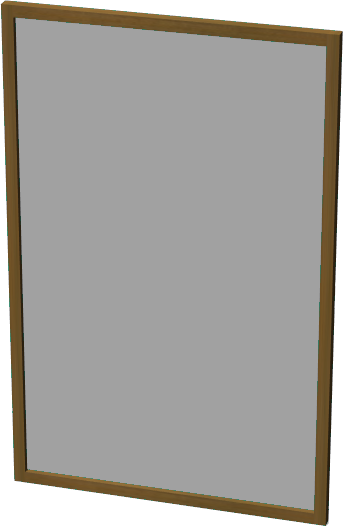

# Mirror

## Mirror

%figure "Mirror model in Webots."



%end

```
Mirror {
   SFVec3f    translation    0 0 0
   SFRotation rotation       0 1 0 0
   SFString   name           "mirror"
   SFString   controller     "mirror"
   SFFloat    OfView    0.785398
   SFFloat    width          0.5
   SFFloat    height         0.8
   SFFloat    frameThickness 0.02
   MFString   frameTexture   [ "textures/wood.jpg" ]
   SFNode     physics        NULL
}
```

> **File location**: "WEBOTS\_HOME/projects/objects/mirror/protos/Mirror.proto"

### Mirror Description

A simple mirror made of a display attached to a camera.
The reflected image does not depend on the viewpoint position.

