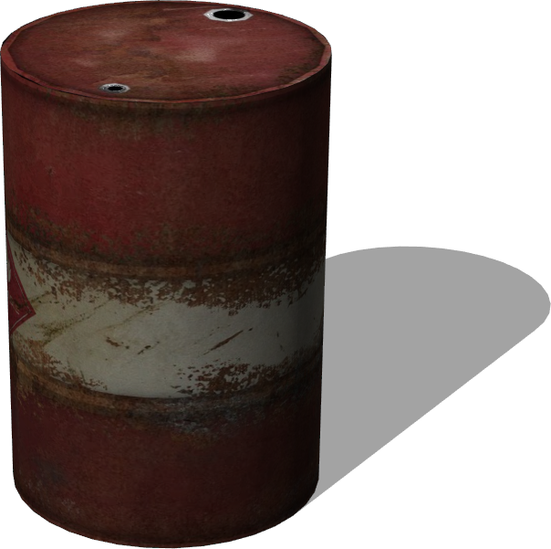
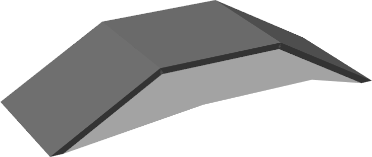
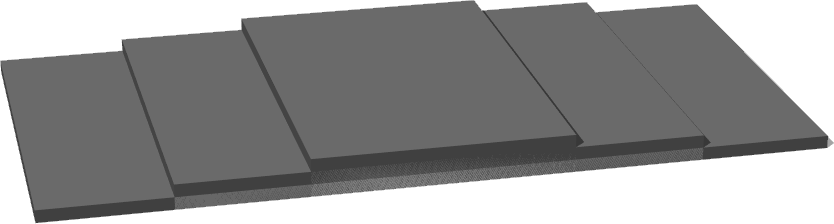

# Obstacles

## OilBarrel

%figure "OilBarrel model in Webots."



%end

```
OilBarrel {
   SFVec3f translation 0 0.44 0
   SFRotation rotation 0 1 0 0
   SFString name "oil barrel"
   SFFloat height 0.88
   SFFloat radius 0.305
   SFNode physics NULL
   MFNode immersionProperties []
}
```

> **File location**: "WEBOTS\_HOME/projects/objects/obstacles/protos/OilBarrel.proto"

### OilBarrel Description

Resizable oil barrel.

## Ramp30deg

%figure "Ramp30deg model in Webots."



%end

```
Ramp30deg {
   SFVec3f translation  0 0 0
   SFRotation rotation 0 1 0 0
   SFString name "ramp 30 degrees"
   SFColor color 0.5 0.5 0.5
}
```

> **File location**: "WEBOTS\_HOME/projects/objects/obstacles/protos/Ramp30deg.proto"

### Ramp30deg Description

A simple ramp made of two 30° slopes and a flat top.
The ramp is a static object (not physics-enabled) so it will not move when hit.

## ThreeSteps

%figure "ThreeSteps model in Webots."



%end

```
ThreeSteps {
   SFVec3f translation  0 -0.5 0
   SFRotation rotation 0 1 0 0
   SFString name "three steps"
   SFVec3f increment 0 0.1 0
   SFColor color 0.5 0.5 0.5
}
```

> **File location**: "WEBOTS\_HOME/projects/objects/obstacles/protos/ThreeSteps.proto"

### ThreeSteps Description

Three steps with customizable height and color.
This is not a physics-enabled object so it will not move when hit.

