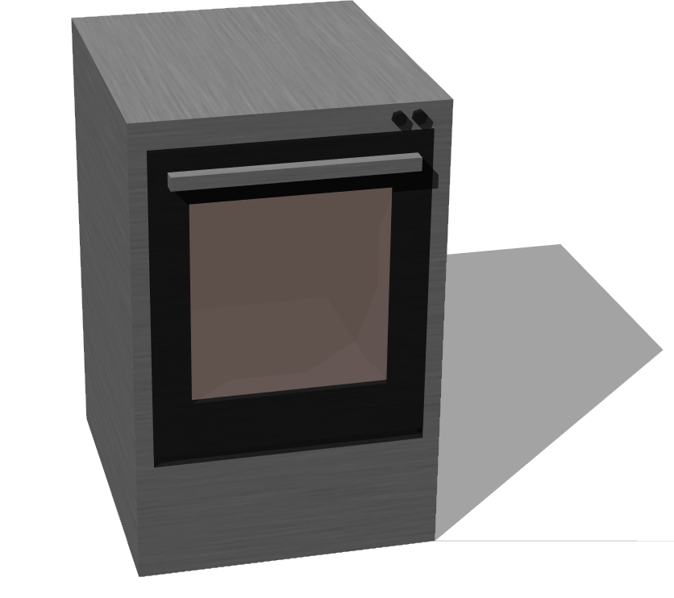

# Oven

## Oven

%figure "Oven"



%end

```
Oven {
   SFVec3f translation 0 0.34 0
   SFRotation rotation 0 1 0 0
   SFString name "oven"
   SFColor mainColor 1 1 1
   MFString mainTextureUrl [
    "textures/oven.jpg"
  ]
   SFColor doorColor 1 1 1
   MFString doorTextureUrl [
    "textures/oven.jpg"
  ]
}
```

> **File location**: "WEBOTS\_HOME/projects/objects/kitchen/oven/protos/Oven.proto"

### Description

An oven (0.5 x 0.68 x 0.44 m)

