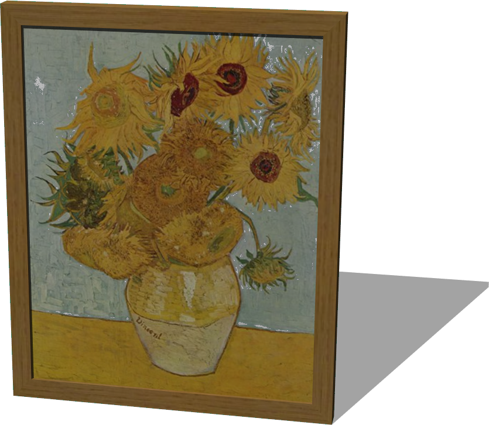

# Paintings

## LandscapePainting

%figure "LandscapePainting model in Webots."


%end

```
LandscapePainting {
  SFVec3f translation 0 0.5 0
  SFRotation rotation 0 1 0 0
  SFString name "landscape painting"
  SFColor color 1 1 1
  MFString textureUrl "textures/landscape_painting.jpg"
}
```

> **File location**: "WEBOTS\_HOME/projects/objects/paintings/protos/LandscapePainting.proto"

### LandscapePainting Description

A painting (1.5 x 1 x 0.05 m).

## PortraitPainting

%figure "PortraitPainting model in Webots."



%end

```
PortraitPainting {
  SFVec3f translation 0 0.505 0
  SFRotation rotation 0 1 0 0
  SFString name "portrait painting"
  SFColor color 1 1 1
  MFString textureUrl "textures/portrait_painting.jpg"
}
```

> **File location**: "WEBOTS\_HOME/projects/objects/paintings/protos/PortraitPainting.proto"

### PortraitPainting Description

A painting (0.82 x 1.01 x 0.05 m).

