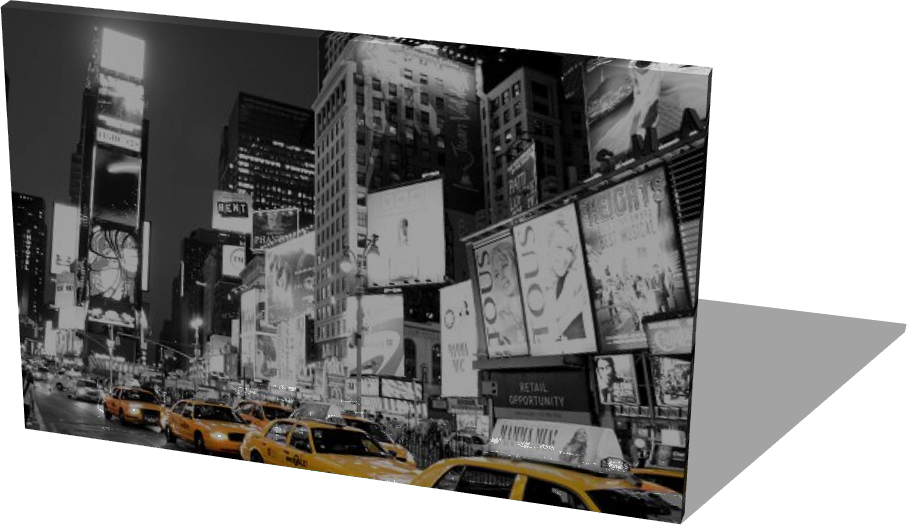
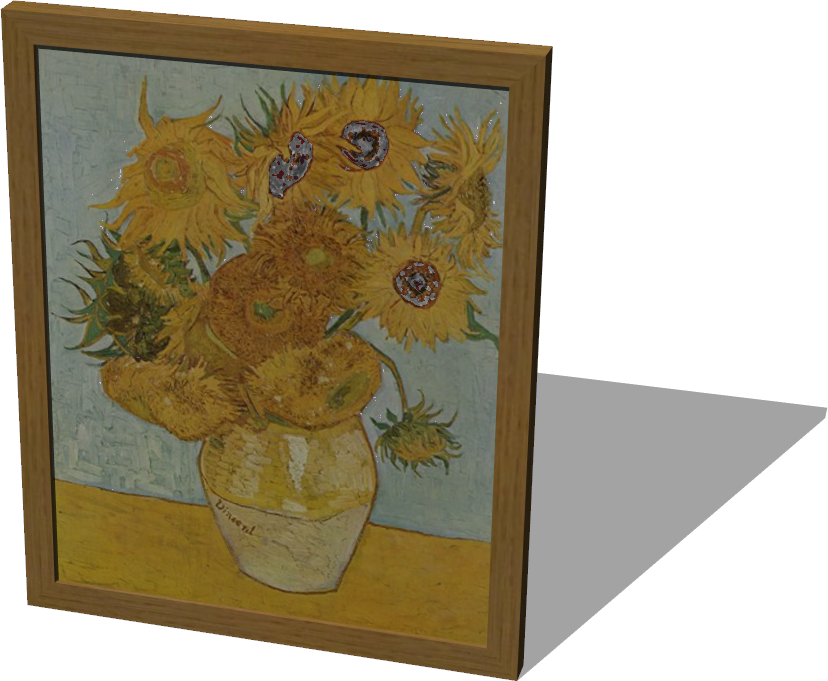

# Paintings

## LandscapePainting

A painting (1.5 x 1 x 0.05 m).

Derived from [Solid](../reference/solid.md).

%figure



%end

```
LandscapePainting {
  SFVec3f    translation 0 0.5 0
  SFRotation rotation    0 1 0 0
  SFString   name        "landscape painting"
  SFColor    color       1 1 1
  MFString   textureUrl  "textures/landscape_painting.jpg"
}
```

> **File location**: "WEBOTS\_HOME/projects/objects/paintings/protos/LandscapePainting.proto"

### LandscapePainting Field Summary

- `color`: Defines the color of the painting.
- `textureUrl`: Defines the texure used for the painting.
## PortraitPainting

A painting (0.82 x 1.01 x 0.05 m).

Derived from [Solid](../reference/solid.md).

%figure



%end

```
PortraitPainting {
  SFVec3f    translation 0 0.505 0
  SFRotation rotation    0 1 0 0
  SFString   name        "portrait painting"
  SFColor    color       1 1 1
  MFString   textureUrl  "textures/portrait_painting.jpg"
}
```

> **File location**: "WEBOTS\_HOME/projects/objects/paintings/protos/PortraitPainting.proto"

### PortraitPainting Field Summary

- `color`: Defines the color of the painting.
- `textureUrl`: Defines the texure used for the painting.
