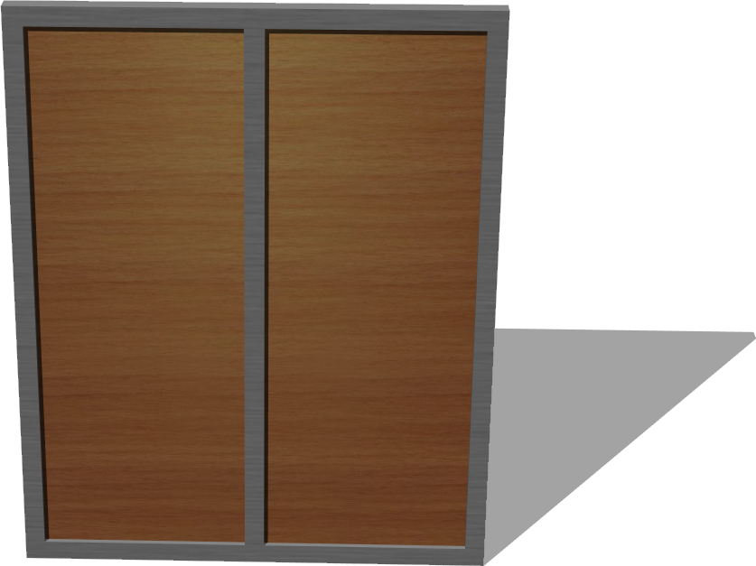
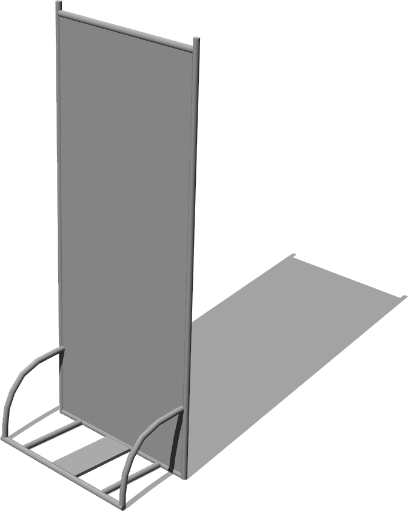

# Panels

## Panel

Derived from [Solid](../reference/solid.md)

%figure



%end

```
Panel {
  SFVec3f    translation      0 0 0
  SFRotation rotation         0 1 0 0
  SFString   name             "panel"
  SFVec3f    size             1.2 1.5 0.05                                                                                       
  SFFloat    borderHeight     0.05                                                                                               
  SFFloat    internalWidth    0.02                                                                                               
  SFInt32    panelsCount      2                                                                                                  
  SFNode     appearance       Appearance { material Material { } texture ImageTexture { url [ "textures/desktop_wood.jpg" ] } }  
  SFNode     borderAppearance Appearance { material Material { } texture ImageTexture { url [ "textures/metal.jpg" ] } }         
}
```

> **File location**: "WEBOTS\_HOME/projects/objects/panels/protos/Panel.proto"

### Panel Description

Customizable simple panel.

### Panel Field Summary

- `size`: Defines the size of the panel

- `borderHeight`: Defines the height of the border.

- `internalWidth`: Defines the width of the panel (without border).

- `panelsCount`: Defines the number of panels.

- `appearance`: Defines the appearance of the panel body.

- `borderAppearance`: Defines the appearance of the panel norder.

## PannelWithTubes

Derived from [Solid](../reference/solid.md)

%figure



%end

```
PannelWithTubes {
  SFVec3f    translation          0 0 0
  SFRotation rotation             0 1 0 0
  SFString   name                 "panel with tubes"
  SFNode     appearance           Appearance { material Material { } }  
}
```

> **File location**: "WEBOTS\_HOME/projects/objects/panels/protos/PannelWithTubes.proto"

### PannelWithTubes Description

A gray panel with tubes.

### PannelWithTubes Field Summary

- `appearance`: Defines the appearance of the panel.

