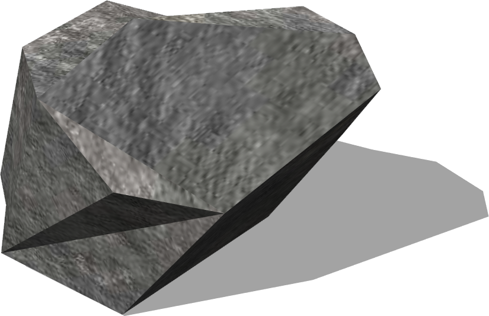
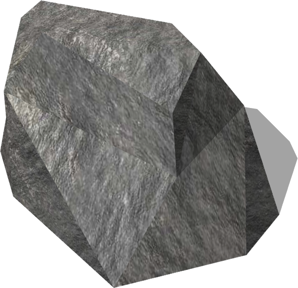

# Rocks

## Rock10cm

%figure "Rock10cm model in Webots."



%end

```
Rock10cm {
  SFVec3f    translation      0 0.05 0
  SFRotation rotation         0 1 0 0
  SFString   name             "rock 10 cm"
  MFString   texture          "textures/rock.jpg"  
  SFColor    color            1 1 1                
  SFFloat    ambientIntensity 0.2                  
  SFNode     physics          NULL                 
  SFBool     locked           FALSE                
}
```

> **File location**: "WEBOTS\_HOME/projects/objects/rocks/protos/Rock10cm.proto"

### Rock10cm Description

A rock (10 cm).

### Rock10cm Field Summary

- `texture`: Defines the texture used for the rock.

- `color`: Defines the color of the rock.

- `ambientIntensity`: Defines the ambiant intensity of the rock.

- `physics`: Is equivalent to the `physics` field of the [Solid](../reference/solid.md) node.

- `locked`: Is equivalent to the `locked` field of the [Solid](../reference/solid.md) node.

## Rock17cm

%figure "Rock17cm model in Webots."



%end

```
Rock17cm {
  SFVec3f    translation       0 0 0
  SFRotation rotation          0 1 0 0
  SFString   name             "rock 17 cm"
  MFString   texture          "textures/rock.jpg"  
  SFColor    color            1 1 1                
  SFFloat    ambientIntensity 0.2                  
  SFNode     physics          NULL                 
  SFBool     locked           FALSE                
}
```

> **File location**: "WEBOTS\_HOME/projects/objects/rocks/protos/Rock17cm.proto"

### Rock17cm Description

A rock (17 cm).

### Rock17cm Field Summary

- `texture`: Defines the texture used for the rock.

- `color`: Defines the color of the rock.

- `ambientIntensity`: Defines the ambiant intensity of the rock.

- `physics`: Is equivalent to the `physics` field of the [Solid](../reference/solid.md) node.

- `locked`: Is equivalent to the `locked` field of the [Solid](../reference/solid.md) node.

