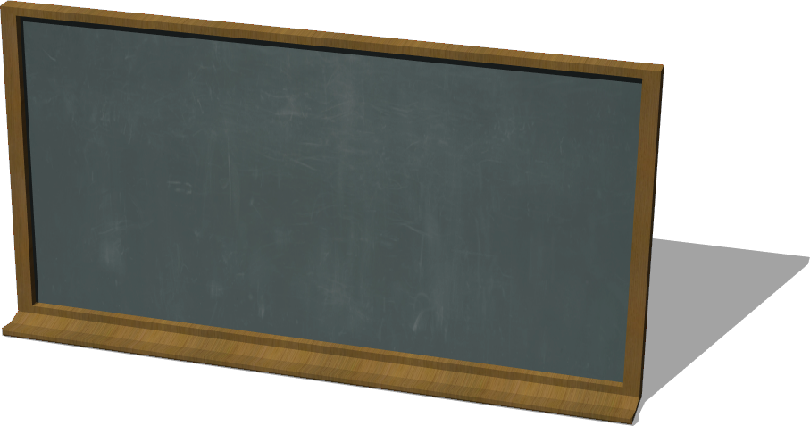
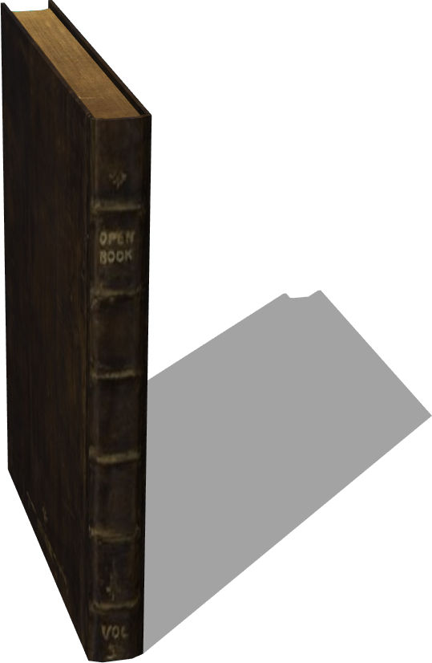
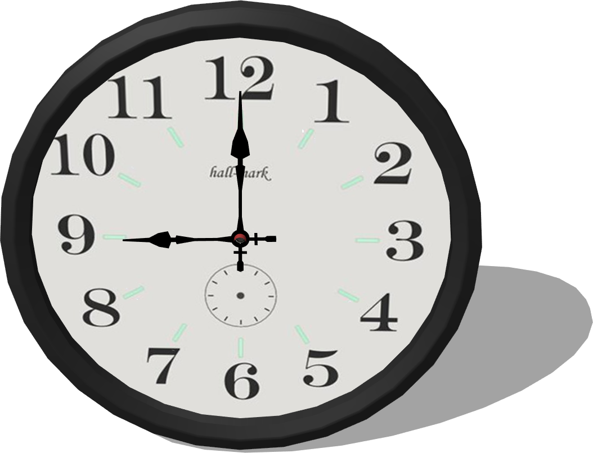

# School Furniture

## Blackboard

%figure "Blackboard model in Webots."



%end

```
Blackboard {
  SFVec3f translation 0 0 0
  SFRotation rotation 0 1 0 0
  SFString name "blackboard"
}
```

> **File location**: "WEBOTS\_HOME/projects/objects/school_furniture/protos/Blackboard.proto"

### Blackboard Description

A blackboard (about 1.3 x 2.5 m).

## Book

%figure "Book model in Webots."



%end

```
Book {
  SFVec3f translation 0 0.1 0
  SFRotation rotation 0 1 0 0
  SFString name "book"
  SFColor color 1 1 1
  MFString textureUrl "textures/book.jpg"
  SFFloat mass 0.3
}
```

> **File location**: "WEBOTS\_HOME/projects/objects/school_furniture/protos/Book.proto"

### Book Description

A book (0.2 x 0.15 x 0.02 m).

## Clock

%figure "Clock model in Webots."



%end

```
Clock {
  SFVec3f translation 0 0 0
  SFRotation rotation 0 1 0 0
  SFString name "clock"
}
```

> **File location**: "WEBOTS\_HOME/projects/objects/school_furniture/protos/Clock.proto"

### Clock Description

A clock (radius 16.5 cm).

