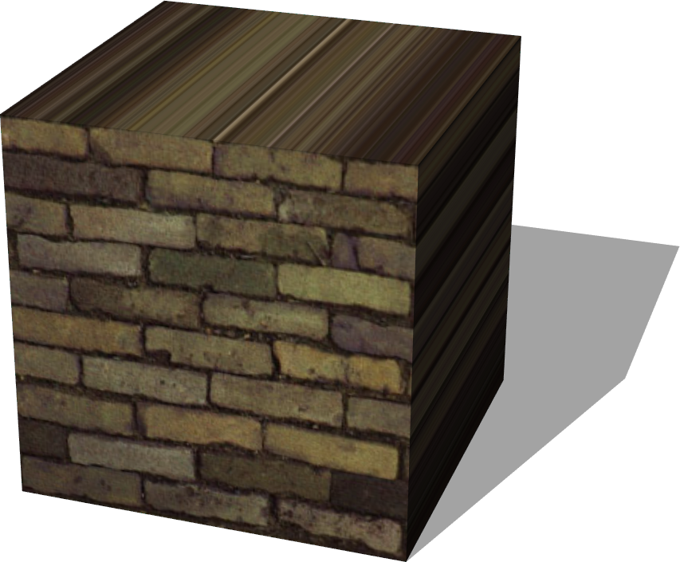

# Shapes

## TexturedBoxShape

%figure "TexturedBoxShape model in Webots."



%end

```
TexturedBoxShape {
  SFVec3f  size             0.1 0.1 0.1
  MFString textureUrl       "textures/old_brick_wall.jpg"
  SFInt32  textureFiltering 4
  SFNode   textureTransform NULL
  SFString textureMapping   "flat"
  SFColor  faceColor        0.8 0.8 0.8
  SFBool   frontFace        TRUE
  SFBool   backFace         TRUE
  SFBool   leftFace         TRUE
  SFBool   rightFace        TRUE
  SFBool   topFace          TRUE
  SFBool   bottomFace       TRUE
}
```

> **File location**: "WEBOTS\_HOME/projects/objects/shapes/protos/TexturedBoxShape.proto"

### TexturedBoxShape Description

Box with customizable texture mapping on selected faces.
If the boolean value associated with a face ('frontFace', 'leftFace', etc.) is FALSE, then the uniform color specified in 'faceColor' field will be applied instead of the texture.
This is an extension of the TexturedBox geometry PROTO.
Available texture mappings:
- 'cube' mapping: see texture at projects/samples/geometries/worlds/textures/cube\_mapping.jpg
- 'compact' cube mapping: see texture at projects/samples/geometries/worlds/textures/compact\_mapping.jpg
- 'flat' mapping: projecting the texture on the front face
- 'metric' mapping: similar to default mapping but the texture is not deformed to match each face size
- 'default' mapping: same texture on all the faces
A demo of these mappings is available in projects/samples/geometries/worlds/textured\_boxes.wbt

