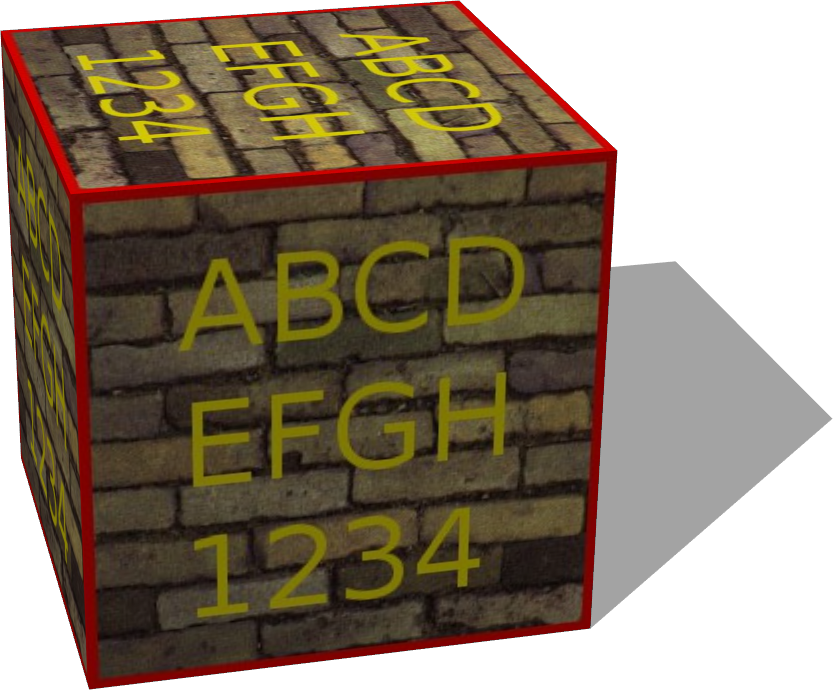
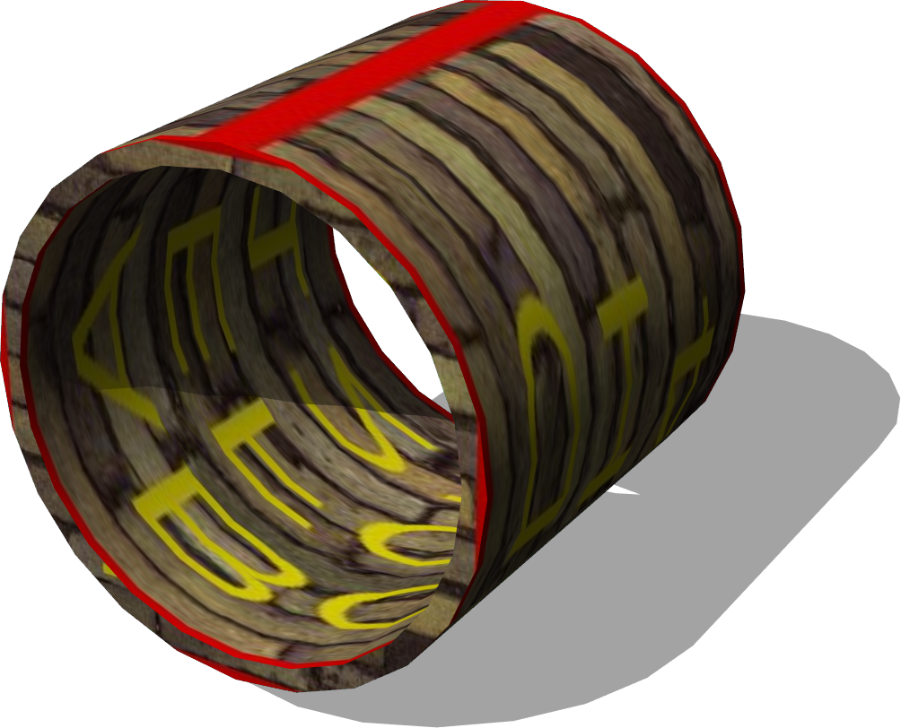
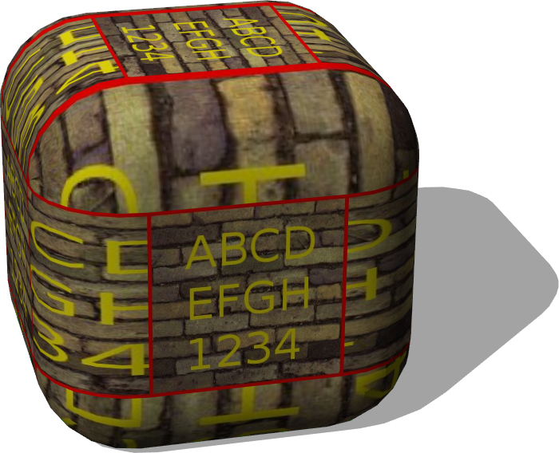
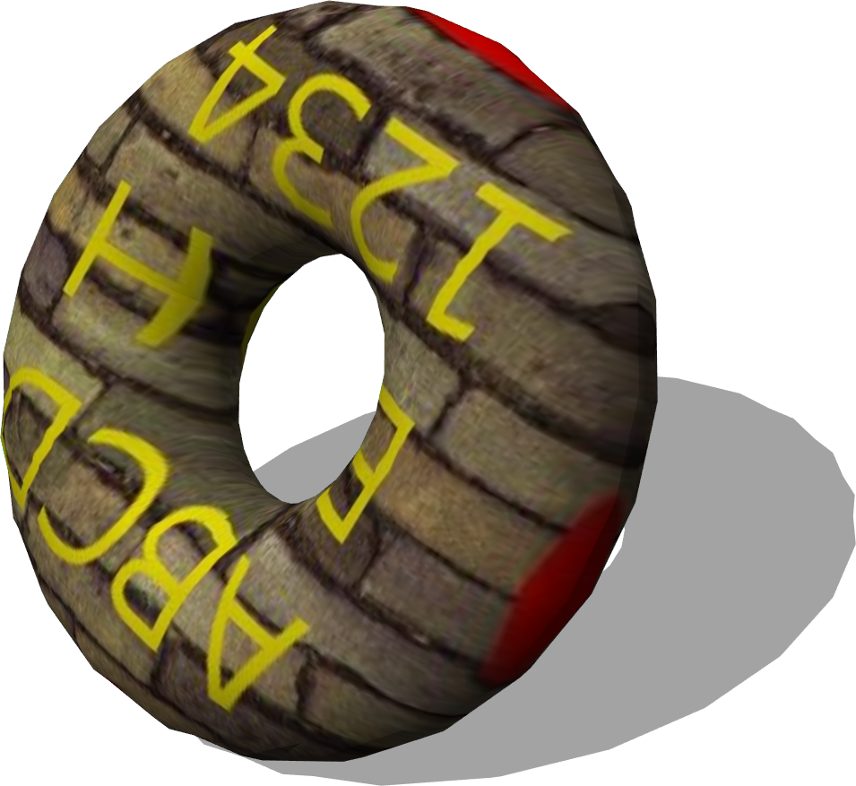

# Solids

## SolidBox

%figure "SolidBox model in Webots."



%end

```
SolidBox {
   SFVec3f    translation     0 0 0
   SFRotation rotation        0 1 0 0
   SFString   name            "box"
   SFVec3f    size            2 2 2
   SFInt32    subdivision     8
   SFString   contactMaterial "default"
   SFNode     appearance      Appearance { material Material { } texture ImageTexture { url [ "textures/tagged_wall.jpg" ] } }
   SFNode     physics         NULL
}
```

> **File location**: "WEBOTS\_HOME/projects/objects/solids/protos/SolidBox.proto"

### SolidBox Description

A box object implemented at the Solid-node level.
The box has similar properties as the VRML Box node in term of axis and fields.
The UV-mapping is defined in a metric way (the textures are not deformed - the reference is the longest edge).
The subdivision field allows to divide the faces into multiple quads (useful mainly for simple renderings).

## SolidPipe

%figure "SolidPipe model in Webots."



%end

```
SolidPipe {
   SFVec3f    translation     0 0 0
   SFRotation rotation        0 1 0 0
   SFString   name            "pipe"
   SFFloat    height          2
   SFFloat    radius          1
   SFFloat    thickness       0.1
   SFInt32    subdivision     24
   SFFloat    accuracy        0.0001
   SFString   contactMaterial "default"
   SFNode     appearance      Appearance { material Material { } texture ImageTexture { url [ "textures/tagged_wall.jpg" ] } }
   SFNode     physics         NULL
}
```

> **File location**: "WEBOTS\_HOME/projects/objects/solids/protos/SolidPipe.proto"

### SolidPipe Description

A pipe object implemented at the Solid-node level.
Graphically, the SolidPipe is an IndexedFaceSet.
Physically, the SolidPipe is a set of N boxes, where N is the subdivision field.
The 'accuracy' field defines how much boxes position can differ on y axis: a 0 value represents an error-free model but it will slow down the simulation.

## SolidRoundedBox

%figure "SolidRoundedBox model in Webots."



%end

```
SolidRoundedBox {
   SFVec3f    translation     0 0 0
   SFRotation rotation        0 1 0 0
   SFString   name            "rounded box"
   SFVec3f    size            2 2 2
   SFFloat    borderRadius    0.5
   SFInt32    subdivision     24
   SFString   contactMaterial "default"
   SFNode     appearance      Appearance { material Material { } texture ImageTexture { url [ "textures/tagged_wall.jpg" ] } }
   SFNode     physics         NULL
}
```

> **File location**: "WEBOTS\_HOME/projects/objects/solids/protos/SolidRoundedBox.proto"

### SolidRoundedBox Description

A box object with rounded corners and edges implemented at the Solid-node level.
The box has similar properties as the VRML Box node in term of axis and fields.

## SolidTorus

%figure "SolidTorus model in Webots."



%end

```
SolidTorus {
   SFVec3f    translation     0 0 0
   SFRotation rotation        0 1 0 0
   SFString   name            "torus"
   SFFloat    majorRadius     2
   SFFloat    minorRadius     1
   SFInt32    subdivision     24
   SFString   contactMaterial "default"
   SFNode     appearance      Appearance { material Material { } texture ImageTexture { url [ "textures/tagged_wall.jpg" ] } }
   SFNode     physics         NULL
}
```

> **File location**: "WEBOTS\_HOME/projects/objects/solids/protos/SolidTorus.proto"

### SolidTorus Description

A torus object implemented at the Solid-node level.
Graphically, the SolidTorus is defined as an IndexedFaceSet.
Physically, the SolidTorus is defined as a set of N spheres, where N is the subdivision field.

