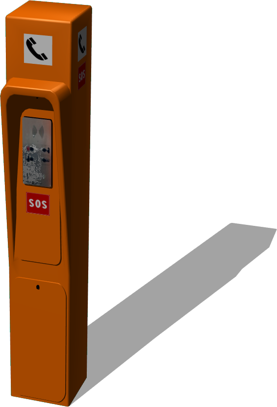
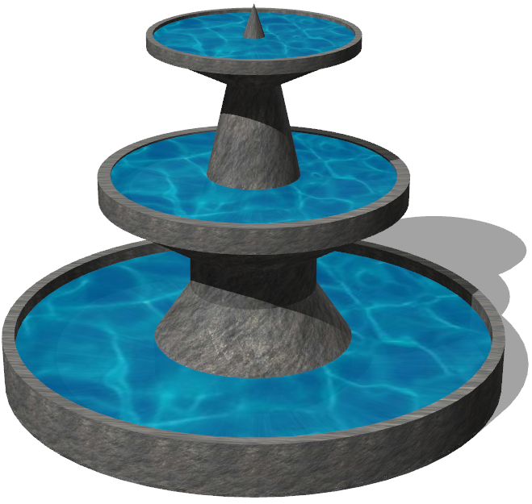
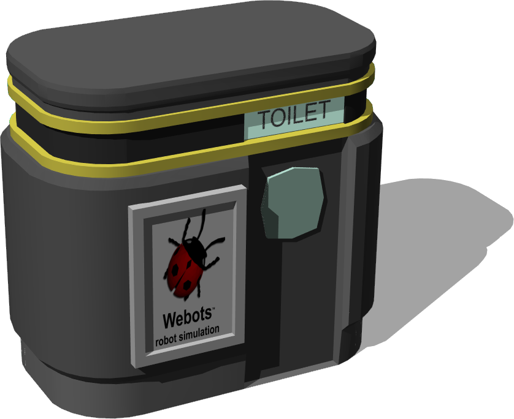

# Street Furniture

## Bench

A bench.

Derived from [Solid](../reference/solid.md).

%figure


%end

```
Bench {
        SFVec3f    translation          0 0 0
        SFRotation rotation             0 1 0 0
        SFString   name                 "bench"
        SFColor    metalColor           0.17 0.17 0.17
        SFColor    woodColor            0.25 0.17 0.12
        MFColor    recognitionColors    [0.17 0.17 0.17, 0.25 0.17 0.12]
}
```

> **File location**: "WEBOTS\_HOME/projects/objects/street_furniture/protos/Bench.proto"

### Bench Field Summary

- `metalColor`: Defines the color of the metalic part.

- `woodColor`: Defines the color of the wooden part.

- `recognitionColors`: Is equivalent to the `recognitionColors` field of the [Solid](../reference/solid.md) node.

## BusStop

Simple bus stop with customizable appearance and an optional bench.
The original blender model was made by Ringbarkis ([http://www.blendswap.com/blends/view/66783](http://www.blendswap.com/blends/view/66783)).
This model was sponsored by the CTI project RO2IVSim ([http://transport.epfl.ch/simulator-for-mobile-robots-and-intelligent-vehicles](http://transport.epfl.ch/simulator-for-mobile-robots-and-intelligent-vehicles)).

Derived from [Solid](../reference/solid.md).

%figure


%end

```
BusStop {
  SFVec3f     translation                 0 0 0
  SFRotation  rotation                    0 1 0 0
  SFString    name                        "bus stop"
  SFBool      bench                       TRUE
  SFNode      appearance                  Appearance { material Material { diffuseColor 0.3 0.45 0.33 } }
  MFString    internalAdvertisingTexture  ["textures/cocacola_advertising.jpg"]
  MFString    externalAdvertisingTexture  ["textures/cocacola_advertising.jpg"]
  SFBool      advertisingLightOn          TRUE
}
```

> **File location**: "WEBOTS\_HOME/projects/objects/street_furniture/protos/BusStop.proto"

### BusStop Field Summary

- `bench`: Defines whether the bust stop should include a bench.

- `appearance`: Defines the appearance of the bench.

- `internalAdvertisingTexture`: Defines the texture used for the internal advertising.

- `externalAdvertisingTexture`: Defines the texture used for the external advertising.

- `advertisingLightOn`: Defines whether the advertising should have an emissive color.

## EmergencyPhone

An emergency phone.

Derived from [Solid](../reference/solid.md).

%figure



%end

```
EmergencyPhone {
        SFVec3f    translation          0 0 0
        SFRotation rotation             0 1 0 0
        SFString   name                 "emergency phone"
        SFColor    poleColor            1 0.44 0
        MFColor    recognitionColors    [1 0.44 0]
}
```

> **File location**: "WEBOTS\_HOME/projects/objects/street_furniture/protos/EmergencyPhone.proto"

### EmergencyPhone Field Summary

- `poleColor`: Defines the color of the pole.

- `recognitionColors`: Is equivalent to the `recognitionColors` field of the [Solid](../reference/solid.md) node.

## Fence

A customizable fence.
Dimensions, path and appearance of the fence can be set.
If subdivision is bigger than 1, B-Splines are used to interpolate path of the fence.
This model was sponsored by the CTI project RO2IVSim ([http://transport.epfl.ch/simulator-for-mobile-robots-and-intelligent-vehicles](http://transport.epfl.ch/simulator-for-mobile-robots-and-intelligent-vehicles)).

Derived from [Solid](../reference/solid.md).

%figure


%end

```
Fence {
  SFVec3f      translation             0 0 0
  SFRotation   rotation                0 1 0 0
  SFString     name                    "fence"
  SFFloat      height                  1.5
  SFFloat      poleGap                 0.5
  SFFloat      poleRadius              0.04
  SFString     poleShape               "cylinder"
  SFNode       poleAppearance          Appearance { material Material {} }
  MFVec3f      path                    [0 0 0, 5 0 0]
  SFInt32      subdivision             -1
  SFInt32      horizontalBarsNumber    2
  MFVec2f      horizontalBarShape      [0.06 0.02, 0.06 -0.02, -0.06 -0.02, -0.06 0.02, 0.06 0.02]
  SFNode       horizontalBarAppearance Appearance { material Material {} }
  SFNode       boundingObject          NULL
}
```

> **File location**: "WEBOTS\_HOME/projects/objects/street_furniture/protos/Fence.proto"

### Fence Field Summary

- `height`: Defines the height of the fence.

- `poleGap`: Defines the distance between two consecutives poles.

- `poleRadius`: Defines the radius of the poles.

- `poleShape`: Defines the shape of the poles. The value should be either `cylinder`, `square`, `diamond` or `H`.

- `poleAppearance`: Defines the appearance of the poles.

- `path`: Defines the 3D path of the fence.

- `subdivision`: Defines the degree of interpolation using B-Splines (if the value is lower than 0, the interpolation is disabled).

- `horizontalBarsNumber`: Defines the number of horizontal bars.

- `horizontalBarShape`: Defines the shape 2D of the horizontal bars.

- `horizontalBarAppearance`: Defines the appearance of the horizontal bars.

- `boundingObject`: Is equivalent to the `boundingObject` field of the [Solid](../reference/solid.md) node.

- `appearance`: For backward compatibility warning.

## FireHydrant

A fire hydrant.

Derived from [Solid](../reference/solid.md).

%figure


%end

```
FireHydrant {
  SFVec3f    translation 0 0 0
  SFRotation rotation    0 1 0 0
  SFString   name        "fire hydrant"
  SFNode     appearance  Appearance { material Material { diffuseColor 0.643 0 0 specularColor 0.473 0.027 0.027} }
}
```

> **File location**: "WEBOTS\_HOME/projects/objects/street_furniture/protos/FireHydrant.proto"

### FireHydrant Field Summary

- `appearance`: Defines the appearance of the fire hydrant.

## Fountain

A configurable fountain.

Derived from [Solid](../reference/solid.md).

%figure



%end

```
Fountain {
  SFVec3f     translation            0 0 0
  SFRotation  rotation               0 1 0 0
  SFString    name                   "fountain"
  SFFloat     height                 1.5
  SFFloat     radius                 1
  SFInt32     sudivision             16
}
```

> **File location**: "WEBOTS\_HOME/projects/objects/street_furniture/protos/Fountain.proto"

### Fountain Field Summary

- `height`: Defines the height of the fountain.

- `radius`: Defines the radius of the fountain.

- `sudivision`: Defines subdivision of the fountain cylinders.

## PublicBin

A public bin.

Derived from [Solid](../reference/solid.md).

%figure


%end

```
PublicBin {
        SFVec3f    translation          0 0 0
        SFRotation rotation             0 1 0 0
        SFString   name                 "public bin"
        SFColor    color                0.27 0.27 0.27
        MFColor    recognitionColors    [0.27 0.27 0.27]
}
```

> **File location**: "WEBOTS\_HOME/projects/objects/street_furniture/protos/PublicBin.proto"

### PublicBin Field Summary

- `color`: Defines the color of the bin.

- `recognitionColors`: Is equivalent to the `recognitionColors` field of the [Solid](../reference/solid.md) node.

## PublicToilet

Resizable public toilet with two different displays.

Derived from [Solid](../reference/solid.md).

%figure



%end

```
PublicToilet {
  SFVec3f     translation         0 0 0
  SFRotation  rotation            0 1 0 0
  SFString    name                "public toilet"
  SFFloat     height              3.2
  SFFloat     length              3.5
  SFFloat     width               2.1
  SFColor     mainColor           0.4 0.4 0.4
  SFColor     secondaryColor      0.5 0.5 0.5
  SFColor     mainTopColor        0.22 0.22 0.22
  SFColor     secondaryTopColor   1 0.95 0.33
  SFColor     windowColor         0.8 1 0.93
  SFString    text                "TOILET"
  SFFloat     textScale           80
  MFString    backDisplayTexture  "textures/webots_billboard.jpg"
  SFBool      backDisplayLight    FALSE
  MFNode      frontDisplay        [
    AdvertisingBoard {
      frontTexture ["textures/webots_billboard.jpg"]
      backTexture []
      displayBackLight FALSE
      displayWidth 0.90
      displayHeight 1.35
      frameThickness 0.1
    }
  ]
}
```

> **File location**: "WEBOTS\_HOME/projects/objects/street_furniture/protos/PublicToilet.proto"

### PublicToilet Field Summary

- `height`: Defines the height of the toilet.

- `length`: Defines the lenght of the toilet.

- `width`: Defines the wdith of the toilet.

- `mainColor`: Defines the primary color of the toilet.

- `secondaryColor`: Defines the secondary color of the toilet.

- `mainTopColor`: Defines the primary color of the top part of the toilet.

- `secondaryTopColor`: Defines the secondary color of the top part of the toilet.

- `windowColor`: Defines the color of the windows of the toilet.

- `text`: Defines the text displayed on the toilet.

- `textScale`: Defines the scale of the text displayed on the toilet.

- `backDisplayTexture`: Defines the texture used on the back display.

- `backDisplayLight`: Defines whether the back display should have emissive color.

- `frontDisplay`: Defines the content of the front display.

## TrashBin

A trash bin.

Derived from [Solid](../reference/solid.md).

%figure


%end

```
TrashBin {
        SFVec3f    translation          0 0 0
        SFRotation rotation             0 1 0 0
        SFString   name                 "trash bin"
        SFColor    coverColor           0.1 0.1 0.1
        SFColor    binColor             0.08 0.46 0
        MFColor    recognitionColors    [0.1 0.1 0.1, 0.08 0.46 0]
}
```

> **File location**: "WEBOTS\_HOME/projects/objects/street_furniture/protos/TrashBin.proto"

### TrashBin Field Summary

- `coverColor`: Defines the color of the top part of the bin.

- `binColor`: Defines the main color of the bin.

- `recognitionColors`: Is equivalent to the `recognitionColors` field of the [Solid](../reference/solid.md) node.

