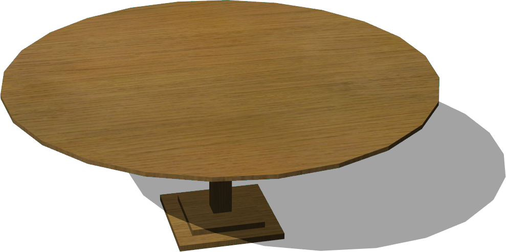

# Tables

## Desk

Derived from [Solid](../reference/solid.md)

%figure "Desk model in Webots."


%end

```
Desk {
  SFVec3f    translation 0 0 0
  SFRotation rotation    0 1 0 0
  SFString   name        "desk"
  SFColor    color       1 1 1               
  MFString   textureUrl "textures/desk.jpg"  
  SFNode     physics     NULL                
}
```

> **File location**: "WEBOTS\_HOME/projects/objects/tables/protos/Desk.proto"

### Desk Description

A desk (1.2 x 0.72 x 0.7 m).

### Desk Field Summary

- `color`: Defines the color of the desk.

- `textureUrl`: Defines the texture used for the desk.

- `physics`: Is equivalent to the `physics` field of the [Solid](../reference/solid.md) node.

## RoundTable

Derived from [Solid](../reference/solid.md)

%figure "RoundTable model in Webots."



%end

```
RoundTable {
  SFVec3f    translation 0 0 0
  SFRotation rotation    0 1 0 0
  SFString   name        "round table"
  SFColor    color       1 1 1                
  MFString   textureUrl  "textures/wood.jpg"  
  SFNode     physics     NULL                 
}
```

> **File location**: "WEBOTS\_HOME/projects/objects/tables/protos/RoundTable.proto"

### RoundTable Description

A round table (2 x 0.76 x 2 m).

### RoundTable Field Summary

- `color`: Defines the color of the table.

- `textureUrl`: Defines the texture used for the table.

- `physics`: Is equivalent to the `physics` field of the [Solid](../reference/solid.md) node.

## Table

Derived from [Solid](../reference/solid.md)

%figure "Table model in Webots."


%end

```
Table {
  SFVec3f    translation         0 0 0
  SFRotation rotation            0 1 0 0
  SFString   name                "table"
  SFVec3f    size                1.8 0.74 1           
  SFVec2f    feetSize            0.1 0.1              
  SFFloat    feetPadding         0                    
  SFFloat    frameThickness      0.05                 
  SFFloat    trayTransparency    0                    
  MFString   trayTextureUrl      "textures/wood.jpg"  
  SFVec2f    trayTileSize        0.5 0.5              
  MFString   feetTextureUrl      "textures/wood.jpg"  
  SFVec2f    feetTileSize        0.5 0.5              
}
```

> **File location**: "WEBOTS\_HOME/projects/objects/tables/protos/Table.proto"

### Table Description

Customizable table.

### Table Field Summary

- `size`: Defines the size of the table.

- `feetSize`: Defines the size of the feet.

- `feetPadding`: Defines the padding of the feet.

- `frameThickness`: Defines the thickness of the frame.

- `trayTransparency`: Defines the transparency of the tray.

- `trayTextureUrl`: Defines the texture used for the tray.

- `trayTileSize`: Defines the size of the texture used for the tray.

- `feetTextureUrl`: Defines the texture used for the feet.

- `feetTileSize`: Defines the size of the texture used for the feet.

