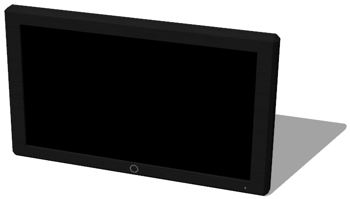

# Television

## Television

%figure "Television model in Webots."



%end

```
Television {
   SFVec3f translation 0 0.3 0
   SFRotation rotation 0 1 0 0
   SFString name "television"
   SFColor color 1 1 1
   MFString textureUrl "textures/television.jpg"
   SFInt32 displayWidth 128
   SFInt32 displayHeight 64
   SFString controller "television_switch_on"
}
```

> **File location**: "WEBOTS\_HOME/projects/objects/television/protos/Television.proto"

### Television Description

A television (1 x 0.6 x 0.1 m).

