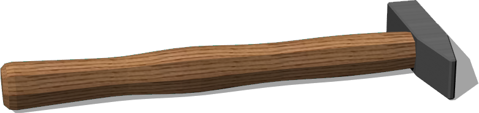
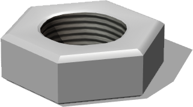
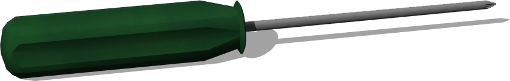
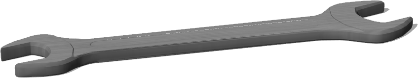

# Tools

## Bolt

%figure "Bolt"


%end

```
Bolt {
   SFVec3f translation 0 0.0131 0
   SFRotation rotation 0 0 1 0
   SFString name "bolt"
   SFString contactMaterial "default"
}
```

> **File location**: "WEBOTS\_HOME/projects/objects/factory/tools/protos/Bolt.proto"

### Description

A threaded bolt.

## Hammer

%figure "Hammer"



%end

```
Hammer {
   SFVec3f translation 0 0.014 0
   SFRotation rotation 0 1 0 0
   SFString name "hammer"
   SFString contactMaterial "default"
}
```

> **File location**: "WEBOTS\_HOME/projects/objects/factory/tools/protos/Hammer.proto"

### Description

A 25cm asymmetric club hammer.

## Nut

%figure "Nut"



%end

```
Nut {
   SFVec3f translation 0 0.004 0
   SFRotation rotation 0 1 0 0
   SFString name "nut"
   SFString contactMaterial "default"
}
```

> **File location**: "WEBOTS\_HOME/projects/objects/factory/tools/protos/Nut.proto"

### Description

A hexagonal nut.

## PaintBucket

%figure "PaintBucket"


%end

```
PaintBucket {
   SFVec3f translation 0 0 0
   SFRotation rotation 0 1 0 0
   SFString name "paint bucket"
   SFString contactMaterial "default"
}
```

> **File location**: "WEBOTS\_HOME/projects/objects/factory/tools/protos/PaintBucket.proto"

### Description

A 4kg bucket of paint, with HingeJoint-based handle.

## PlatformCart

%figure "PlatformCart"


%end

```
PlatformCart {
   SFVec3f translation 0 0 0
   SFRotation rotation 0 1 0 0
   SFString name "platform cart"
   MFNode slot []
   SFNode physics Physics {}
}
```

> **File location**: "WEBOTS\_HOME/projects/objects/factory/tools/protos/PlatformCart.proto"

### Description

A platform cart with overall dimensions 90Lx50Wx85H cm.

## Screwdriver

%figure "Screwdriver"



%end

```
Screwdriver {
   SFVec3f translation 0 0.012 0
   SFRotation rotation 0 1 0 0
   SFString name "screwdriver"
   SFString contactMaterial "default"
}
```

> **File location**: "WEBOTS\_HOME/projects/objects/factory/tools/protos/Screwdriver.proto"

### Description

A Philips screwdriver. The blade and handle are balanced.

## Wrench

%figure "Wrench"



%end

```
Wrench {
   SFVec3f translation 0 0 0
   SFRotation rotation 0 1 0 0
   SFString name "wrench"
   SFString contactMaterial "default"
}
```

> **File location**: "WEBOTS\_HOME/projects/objects/factory/tools/protos/Wrench.proto"

### Description

A 15cm Open-End wrench.

