# Traffic

## CautionPanel

Traffic panel: Caution panel.

Derived from [Solid](../reference/solid.md).

%figure

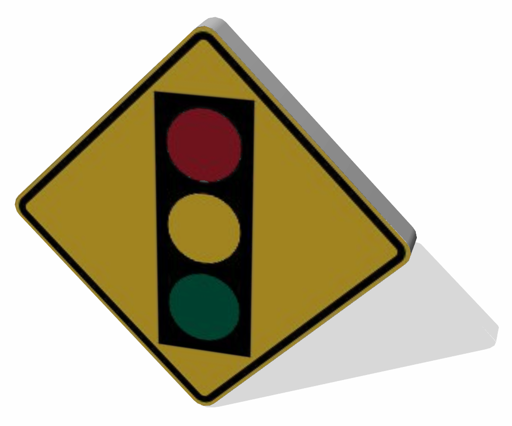

%end

```
CautionPanel {
  SFVec3f    translation        0 0 0
  SFRotation rotation           0 1 0 0
  SFString   name               "caution panel"
  MFString   signImage          "textures/signs/us/traffic_signals_ahead.jpg"
  SFColor    color              0.576471 0.576471 0.576471
  MFColor    recognitionColors  [ 1 0.82 0.2, 0.58 0.58 0.58 ]
}
```

> **File location**: "WEBOTS\_HOME/projects/objects/traffic/protos/CautionPanel.proto"

### CautionPanel Field Summary

- `signImage`: Defines the texture used for the sign.
- `color`: Defines the color of the panel
- `recognitionColors`: Inherited from [Solid](../reference/solid.md) node.

## CautionSign

Traffic sign: Caution sign.

Derived from [Solid](../reference/solid.md).

%figure

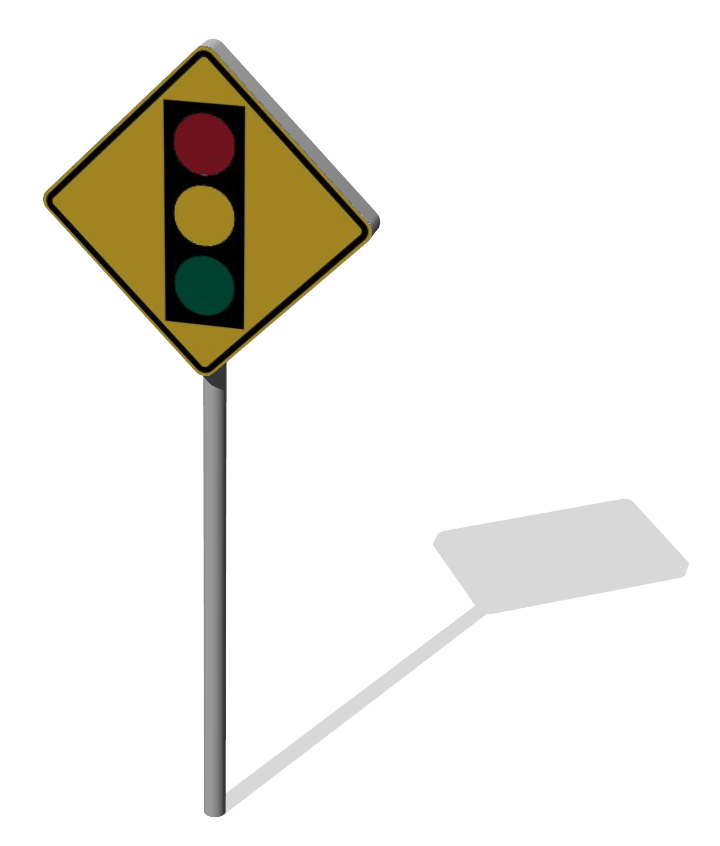

%end

```
CautionSign {
  SFVec3f    translation  0 0 0
  SFRotation rotation     0 1 0 0
  SFString   name         "caution sign"
  SFFloat    height       2
  SFFloat    radius       0.03
  SFColor    color        0.576471 0.576471 0.576471
  MFNode     signBoards   [ CautionPanel { translation 0 -0.17 0 } ]
}
```

> **File location**: "WEBOTS\_HOME/projects/objects/traffic/protos/CautionSign.proto"

### CautionSign Field Summary

- `height`: Defines the height of the sign.
- `radius`: Defines the radius of the sign pole.
- `color`: Defines the color of the sign.
- `signBoards`: Defines the boards.

## ControlledStreetLight

Simple model of a controlled street light including a customizable SpotLight.

Derived from [Robot](../reference/robot.md).

%figure


%end

```
ControlledStreetLight {
  SFVec3f    translation  0 0 0
  SFRotation rotation     0 1 0 0
  SFString   name         "street light"
  SFString   controller   "defective_street_light"
  SFFloat    beamWidth    1.1
  MFColor    color        [ 1 0.9 0.8 ]
  SFFloat    cutOffAngle  1.57
  SFVec3f    direction    0 -1 -0.1
  SFFloat    radius       50
  SFBool     castShadows  FALSE
}
```

> **File location**: "WEBOTS\_HOME/projects/objects/traffic/protos/ControlledStreetLight.proto"

> **License**: Creative Commons Attribution 3.0 United States License (original model by Andrew Kator & Jennifer Legaz)

### ControlledStreetLight Field Summary

- `controller`: Defines the controller used to make the LED blink.
- `beamWidth`: Defines the beam width of the spot light.
- `color`: Defines the color of the spot light.
- `cutOffAngle`: Defines the cut-off angle of the spot light.
- `direction`: Defines the direction of the spot light.
- `radius`: Defines the radius of the spot light.
- `castShadows`: Defines whether the spot light casts shadows.

## CrossRoadsTrafficLight

Four roads crossing traffic light.

Derived from [Robot](../reference/robot.md).

%figure

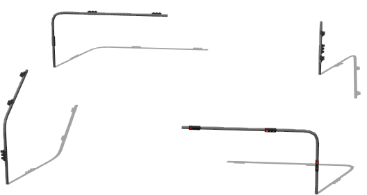

%end

```
CrossRoadsTrafficLight {
  SFVec3f    translation 0 0 0
  SFRotation rotation    0 1 0 0
  SFString   name        "cross road traffic light"
  SFString   controller  "crossroads_traffic_lights"
  SFVec2f    size        20.8 20.8
}
```

> **File location**: "WEBOTS\_HOME/projects/objects/traffic/protos/CrossRoadsTrafficLight.proto"

### CrossRoadsTrafficLight Field Summary

- `controller`: Inherited from [Robot](../reference/robot.md) node.
- `size`: Defines the size of the traffic lights.

## DirectionPanel

Resizable direction panel with two customizable sides.
The 'textSize' fields defines the height (in meter) of one line of text.
List of supported fonts:
- 'Arial'
- 'Arial Black'
- 'Comic Sans MS'
- 'Courier New'
- 'Georgia',
- 'Impact'
- 'Lucida Console'
- 'Lucida Sans Unicode'
- 'Palatino Linotype'
- 'Tahoma'
- 'Times New Roman'
- 'Trebuchet MS'
- 'Verdana'
Alternatively it is possible to add other *.ttf files in the PROJECT\_HOME/fonts directory.

Derived from [Solid](../reference/solid.md).

%figure

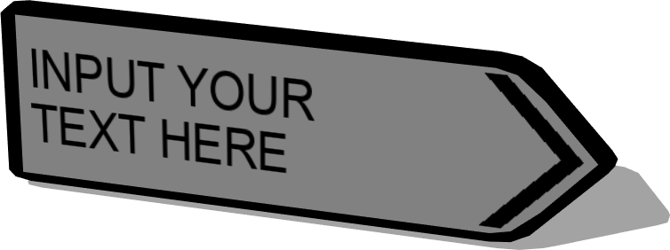

%end

```
DirectionPanel {
  SFVec3f     translation      0 0 0
  SFRotation  rotation         0 1 0 0
  SFString    name             "direction panel"
  SFFloat     width            1.3
  SFFloat     height           0.4
  SFFloat     thickness        0.04
  SFColor     backgroundColor  0.8 0.8 0.8
  SFColor     textColor        0 0 0
  SFFloat     textSize         0.1
  SFString    font             "Arial"
  SFString    text             "INPUT YOUR\nTEXT HERE"
  SFBool      arrow            TRUE
  SFBool      right            TRUE
  SFBool      left             FALSE
}
```

> **File location**: "WEBOTS\_HOME/projects/objects/traffic/protos/DirectionPanel.proto"

### DirectionPanel Field Summary

- `width`: Defines the width of the panel.
- `height`: Defines the height of the panel.
- `thickness`: Defines the thickness of the panel.
- `backgroundColor`: Defines the background color of the panel.
- `textColor`: Defines the color of the text displayed on the panel.
- `textSize`: Defines the size of the text displayed on the panel.
- `font`: Defines the font used by the text displayed on the panel.
- `text`: Defines the text displayed on the panel.
- `arrow`: Defines whether the panel should display an arraw.
- `right`: Defines whether the pannel should draw text on the side pointing toward the right.
- `left`: Defines whether the pannel should draw text on the side pointing toward the left.

## DivergentIndicator

A divergent indicator block.

Derived from [Solid](../reference/solid.md).

%figure


%end

```
DivergentIndicator {
  SFVec3f    translation     0 0 0
  SFRotation rotation        0 1 0 0
  SFString   name            "divergent indicator"
  MFString   texture         "textures/divergent_indicator.jpg"
  SFFloat    height          1
  SFFloat    radius          0.5
  SFInt32    subdivision     24
}
```

> **File location**: "WEBOTS\_HOME/projects/objects/traffic/protos/DivergentIndicator.proto"

### DivergentIndicator Field Summary

- `texture`: Defines the texture used by the divergent indicator.
- `height`: Defines the height of the divergent indicator.
- `radius`: Defines the radius of the divergent indicator.
- `subdivision`: Defines the number of polygons used to represent the divergent indicator cylindrical part and so its resolution .

## ExitPanel

Traffic panel: Exit panel.

Derived from [Solid](../reference/solid.md).

%figure


%end

```
ExitPanel {
  SFVec3f    translation        0 0 0
  SFRotation rotation           0 1 0 0
  SFString   name               "exit panel"
  MFString   signImage          "textures/signs/exit.jpg"
  SFColor    color              0.576471 0.576471 0.576471
  MFColor    recognitionColors  [ 0 0.4 0.3, 0.58 0.58 0.58 ]
}
```

> **File location**: "WEBOTS\_HOME/projects/objects/traffic/protos/ExitPanel.proto"

### ExitPanel Field Summary

- `signImage`: Defines the texture used for the sign.
- `color`: Defines the color of the panel
- `recognitionColors`: Inherited from [Solid](../reference/solid.md) node.

## ExitSign

Traffic sign: Exit sign.

Derived from [Solid](../reference/solid.md).

%figure

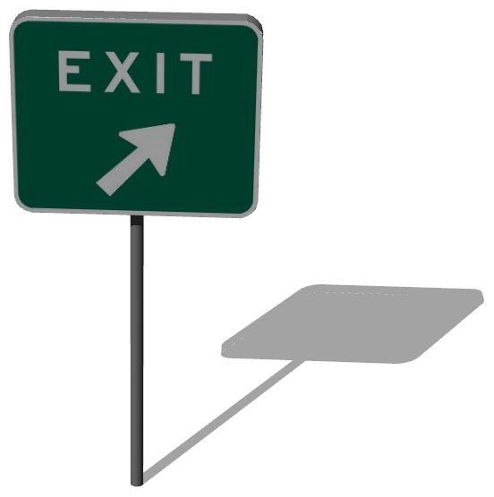

%end

```
ExitSign {
  SFVec3f    translation  0 0 0
  SFRotation rotation     0 1 0 0
  SFString   name         "exit sign"
  SFFloat    height       2
  SFFloat    radius       0.03
  SFColor    color        0.576471 0.576471 0.576471
  MFNode     signBoards   [ ExitPanel { translation 0 -0.051 0 } ]
}
```

> **File location**: "WEBOTS\_HOME/projects/objects/traffic/protos/ExitSign.proto"

### ExitSign Field Summary

- `height`: Defines the height of the sign.
- `radius`: Defines the radius of the sign pole.
- `color`: Defines the color of the panel
- `signBoards`: Defines the boards.

## GenericTrafficLight

A generic traffic light with configurable timming.

Derived from [Robot](../reference/robot.md).

%figure

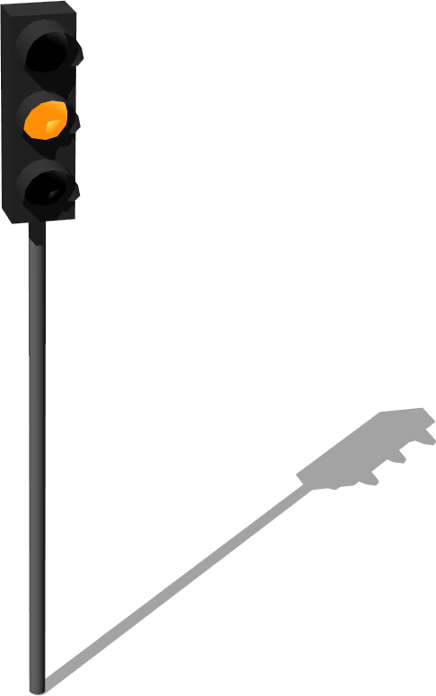

%end

```
GenericTrafficLight {
  SFVec3f    translation 0 0 0
  SFRotation rotation    0 1 0 0
  SFString   name        "generic traffic light"
  SFBool     startGreen  TRUE
  SFFloat    greenTime   60
  SFFloat    redTime     15
  SFString   state       "off"
}
```

> **File location**: "WEBOTS\_HOME/projects/objects/traffic/protos/GenericTrafficLight.proto"

### GenericTrafficLight Field Summary

- `startGreen`: Defines whether the traffic light should start in a 'green' state or 'red' state.
- `greenTime`: Defines how long should be the green state in seconds.
- `redTime`: Defines how long should be the red state in seconds.
- `state`: Defines the current state of the traffic light, this field is automatically updated when the state change.

## HighwayPole

Customizable highway pole with the possibility of adding another stand and more signs along the vertical or horizontal parts of the pole.
Different types of poles are available: "cylinder", "box", or "H-shape".

Derived from [Solid](../reference/solid.md).

%figure


%end

```
HighwayPole {
  SFVec3f     translation           0 0 0
  SFRotation  rotation              0 1 0 0
  SFString    name                  "highway pole"
  SFString    type                  "cylinder"
  SFInt32     stand                 1
  SFFloat     height                6
  SFFloat     length                8
  SFFloat     thickness             0.2
  SFColor     color                 0.258824 0.258824 0.258824
  SFFloat     curveRadius           0.4
  MFNode      rightHorizontalSigns  [ HighwaySign { name "vertical sign" } ]
  MFNode      rightVerticalSigns    [ HighwaySign { name "horizontal sign" height 2.1 length 3.2 texture "textures/highway_sign_la_ciotat.jpg" } ]
  MFNode      leftHorizontalSigns   [ ]
  MFNode      leftVerticalSigns     [ ]
}
```

> **File location**: "WEBOTS\_HOME/projects/objects/traffic/protos/HighwayPole.proto"

### HighwayPole Field Summary

- `stand`: Defines the number of stands.
- `height`: Defines the height of the pole.
- `length`: Defines the length of the pole.
- `thickness`: Defines the thickness of the pole.
- `color`: Defines the color of the pole.
- `curveRadius`: Defines the curvature radius of the pole.
- `rightHorizontalSigns`: Defines the horizontal signs on the right side of the pole.
- `rightVerticalSigns`: Defines the vertical signs on the right side of the pole.
- `leftHorizontalSigns`: Defines the horizontal signs on the left side of the pole.
- `leftVerticalSigns`: Defines the vertical signs on the left side of the pole.

## HighwaySign

Resizable sign with front texture option.

Derived from [Solid](../reference/solid.md).

%figure


%end

```
HighwaySign {
  SFVec3f     translation        0 0 0
  SFRotation  rotation           0 1 0 0
  SFString    name               "highway sign"
  SFFloat     height             3
  SFFloat     length             4.5
  SFFloat     thickness          0.2
  SFColor     color              0.258824 0.258824 0.258824
  MFString    texture            "textures/highway_sign_bordeaux.jpg"
  MFColor     recognitionColors  [ 0.08 0.22 0.75, 0.26 0.26 0.26 ]
}
```

> **File location**: "WEBOTS\_HOME/projects/objects/traffic/protos/HighwaySign.proto"

### HighwaySign Field Summary

- `height`: Defines the height of the sign.
- `length`: Defines the lenght of the sign.
- `thickness`: Defines the thickness of the sign.
- `color`: Defines the color of the sign.
- `texture`: Defines the texture used for the sign.
- `recognitionColors`: Inherited from [Solid](../reference/solid.md) node.

## OrderPanel

Traffic panel: Order panel.

Derived from [Solid](../reference/solid.md).

%figure


%end

```
OrderPanel {
  SFVec3f    translation        0 0 0
  SFRotation rotation           0 1 0 0
  SFString   name               "order panel"
  MFString   signImage          "textures/signs/do_not_enter.jpg"
  SFColor    color              0.576471 0.576471 0.576471
  MFColor    recognitionColors  [ 0.75 0.17 0.22, 0.58 0.58 0.58 ]
}
```

> **File location**: "WEBOTS\_HOME/projects/objects/traffic/protos/OrderPanel.proto"

### OrderPanel Field Summary

- `signImage`: Defines the texture used for the sign.
- `color`: Defines the color of the panel
- `recognitionColors`: Inherited from [Solid](../reference/solid.md) node.

## OrderSign

Traffic sign: Order sign.

Derived from [Solid](../reference/solid.md).

%figure

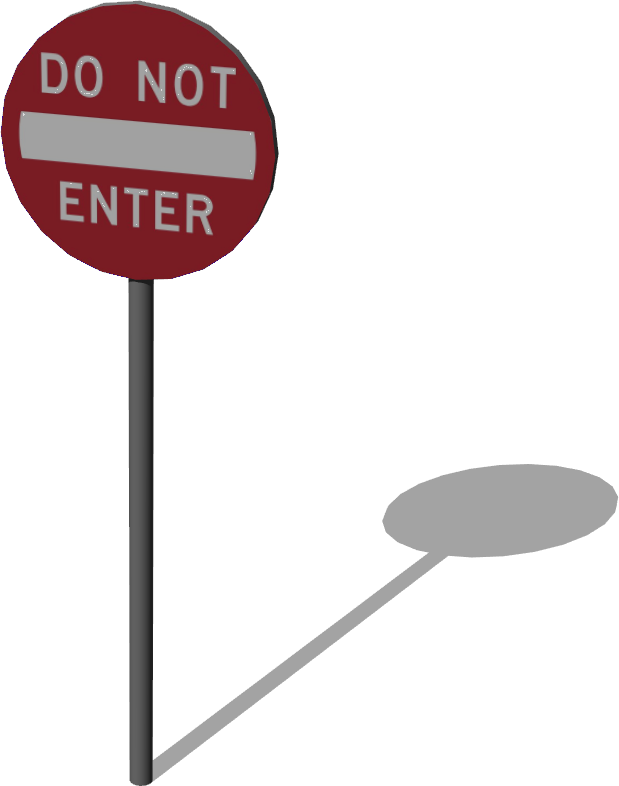

%end

```
OrderSign {
  SFVec3f    translation  0 0 0
  SFRotation rotation     0 1 0 0
  SFString   name         "order sign"
  SFFloat    height       2
  SFFloat    radius       0.03
  SFColor    color        0.576471 0.576471 0.576471
  MFNode     signBoards   [ OrderPanel { translation 0 -0.175 -0.026 } ]
}
```

> **File location**: "WEBOTS\_HOME/projects/objects/traffic/protos/OrderSign.proto"

### OrderSign Field Summary

- `height`: Defines the height of the sign.
- `radius`: Defines the radius of the sign pole.
- `color`: Defines the color of the sign.
- `signBoards`: Defines the boards.

## ParkingLines

Parking lines for several consecutive cars.

Derived from [Transform](../reference/transform.md).

%figure


%end

```
ParkingLines {
  SFVec3f    translation      0 0 0
  SFRotation rotation         0 1 0 0
  SFInt32    numberOfCarParks 5
  SFFloat    carParkLength    4.8
  SFFloat    carParkWidth     2.4
}
```

> **File location**: "WEBOTS\_HOME/projects/objects/traffic/protos/ParkingLines.proto"

### ParkingLines Field Summary

- `numberOfCarParks`: Defines the number of parks.
- `carParkLength`: Defines the length of one park.
- `carParkWidth`: Defines the width of one park.

## PedestrianCrossing

A pedestrian crossing 20 x 8 meters (0.1m thick).

Derived from [Solid](../reference/solid.md).

%figure

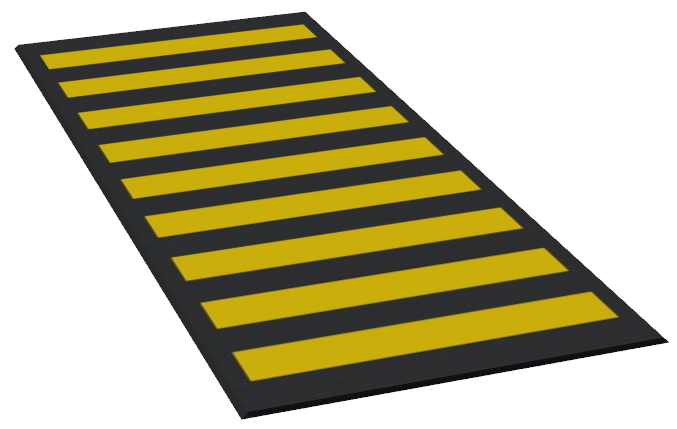

%end

```
PedestrianCrossing {
  SFVec3f    translation      0 0 0
  SFRotation rotation         0 1 0 0
  SFString   name             "pedestrian crossing"
  SFVec2f    size             20 8
  SFInt32    textureFiltering 4
}
```

> **File location**: "WEBOTS\_HOME/projects/objects/traffic/protos/PedestrianCrossing.proto"

### PedestrianCrossing Field Summary

- `size`: Defines the size of the pedestrian crossing.
- `textureFiltering`: Defines the filtering level for the texture used for the pedestrian crossing.

## Pole

A metallic pole for the traffic lights.

Derived from [Solid](../reference/solid.md).

%figure


%end

```
Pole {
  SFVec3f    translation 0 0 0
  SFRotation rotation    0 1 0 0
  SFString   name        "pole"
  MFNode     slot        []
}
```

> **File location**: "WEBOTS\_HOME/projects/objects/traffic/protos/Pole.proto"

### Pole Field Summary

- `slot`: Extends the pole with panels or traffic lights.

## RectangularPanel

A simple rectangular traffic pannel.

Derived from [Solid](../reference/solid.md).

%figure

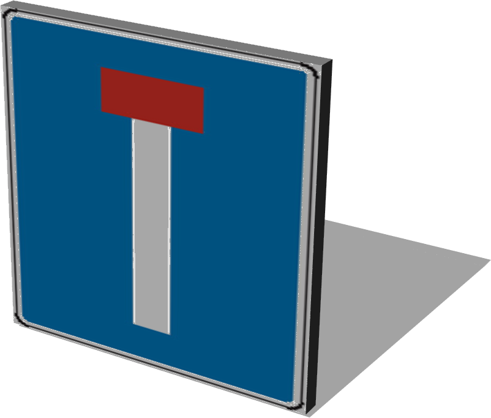

%end

```
RectangularPanel {
  SFVec3f     translation        0 0 0
  SFRotation  rotation           0 1 0 0
  SFString    name               "rectangular panel"
  MFString    signImage          "textures/signs/eu/dead_end.jpg"
  SFColor     color              0.576471 0.576471 0.576471
  SFVec2f     size               0.5 0.5
  MFColor     recognitionColors  [ 0 0.5 0.76, 0.58 0.58 0.58 ]
}
```

> **File location**: "WEBOTS\_HOME/projects/objects/traffic/protos/RectangularPanel.proto"

### RectangularPanel Field Summary

- `signImage`: Defines the texture used for the sign.
- `color`: Defines the color of the panel
- `size`: Defines the size of the panel
- `recognitionColors`: Inherited from [Solid](../reference/solid.md) node.

## SignPole

Customizable direction panel on pole with the possibility of adding more panels.

Derived from [Solid](../reference/solid.md).

%figure

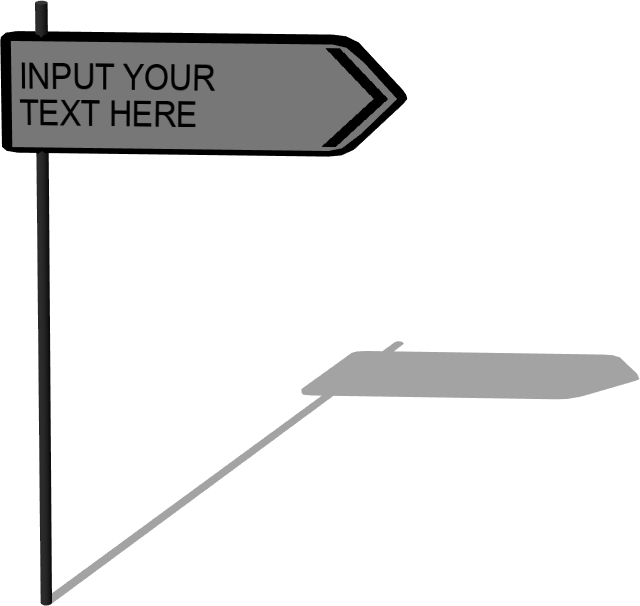

%end

```
SignPole {
  SFVec3f     translation   0 0 0
  SFRotation  rotation      0 1 0 0
  SFString    name          "sign pole"
  SFFloat     height        2.2
  SFFloat     radius        0.02
  SFColor     color         0.258824 0.258824 0.258824
  MFNode      signBoards    [ DirectionPanel {} ]
}
```

> **File location**: "WEBOTS\_HOME/projects/objects/traffic/protos/SignPole.proto"

### SignPole Field Summary

- `height`: Defines the height of the sign.
- `radius`: Defines the radius of the sign.
- `color`: Defines the color of the sign.
- `signBoards`: Defines the boards.

## SpeedLimitPanel

Traffic panel: Speed limit panel (5mph to 80mph) or one way panel.

Derived from [Solid](../reference/solid.md).

%figure


%end

```
SpeedLimitPanel {
  SFVec3f     translation        0 0 0
  SFRotation  rotation           0 1 0 0
  SFString    name               "speed limit panel"
  MFString    signImage          "textures/signs/us/speed_limit_45.jpg"
  SFColor     color              0.576471 0.576471 0.576471
  MFColor     recognitionColors  [ 1 1 1, 0.58 0.58 0.58 ]
}
```

> **File location**: "WEBOTS\_HOME/projects/objects/traffic/protos/SpeedLimitPanel.proto"

### SpeedLimitPanel Field Summary

- `signImage`: Defines the texture used for the sign.
- `color`: Defines the color of the panel
- `recognitionColors`: Inherited from [Solid](../reference/solid.md) node.

## SpeedLimitSign

Traffic sign: Speed limit sign (5mph to 80mph) or one way sign.

Derived from [Solid](../reference/solid.md).

%figure


%end

```
SpeedLimitSign {
  SFVec3f    translation  0 0 0
  SFRotation rotation     0 1 0 0
  SFString   name         "speed limit"
  SFFloat    height       2
  SFFloat    radius       0.03
  SFColor    color        0.576471 0.576471 0.576471
  MFNode     signBoards   [ SpeedLimitPanel { translation 0 0 -0.023 } ]
}
```

> **File location**: "WEBOTS\_HOME/projects/objects/traffic/protos/SpeedLimitSign.proto"

### SpeedLimitSign Field Summary

- `height`: Defines the height of the sign.
- `radius`: Defines the radius of the sign pole.
- `color`: Defines the color of the sign.
- `signBoards`: Defines the boards.

## StopPanel

Traffic panel: Stop panel.

Derived from [Solid](../reference/solid.md).

%figure

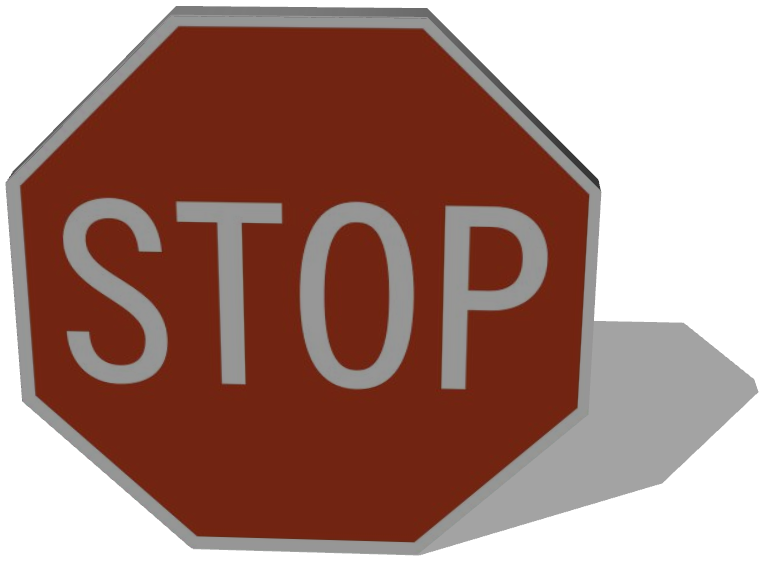

%end

```
StopPanel {
  SFVec3f    translation        0 0 0
  SFRotation rotation           0 1 0 0
  SFString   name               "stop panel"
  MFString   signImage          "textures/signs/stop.jpg"
  SFColor    color              0.576471 0.576471 0.576471
  MFColor    recognitionColors  [ 0.75 0.25 0.12, 0.58 0.58 0.58 ]
}
```

> **File location**: "WEBOTS\_HOME/projects/objects/traffic/protos/StopPanel.proto"

### StopPanel Field Summary

- `signImage`: Defines the texture used for the sign.
- `color`: Defines the color of the panel
- `recognitionColors`: Inherited from [Solid](../reference/solid.md) node.

## StopSign

Traffic sign: Stop sign.

Derived from [Solid](../reference/solid.md).

%figure


%end

```
StopSign {
  SFVec3f    translation  0 0 0
  SFRotation rotation     0 1 0 0
  SFString   name         "stop sign"
  SFFloat    height       2
  SFFloat    radius       0.03
  SFColor    color        0.576471 0.576471 0.576471
  MFNode     signBoards   [ StopPanel { translation 0 -0.097 0 } ]
}
```

> **File location**: "WEBOTS\_HOME/projects/objects/traffic/protos/StopSign.proto"

### StopSign Field Summary

- `height`: Defines the height of the sign.
- `radius`: Defines the radius of the sign pole.
- `color`: Defines the color of the sign.
- `signBoards`: Defines the boards.

## StreetLight

Simple model of a street light including a customizable SpotLight.
This model was sponsored by the CTI project RO2IVSim ([http://transport.epfl.ch/simulator-for-mobile-robots-and-intelligent-vehicles](http://transport.epfl.ch/simulator-for-mobile-robots-and-intelligent-vehicles)).

Derived from [Solid](../reference/solid.md).

%figure


%end

```
StreetLight {
  SFVec3f    translation   0 0 0
  SFRotation rotation      0 1 0 0
  SFString   name          "street light"
  SFVec3f    attenuation   1 0 0
  SFFloat    beamWidth     1.1
  SFColor    color         1 0.9 0.8
  SFFloat    cutOffAngle   1.57
  SFVec3f    direction     0 -1 -0.1
  SFBool     on            TRUE
  SFFloat    radius        50
  SFBool     castShadows   FALSE
}
```

> **File location**: "WEBOTS\_HOME/projects/objects/traffic/protos/StreetLight.proto"

> **License**: Creative Commons Attribution 3.0 United States License (original model by Andrew Kator & Jennifer Legaz)

### StreetLight Field Summary

- `beamWidth`: Defines the beam width of the spot light.
- `color`: Defines the color of the spot light.
- `cutOffAngle`: Defines the cut-off angle of the spot light.
- `direction`: Defines the direction of the spot light.
- `on`: Defines whether the spot light is on or off.
- `radius`: Defines the radius of the spot light.
- `castShadows`: Defines whether the spot light casts shadows.

## TrafficCone

Traffic cone.

Derived from [Solid](../reference/solid.md).

%figure


%end

```
TrafficCone {
  SFVec3f    translation 0 0 0
  SFRotation rotation    0 1 0 0
  SFString   name        "traffic cone"
  SFNode     physics     NULL
}
```

> **File location**: "WEBOTS\_HOME/projects/objects/traffic/protos/TrafficCone.proto"

### TrafficCone Field Summary

- `physics`: Inherited from [Solid](../reference/solid.md) node.

## TrafficLight

Basic traffic light without lamp.

Derived from [Solid](../reference/solid.md).

%figure


%end

```
TrafficLight {
  SFVec3f    translation        0 0 0
  SFRotation rotation           0 1 0 0
  SFString   name               "traffic light"
  SFString   red_light          "red light"
  SFString   orange_light       "orange light"
  SFString   green_light        "green light"
  SFNode     lamp_geometry      NULL
  SFRotation lamp_rotation      0 0 1 0
  MFColor    recognitionColors  [ 0.25 0.25 0.25, 0 0 0 ]
}
```

> **File location**: "WEBOTS\_HOME/projects/objects/traffic/protos/TrafficLight.proto"

### TrafficLight Field Summary

- `red_light`: Defines the name of the red LED device.
- `orange_light`: Defines the name of the orange LED device.
- `green_light`: Defines the name of the green LED device.
- `lamp_geometry`: Defines the geometry of the lamps.
- `lamp_rotation`: Defines the rotation of the lamps.
- `recognitionColors`: Inherited from [Solid](../reference/solid.md) node.

## TrafficLightArrowLampGeometry

A traffic light lamp with an adjustable arrow.

Derived from [IndexedFaceSet](../reference/indexedfaceset.md).

%figure


%end

```
TrafficLightArrowLampGeometry {
}
```

> **File location**: "WEBOTS\_HOME/projects/objects/traffic/protos/TrafficLightArrowLampGeometry.proto"

## TrafficLightBigPole

A big metallic pole above the road for traffic lights.

Derived from [Solid](../reference/solid.md).

%figure

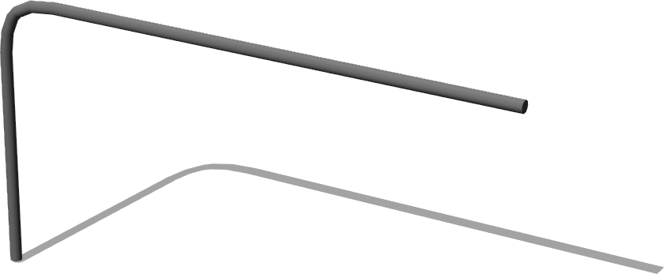

%end

```
TrafficLightBigPole {
  SFVec3f    translation 0 0 0
  SFRotation rotation    0 1 0 0
  SFString   name        "traffic light big pole"
  MFNode     slot1       []
  MFNode     slot2       []
  MFNode     slot3       []
}
```

> **File location**: "WEBOTS\_HOME/projects/objects/traffic/protos/TrafficLightBigPole.proto"

### TrafficLightBigPole Field Summary

- `slot1`: Extends the pole with a traffic light located in the middle of the vertical part of the pole.
- `slot2`: Extends the pole with a traffic light located in the begining of the horizontal part of the pole.
- `slot3`: Extends the pole with a traffic light located in the end of the horizontal part of the pole.

## TrafficLightHorizontal

Horizontal traffic light without lamp to put on the big pole above the road.

Derived from [Solid](../reference/solid.md).

%figure


%end

```
TrafficLightHorizontal {
  SFVec3f    translation        0 0 0
  SFRotation rotation           0 1 0 0
  SFString   name               "horizontal traffic light"
  SFString   red_light          "red light"
  SFString   orange_light       "orange light"
  SFString   green_light        "green light"
  SFNode     lamp_geometry      NULL
  SFRotation lamp_rotation      0 0 1 0
  MFColor    recognitionColors  [ 0.25 0.25 0.25, 0 0 0 ]
}
```

> **File location**: "WEBOTS\_HOME/projects/objects/traffic/protos/TrafficLightHorizontal.proto"

### TrafficLightHorizontal Field Summary

- `red_light`: Defines the name of the red LED device.
- `orange_light`: Defines the name of the orange LED device.
- `green_light`: Defines the name of the green LED device.
- `lamp_geometry`: Defines the geometry of the lamps.
- `lamp_rotation`: Defines the rotation of the lamps.
- `recognitionColors`: Inherited from [Solid](../reference/solid.md) node.

## TrafficLightStandardLampGeometry

A traffic light lamp with a standard geometry.

Derived from [Sphere](../reference/sphere.md).

%figure

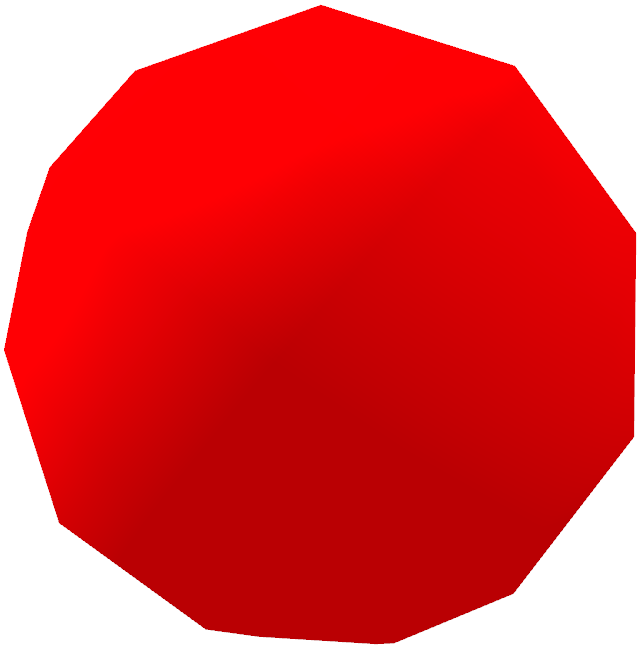

%end

```
TrafficLightStandardLampGeometry {
}
```

> **File location**: "WEBOTS\_HOME/projects/objects/traffic/protos/TrafficLightStandardLampGeometry.proto"

## YieldPanel

Traffic panel: Yield panel.

Derived from [Solid](../reference/solid.md).

%figure

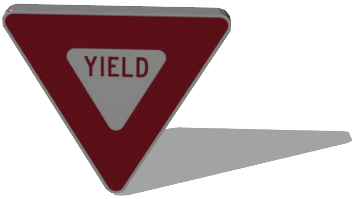

%end

```
YieldPanel {
  SFVec3f     translation        0 0 0
  SFRotation  rotation           0 1 0 0
  SFString    name               "yield panel"
  MFString    signImage          "textures/signs/us/yield.jpg"
  SFColor     color              0.576471 0.576471 0.576471
  SFFloat     textureRotation    0
  MFColor     recognitionColors  [ 0.7 0.12 0.18, 0.58 0.58 0.58 ]
}
```

> **File location**: "WEBOTS\_HOME/projects/objects/traffic/protos/YieldPanel.proto"

### YieldPanel Field Summary

- `signImage`: Defines the texture used for the sign.
- `color`: Defines the color of the panel
- `textureRotation`: Defines the rotation of the texture used for the sign.
- `recognitionColors`: Inherited from [Solid](../reference/solid.md) node.

## YieldSign

Traffic sign: Yield sign.

Derived from [Solid](../reference/solid.md).

%figure

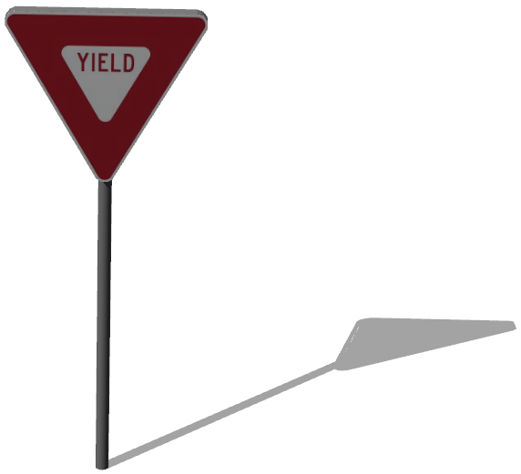

%end

```
YieldSign {
  SFVec3f    translation  0 0 0
  SFRotation rotation     0 1 0 0
  SFString   name         "yield sign"
  SFFloat    height       2
  SFFloat    radius       0.03
  SFColor    color        0.576471 0.576471 0.576471
  MFNode     signBoards   [ YieldPanel { } ]
}
```

> **File location**: "WEBOTS\_HOME/projects/objects/traffic/protos/YieldSign.proto"

### YieldSign Field Summary

- `height`: Defines the height of the sign.
- `radius`: Defines the radius of the sign pole.
- `color`: Defines the color of the sign.
- `signBoards`: Defines the boards.

