# Traffic

## CautionPanel

%figure "CautionPanel"


%end

```
CautionPanel {
   SFVec3f    translation 0 0 0
   SFRotation rotation    0 1 0 0
   SFString   name        "caution panel"
   MFString   signImage   "textures/signs/us/traffic_signals_ahead.jpg"
   SFColor    color       0.576471 0.576471 0.576471
   MFColor    recognitionColors  [ 1 0.82 0.2, 0.58 0.58 0.58 ]
}
```

> **File location**: "WEBOTS\_HOME/projects/objects/traffic/protos/CautionPanel.proto"

### Description

Traffic panel: Caution panel.

## CautionSign

%figure "CautionSign"


%end

```
CautionSign {
   SFVec3f    translation  0 0 0
   SFRotation rotation     0 1 0 0
   SFString   name         "caution sign"
   SFFloat    height       2
   SFFloat    radius       0.03
   SFColor    color        0.576471 0.576471 0.576471
   MFNode     signBoards   [ CautionPanel { translation 0 -0.17 0 } ]
}
```

> **File location**: "WEBOTS\_HOME/projects/objects/traffic/protos/CautionSign.proto"

### Description

Traffic sign: Caution sign.

## ControlledStreetLight

%figure "ControlledStreetLight"

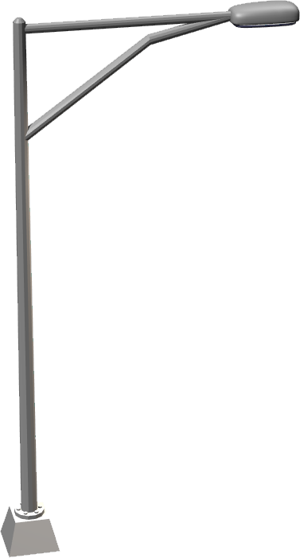

%end

```
ControlledStreetLight {
   SFVec3f    translation  0 0 0
   SFRotation rotation     0 1 0 0
   SFString   name         "street light"
   SFString   controller   "defective_street_light"
   SFFloat    beamWidth    1.1
   MFColor    color        [ 1 0.9 0.8 ]
   SFFloat    cutOffAngle  1.57
   SFVec3f    direction    0 -1 -0.1
   SFFloat    radius       50
   SFBool     castShadows  FALSE
}
```

> **File location**: "WEBOTS\_HOME/projects/objects/traffic/protos/ControlledStreetLight.proto"

> **License**: Creative Commons Attribution 3.0 United States License (original model by Andrew Kator & Jennifer Legaz)

### Description

Simple model of a controlled street light including a customizable SpotLight

## CrossRoadsTrafficLight

%figure "CrossRoadsTrafficLight"


%end

```
CrossRoadsTrafficLight {
   SFVec3f    translation 0 0 0
   SFRotation rotation    0 1 0 0
   SFString   name        "cross road traffic light"
   SFString   controller  "crossroads_traffic_lights"
   SFVec2f    size        20.8 20.8
}
```

> **File location**: "WEBOTS\_HOME/projects/objects/traffic/protos/CrossRoadsTrafficLight.proto"

### Description

Four roads crossing traffic light.

## DirectionPanel

%figure "DirectionPanel"


%end

```
DirectionPanel {
   SFVec3f     translation      0 0 0
   SFRotation  rotation         0 1 0 0
   SFString    name             "direction panel"
   SFFloat     width            1.3
   SFFloat     height           0.4
   SFFloat     thickness        0.04
   SFColor     backgroundColor  0.8 0.8 0.8
   SFColor     textColor        0 0 0
   SFFloat     textSize         0.1
   SFString    font             "Arial"
   SFString    text             "INPUT YOUR\nTEXT HERE"
   SFBool      arrow            TRUE
   SFBool      right            TRUE
   SFBool      left             FALSE
}
```

> **File location**: "WEBOTS\_HOME/projects/objects/traffic/protos/DirectionPanel.proto"

### Description

Resizable direction panel with two customizable sides.
The 'textSize' fields defines the height (in meter) of one line of text
List of supported fonts:'Arial', 'Arial Black', 'Comic Sans MS', 'Courier New', 'Georgia',
'Impact', 'Lucida Console', 'Lucida Sans Unicode', 'Palatino Linotype',
'Tahoma', 'Times New Roman', 'Trebuchet MS', 'Verdana'
Alternatively it is possible to add other *.ttf files in the PROJECT\_HOME/fonts directory

## DivergentIndicator

%figure "DivergentIndicator"

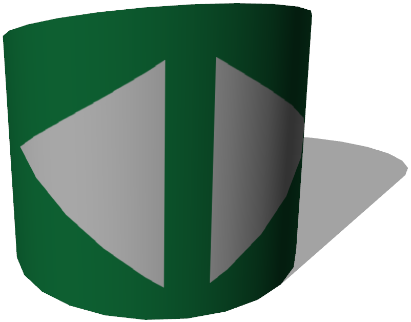

%end

```
DivergentIndicator {
   SFVec3f    translation     0 0 0
   SFRotation rotation        0 1 0 0
   SFString   name            "divergent indicator"
   MFString   texture         "textures/divergent_indicator.jpg"
   SFFloat    height          1
   SFFloat    radius          0.5
   SFInt32    subdivision     24
}
```

> **File location**: "WEBOTS\_HOME/projects/objects/traffic/protos/DivergentIndicator.proto"

### Description

A divergent indicator block.

## ExitPanel

%figure "ExitPanel"

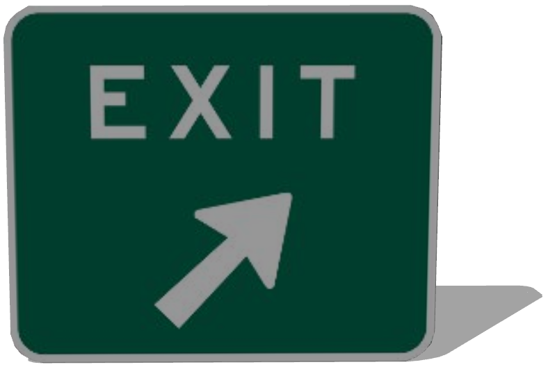

%end

```
ExitPanel {
   SFVec3f    translation 0 0 0
   SFRotation rotation    0 1 0 0
   SFString   name        "exit panel"
   MFString   signImage   "textures/signs/exit.jpg"
   SFColor    color       0.576471 0.576471 0.576471
   MFColor    recognitionColors  [ 0 0.4 0.3, 0.58 0.58 0.58 ]
}
```

> **File location**: "WEBOTS\_HOME/projects/objects/traffic/protos/ExitPanel.proto"

### Description

Traffic panel: Exit panel.

## ExitSign

%figure "ExitSign"


%end

```
ExitSign {
   SFVec3f    translation  0 0 0
   SFRotation rotation     0 1 0 0
   SFString   name         "exit sign"
   SFFloat    height       2
   SFFloat    radius       0.03
   SFColor    color        0.576471 0.576471 0.576471
   MFNode     signBoards   [ ExitPanel { translation 0 -0.051 0 } ]
}
```

> **File location**: "WEBOTS\_HOME/projects/objects/traffic/protos/ExitSign.proto"

### Description

Traffic sign: Exit sign.

## GenericTrafficLight

%figure "GenericTrafficLight"


%end

```
GenericTrafficLight {
   SFVec3f    translation 0 0 0
   SFRotation rotation    0 1 0 0
   SFString   name        "generic traffic light"
   SFBool     startGreen  TRUE
   SFFloat    greenTime   60
   SFFloat    redTime     15
   SFString   state       "off"
}
```

> **File location**: "WEBOTS\_HOME/projects/objects/traffic/protos/GenericTrafficLight.proto"

### Description

Generic traffic light

## HighwayPole

%figure "HighwayPole"

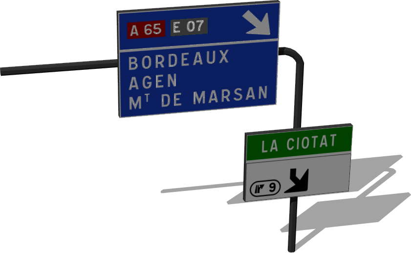

%end

```
HighwayPole {
   SFVec3f     translation           0 0 0
   SFRotation  rotation              0 1 0 0
   SFString    name                  "highway pole"
   SFString    type                  "cylinder"
   SFInt32     stand                 1
   SFFloat     height                6
   SFFloat     length                8
   SFFloat     thickness             0.2
   SFColor     color                 0.258824 0.258824 0.258824
   SFFloat     curveRadius           0.4
   MFNode      rightHorizontalSigns  [ HighwaySign { name "vertical sign" } ]
   MFNode      rightVerticalSigns    [ HighwaySign { name "horizontal sign" height 2.1 length 3.2 texture "textures/highway_sign_la_ciotat.jpg" } ]
   MFNode      leftHorizontalSigns   [ ]
   MFNode      leftVerticalSigns     [ ]
}
```

> **File location**: "WEBOTS\_HOME/projects/objects/traffic/protos/HighwayPole.proto"

### Description

Customizable highway pole with the possibility of adding another stand and more signs along the vertical or horizontal parts of the pole.
Different types of poles are available: "cylinder", "box", or "H-shape".

## HighwaySign

%figure "HighwaySign"

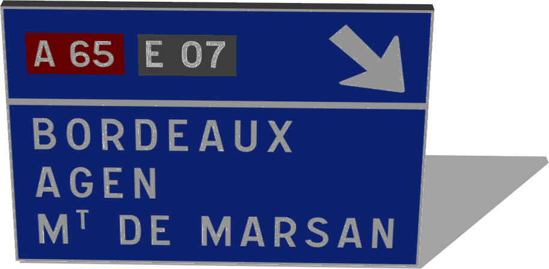

%end

```
HighwaySign {
   SFVec3f     translation   0 0 0
   SFRotation  rotation      0 1 0 0
   SFString    name          "highway sign"
   SFFloat     height        3
   SFFloat     length        4.5
   SFFloat     thickness     0.2
   SFColor     color         0.258824 0.258824 0.258824
   MFString    texture       "textures/highway_sign_bordeaux.jpg"
   MFColor     recognitionColors  [ 0.08 0.22 0.75, 0.26 0.26 0.26 ]
}
```

> **File location**: "WEBOTS\_HOME/projects/objects/traffic/protos/HighwaySign.proto"

### Description

Resizable sign with front texture option.

## OrderPanel

%figure "OrderPanel"


%end

```
OrderPanel {
   SFVec3f    translation 0 0 0
   SFRotation rotation    0 1 0 0
   SFString   name        "order panel"
   MFString   signImage   "textures/signs/do_not_enter.jpg"
   SFColor    color       0.576471 0.576471 0.576471
   MFColor    recognitionColors  [ 0.75 0.17 0.22, 0.58 0.58 0.58 ]
}
```

> **File location**: "WEBOTS\_HOME/projects/objects/traffic/protos/OrderPanel.proto"

### Description

Traffic panel: Order panel.

## OrderSign

%figure "OrderSign"


%end

```
OrderSign {
   SFVec3f    translation  0 0 0
   SFRotation rotation     0 1 0 0
   SFString   name         "order sign"
   SFFloat    height       2
   SFFloat    radius       0.03
   SFColor    color        0.576471 0.576471 0.576471
   MFNode     signBoards   [ OrderPanel { translation 0 -0.175 -0.026 } ]
}
```

> **File location**: "WEBOTS\_HOME/projects/objects/traffic/protos/OrderSign.proto"

### Description

Traffic sign: Order sign.

## ParkingLines

%figure "ParkingLines"

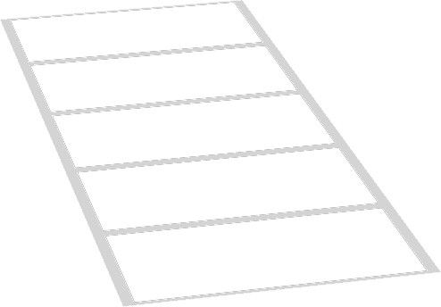

%end

```
ParkingLines {
   SFVec3f    translation      0 0 0
   SFRotation rotation         0 1 0 0
   SFInt32    numberOfCarParks 5
   SFFloat    carParkLength    4.8
   SFFloat    carParkWidth     2.4
}
```

> **File location**: "WEBOTS\_HOME/projects/objects/traffic/protos/ParkingLines.proto"

### Description

Parking lines for several consecutive cars.

## PedestrianCrossing

%figure "PedestrianCrossing"


%end

```
PedestrianCrossing {
   SFVec3f    translation      0 0 0
   SFRotation rotation         0 1 0 0
   SFString   name             "pedestrian crossing"
   SFVec2f    size             20 8
   SFInt32    textureFiltering 4
}
```

> **File location**: "WEBOTS\_HOME/projects/objects/traffic/protos/PedestrianCrossing.proto"

### Description

Pedestrian crossing 20 x 8 meters
Elevation 10 cm

## Pole

%figure "Pole"

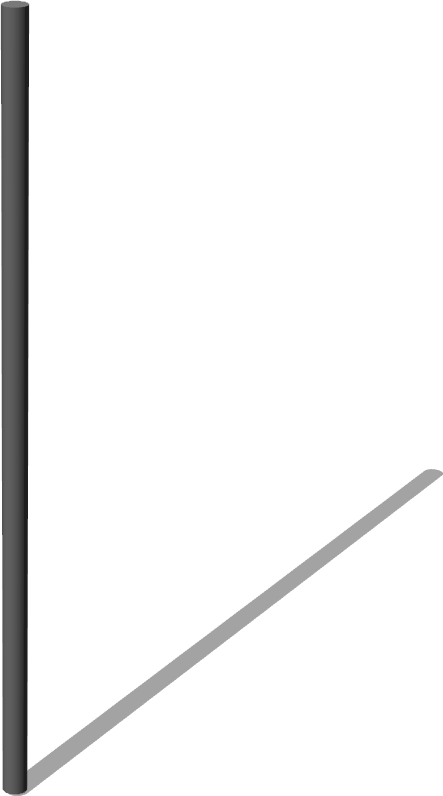

%end

```
Pole {
   SFVec3f translation 0 0 0
   SFRotation rotation 0 1 0 0
   SFString name "pole"
   MFNode slot [ ]
}
```

> **File location**: "WEBOTS\_HOME/projects/objects/traffic/protos/Pole.proto"

### Description

A metallic pole for the traffic lights.

## RectangularPanel

%figure "RectangularPanel"


%end

```
RectangularPanel {
   SFVec3f     translation 0 0 0
   SFRotation  rotation    0 1 0 0
   SFString    name        "rectangular panel"
   MFString    signImage   "textures/signs/eu/dead_end.jpg"
   SFColor     color       0.576471 0.576471 0.576471
   SFVec2f     size        0.5 0.5
   MFColor     recognitionColors  [ 0 0.5 0.76, 0.58 0.58 0.58 ]
}
```

> **File location**: "WEBOTS\_HOME/projects/objects/traffic/protos/RectangularPanel.proto"

### Description

simple rectangular traffic pannel

## SignPole

%figure "SignPole"


%end

```
SignPole {
   SFVec3f     translation   0 0 0
   SFRotation  rotation      0 1 0 0
   SFString    name          "sign pole"
   SFFloat     height        2.2
   SFFloat     radius        0.02
   SFColor     color         0.258824 0.258824 0.258824
   MFNode      signBoards    [ DirectionPanel {} ]
}
```

> **File location**: "WEBOTS\_HOME/projects/objects/traffic/protos/SignPole.proto"

### Description

Customizable direction panel on pole with the possibility of adding more panels.

## SpeedLimitPanel

%figure "SpeedLimitPanel"

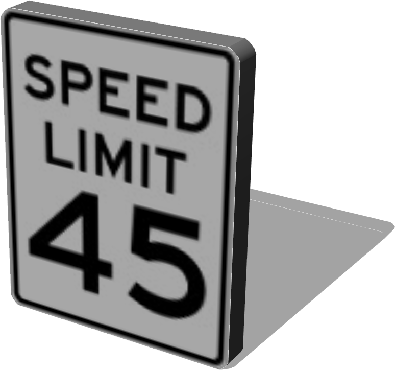

%end

```
SpeedLimitPanel {
   SFVec3f     translation 0 0 0
   SFRotation  rotation    0 1 0 0
   SFString    name        "speed limit panel"
   MFString    signImage   "textures/signs/us/speed_limit_45.jpg"
   SFColor     color       0.576471 0.576471 0.576471
   MFColor     recognitionColors  [ 1 1 1, 0.58 0.58 0.58 ]
}
```

> **File location**: "WEBOTS\_HOME/projects/objects/traffic/protos/SpeedLimitPanel.proto"

### Description

Traffic panel: Speed limit panel (5mph to 80mph) or one way panel.

## SpeedLimitSign

%figure "SpeedLimitSign"

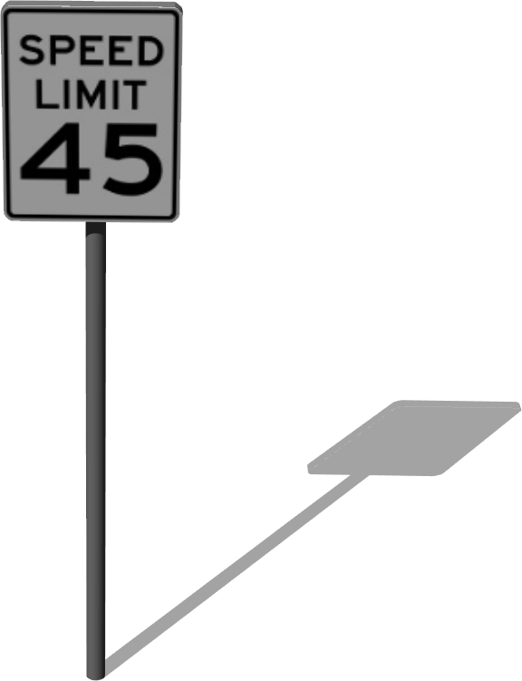

%end

```
SpeedLimitSign {
   SFVec3f    translation  0 0 0
   SFRotation rotation     0 1 0 0
   SFString   name         "speed limit"
   SFFloat    height       2
   SFFloat    radius       0.03
   SFColor    color        0.576471 0.576471 0.576471
   MFNode     signBoards   [ SpeedLimitPanel { translation 0 0 -0.023 } ]
}
```

> **File location**: "WEBOTS\_HOME/projects/objects/traffic/protos/SpeedLimitSign.proto"

### Description

Traffic sign: Speed limit sign (5mph to 80mph) or one way sign.

## StopPanel

%figure "StopPanel"


%end

```
StopPanel {
   SFVec3f    translation 0 0 0
   SFRotation rotation    0 1 0 0
   SFString   name        "stop panel"
   MFString   signImage   "textures/signs/stop.jpg"
   SFColor    color       0.576471 0.576471 0.576471
   MFColor    recognitionColors  [ 0.75 0.25 0.12, 0.58 0.58 0.58 ]
}
```

> **File location**: "WEBOTS\_HOME/projects/objects/traffic/protos/StopPanel.proto"

### Description

Traffic panel: Stop panel.

## StopSign

%figure "StopSign"

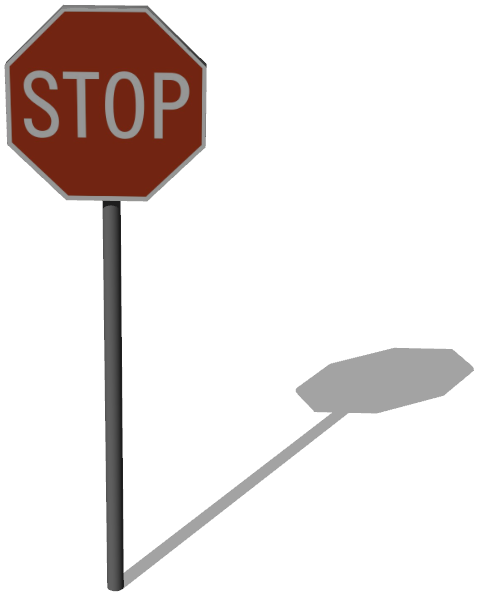

%end

```
StopSign {
   SFVec3f    translation  0 0 0
   SFRotation rotation     0 1 0 0
   SFString   name         "stop sign"
   SFFloat    height       2
   SFFloat    radius       0.03
   SFColor    color        0.576471 0.576471 0.576471
   MFNode     signBoards   [ StopPanel { translation 0 -0.097 0 } ]
}
```

> **File location**: "WEBOTS\_HOME/projects/objects/traffic/protos/StopSign.proto"

### Description

Traffic sign: Stop sign.

## StreetLight

%figure "StreetLight"


%end

```
StreetLight {
   SFVec3f    translation   0 0 0
   SFRotation rotation      0 1 0 0
   SFString   name          "street light"
   SFVec3f    attenuation   1 0 0
   SFFloat    beamWidth     1.1
   SFColor    color         1 0.9 0.8
   SFFloat    cutOffAngle   1.57
   SFVec3f    direction     0 -1 -0.1
   SFBool     on            TRUE
   SFFloat    radius        50
   SFBool     castShadows   FALSE
}
```

> **File location**: "WEBOTS\_HOME/projects/objects/traffic/protos/StreetLight.proto"

> **License**: Creative Commons Attribution 3.0 United States License (original model by Andrew Kator & Jennifer Legaz)

### Description

Simple model of a street light including a customizable SpotLight
This model was sponsored by the CTI project RO2IVSim ([http://transport.epfl.ch/simulator-for-mobile-robots-and-intelligent-vehicles](http://transport.epfl.ch/simulator-for-mobile-robots-and-intelligent-vehicles))

## TrafficCone

%figure "TrafficCone"


%end

```
TrafficCone {
   SFVec3f translation 0 0 0
   SFRotation rotation 0 1 0 0
   SFString name "traffic cone"
   SFNode physics NULL
}
```

> **File location**: "WEBOTS\_HOME/projects/objects/traffic/protos/TrafficCone.proto"

### Description

Traffic cone.

## TrafficLight

%figure "TrafficLight"

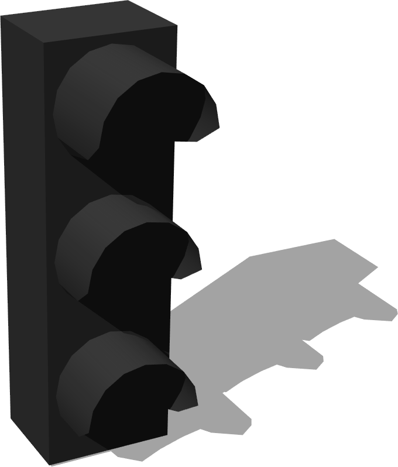

%end

```
TrafficLight {
   SFVec3f translation 0 0 0
   SFRotation rotation 0 1 0 0
   SFString name "traffic light"
   SFString red_light "red light"
   SFString orange_light "orange light"
   SFString green_light "green light"
   SFNode lamp_geometry NULL
   SFRotation lamp_rotation 0 0 1 0
   MFColor recognitionColors  [ 0.25 0.25 0.25, 0 0 0 ]
}
```

> **File location**: "WEBOTS\_HOME/projects/objects/traffic/protos/TrafficLight.proto"

### Description

Basic traffic light without lamp.

## TrafficLightArrowLampGeometry

%figure "TrafficLightArrowLampGeometry"

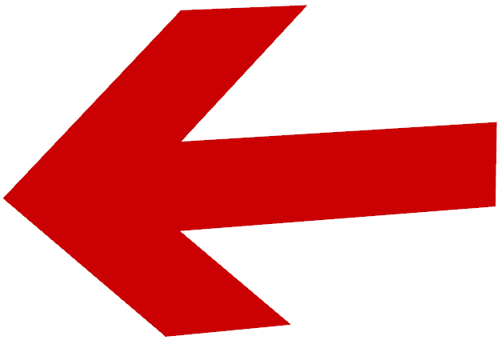

%end

```
TrafficLightArrowLampGeometry {
}
```

> **File location**: "WEBOTS\_HOME/projects/objects/traffic/protos/TrafficLightArrowLampGeometry.proto"

### Description

A traffic light lamp with an adjustable arrow.

## TrafficLightBigPole

%figure "TrafficLightBigPole"


%end

```
TrafficLightBigPole {
   SFVec3f translation 0 0 0
   SFRotation rotation 0 1 0 0
   SFString name "traffic light big pole"
   MFNode slot1 [ ]
   MFNode slot2 [ ]
   MFNode slot3 [ ]
}
```

> **File location**: "WEBOTS\_HOME/projects/objects/traffic/protos/TrafficLightBigPole.proto"

### Description

A big metallic pole above the road for traffic lights.

## TrafficLightHorizontal

%figure "TrafficLightHorizontal"

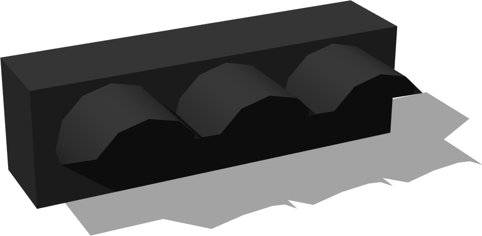

%end

```
TrafficLightHorizontal {
   SFVec3f translation 0 0 0
   SFRotation rotation 0 1 0 0
   SFString name "horizontal traffic light"
   SFString red_light "red light"
   SFString orange_light "orange light"
   SFString green_light "green light"
   SFNode lamp_geometry NULL
   SFRotation lamp_rotation 0 0 1 0
   MFColor recognitionColors  [ 0.25 0.25 0.25, 0 0 0 ]
}
```

> **File location**: "WEBOTS\_HOME/projects/objects/traffic/protos/TrafficLightHorizontal.proto"

### Description

Horizontal traffic light without lamp to put on the big pole above the road.

## TrafficLightStandardLampGeometry

%figure "TrafficLightStandardLampGeometry"


%end

```
TrafficLightStandardLampGeometry {
}
```

> **File location**: "WEBOTS\_HOME/projects/objects/traffic/protos/TrafficLightStandardLampGeometry.proto"

### Description

A traffic light lamp with a standard geometry.

## YieldPanel

%figure "YieldPanel"


%end

```
YieldPanel {
   SFVec3f     translation      0 0 0
   SFRotation  rotation         0 1 0 0
   SFString    name             "yield panel"
   MFString    signImage        "textures/signs/us/yield.jpg"
   SFColor     color            0.576471 0.576471 0.576471
   SFFloat     textureRotation  0
   MFColor     recognitionColors  [ 0.7 0.12 0.18, 0.58 0.58 0.58 ]
}
```

> **File location**: "WEBOTS\_HOME/projects/objects/traffic/protos/YieldPanel.proto"

### Description

Traffic panel: Yield panel.

## YieldSign

%figure "YieldSign"


%end

```
YieldSign {
   SFVec3f    translation  0 0 0
   SFRotation rotation     0 1 0 0
   SFString   name         "yield sign"
   SFFloat    height       2
   SFFloat    radius       0.03
   SFColor    color        0.576471 0.576471 0.576471
   MFNode     signBoards   [ YieldPanel { } ]
}
```

> **File location**: "WEBOTS\_HOME/projects/objects/traffic/protos/YieldSign.proto"

### Description

Traffic sign: Yield sign.

