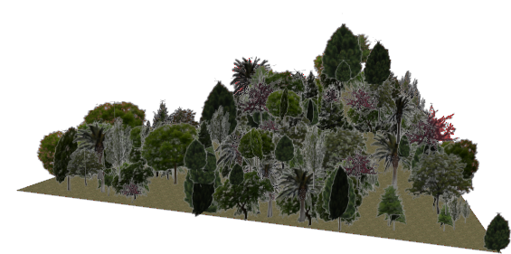
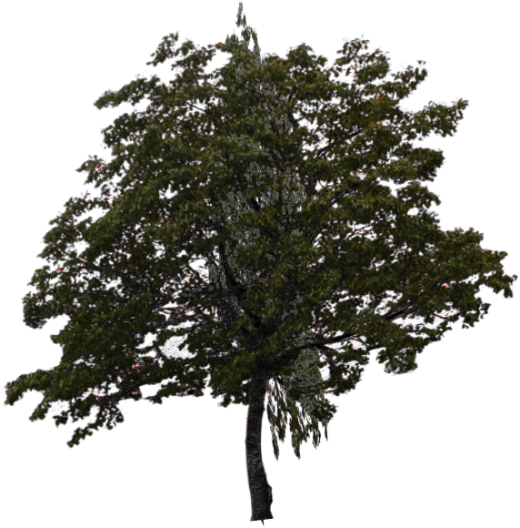

# Trees

## Forest

%figure "Forest model in Webots."



%end

```
Forest {
       SFVec3f    translation          0 0 0
       SFRotation rotation             0 1 0 0
       MFString   treesFiles           [ ]                       
       MFVec2f    shape                [ -20 -10, 20 -10, 0 25]  
       SFFloat    density              0.2                       
       SFString   type                 "random"                  
       MFString   groundTexture        ["textures/dry_leaf.jpg"] 
       SFBool     withSnow             FALSE                     
       SFFloat    maxHeight            6                         
       SFFloat    minHeight            2                         
       SFFloat    maxRadius            3                         
       SFFloat    minRadius            1                         
}
```

> **File location**: "WEBOTS\_HOME/projects/objects/trees/protos/Forest.proto"

### Forest Description

Efficient and customizable forest.
Tree types are:
- 'oak tree'
- 'crab apple tree'
- 'cherry tree'
- 'birch tree'
- 'palm tree'
- 'spruce'
- 'white pine'
- 'hackberry tree'
- 'hazel tree'
The 'random' type choose randomly a tree type each time the node is regenerated.
The shape of the forest can either be defined using the 'shape' and 'density' fields or the coordinate of each tree can be defined in external files ( X,Y,Z per tree, one tree per line).
The path to those files can either be absolute, relative to the proto, relative to the world or relative to the project.
This model was sponsored by the CTI project RO2IVSim ([http://transport.epfl.ch/simulator-for-mobile-robots-and-intelligent-vehicles](http://transport.epfl.ch/simulator-for-mobile-robots-and-intelligent-vehicles)).

### Forest Field Summary

- `treesFiles`: forest file(s)

- `shape`: defines the shape of the forest

- `density`: tree per meter square

- `type`: defines the type of the trees

- `groundTexture`: define the texture of the ground

- `withSnow`: defines if the texture with snow should be used or not

- `maxHeight`: maximum height of the trees

- `minHeight`: minimum height of the trees

- `maxRadius`: maximum radius of the trees

- `minRadius`: minimum radius of the trees

## RoundTree

%figure "RoundTree model in Webots."


%end

```
RoundTree {
   SFVec3f translation 0 3 0
   SFString name "round tree"
}
```

> **File location**: "WEBOTS\_HOME/projects/objects/trees/protos/RoundTree.proto"

### RoundTree Description

A tree.

## SimpleTree

%figure "SimpleTree model in Webots."



%end

```
SimpleTree {
   SFVec3f    translation          0 0 0
   SFRotation rotation             0 1 0 0
   SFString   name                 "tree"
   SFString   type                 "cherry tree"   
   SFBool     withSnow             FALSE           
   SFFloat    height               4               
   SFFloat    radius               2               
   SFInt32    subdivision          2               
   SFBool     enableBoundingObject TRUE            
   SFBool     locked               TRUE
   SFBool     isPickable           TRUE
}
```

> **File location**: "WEBOTS\_HOME/projects/objects/trees/protos/SimpleTree.proto"

### SimpleTree Description

Efficient (with only 8 polygones) and customizable outdoor tree.
Tree types are:
- 'oak tree'
- 'crab apple tree'
- 'cherry tree'
- 'birch tree'
- 'palm tree'
- 'spruce'
- 'white pine'
- 'hackberry tree'
- 'hazel tree'
The 'random' type choose randomly a tree type each time the node is regenerated

### SimpleTree Field Summary

- `type`: defines the type of three

- `withSnow`: defines if the texture with snow should be used or not

- `height`: defines the height of three

- `radius`: defines the maximum radius of three

- `subdivision`: defines the number of faces

- `enableBoundingObject`: enables/disables the boundingObject

## Tree

%figure "Tree model in Webots."


%end

```
Tree {
   SFVec3f    translation          0 0 0
   SFRotation rotation             0 1 0 0
   SFString   name                 "tree"
   SFVec3f    scale                1 4 1
   MFString   texture              "textures/cherry_tree.png"
   SFNode     boundingObject       NULL
   SFBool     locked               TRUE
   SFBool     isPickable           TRUE
}
```

> **File location**: "WEBOTS\_HOME/projects/objects/trees/protos/Tree.proto"

### Tree Description

Efficient (with only 8 polygones) and fast to load tree.
This PROTO is less configurable than 'SimpleTree' but way faster to load.

