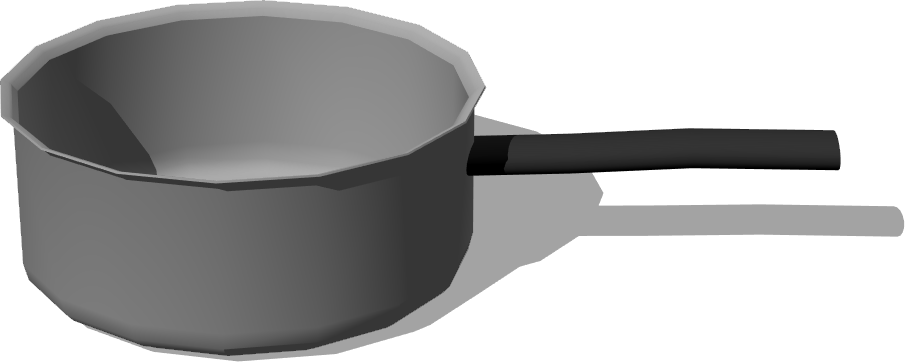
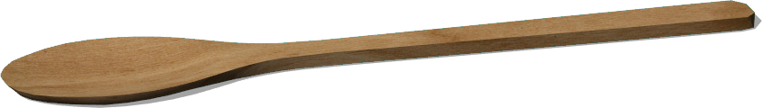

# Utensils

## Carafe

%figure "Carafe model in Webots."


%end

```
Carafe {
   SFVec3f    translation 0 0 0
   SFRotation rotation    0 1 0 0
   SFString   name        "carafe"
   SFFloat    mass        1
}
```

> **File location**: "WEBOTS\_HOME/projects/objects/kitchen/utensils/protos/Carafe.proto"

### Carafe Description

A carafe.

## Cookware

%figure "Cookware model in Webots."



%end

```
Cookware {
   SFVec3f    translation 0 0 0
   SFRotation rotation    0 1 0 0
   SFString   name       "cookware"
   SFColor    color      0.7 0.7 0.7
   SFFloat    mass       0.7
}
```

> **File location**: "WEBOTS\_HOME/projects/objects/kitchen/utensils/protos/Cookware.proto"

### Cookware Description

A cookware.

## Fork

%figure "Fork model in Webots."


%end

```
Fork {
   SFVec3f    translation 0 0 0
   SFRotation rotation    0 1 0 0
   SFString   name        "fork"
   SFColor    color       0.55 0.55 0.55
}
```

> **File location**: "WEBOTS\_HOME/projects/objects/kitchen/utensils/protos/Fork.proto"

### Fork Description

A fork.

## Glass

%figure "Glass model in Webots."


%end

```
Glass {
   SFVec3f    translation 0 0 0
   SFRotation rotation    0 1 0 0
   SFString   name        "glass"
   SFFloat    mass        0.17
}
```

> **File location**: "WEBOTS\_HOME/projects/objects/kitchen/utensils/protos/Glass.proto"

### Glass Description

A glass.

## Knife

%figure "Knife model in Webots."


%end

```
Knife {
   SFVec3f    translation 0 0 0
   SFRotation rotation    0 1 0 0
   SFString   name        "knife"
   SFColor    color       0.55 0.55 0.55
}
```

> **File location**: "WEBOTS\_HOME/projects/objects/kitchen/utensils/protos/Knife.proto"

### Knife Description

A knife.

## Lid

%figure "Lid model in Webots."


%end

```
Lid {
   SFVec3f    translation 0 0.068 0
   SFRotation rotation    0 1 0 0
   SFString   name        "lid"
   SFColor    color       0.7 0.7 0.7
   SFFloat    mass        0.19
}
```

> **File location**: "WEBOTS\_HOME/projects/objects/kitchen/utensils/protos/Lid.proto"

### Lid Description

A lid.

## Plate

%figure "Plate model in Webots."


%end

```
Plate {
   SFVec3f    translation 0 0 0
   SFRotation rotation    0 1 0 0
   SFString   name        "plate"
   MFString   textureUrl  "textures/floral_plate.jpg"
   SFFloat    height      0.01
   SFFloat    radius      0.11
   SFFloat    mass        0.3
}
```

> **File location**: "WEBOTS\_HOME/projects/objects/kitchen/utensils/protos/Plate.proto"

### Plate Description

A customizable (dimensions, texture, etc. ) plate.

## Spoon

%figure "Spoon model in Webots."


%end

```
Spoon {
   SFVec3f     translation 0 0 0
   SFRotation  rotation    0 1 0 0
   SFString    name        "spoon"
   SFColor     color       0.55 0.55 0.55
   SFString    type        "table"
}
```

> **File location**: "WEBOTS\_HOME/projects/objects/kitchen/utensils/protos/Spoon.proto"

### Spoon Description

A spoon.

## Wineglass

%figure "Wineglass model in Webots."


%end

```
Wineglass {
   SFVec3f    translation 0 0 0
   SFRotation rotation    0 1 0 0
   SFString   name        "wine glass"
   SFFloat    mass        0.2
}
```

> **File location**: "WEBOTS\_HOME/projects/objects/kitchen/utensils/protos/Wineglass.proto"

### Wineglass Description

A wine glass.

## WoodenSpoon

%figure "WoodenSpoon model in Webots."



%end

```
WoodenSpoon {
   SFVec3f    translation 0 0 0
   SFRotation rotation    0 1 0 0
   SFString   name        "wooden spoon"
   MFString   textureUrl  "textures/wooden_spoon.jpg"
}
```

> **File location**: "WEBOTS\_HOME/projects/objects/kitchen/utensils/protos/WoodenSpoon.proto"

### WoodenSpoon Description

A wooden spoon.

