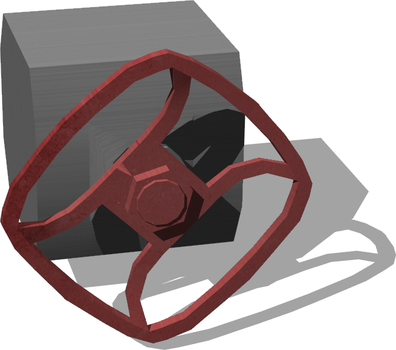
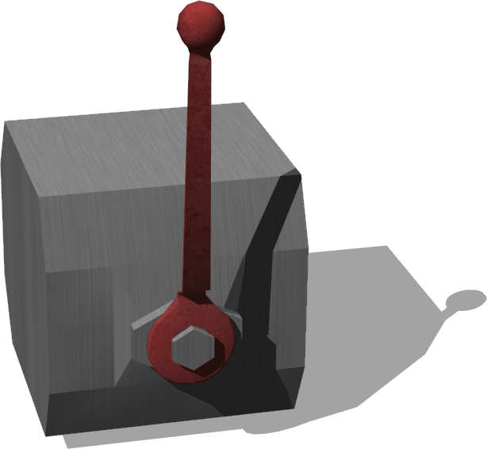

# Valves

## LargeValve

%figure "LargeValve"



%end

```
LargeValve {
   SFVec3f    translation 0 0.106 0
   SFRotation rotation 0 1 0 0
   SFString name "large valve"
   SFFloat jointFriction 0.5
   SFString controller "valve_turner"
   SFString absoluteStop "15.7079632679"
   SFString contactMaterial "default"
}
```

> **File location**: "WEBOTS\_HOME/projects/objects/factory/valves/protos/LargeValve.proto"

### Description

Large Wheel-based valve. Handle can be moved in either direction by the angle (radians) in the "absolute stop" field.

## LeverValve

%figure "LeverValve"



%end

```
LeverValve {
   SFVec3f    translation 0 0.142 0
   SFRotation rotation 0 1 0 0
   SFString name "lever valve"
   SFFloat jointFriction 1
   SFVec3f scale 0.7 0.7 0.7
}
```

> **File location**: "WEBOTS\_HOME/projects/objects/factory/valves/protos/LeverValve.proto"

### Description

Lever-based valve. Handle can be moved in either direction (from up) of 45 degrees.

## SmallValve

%figure "SmallValve"


%end

```
SmallValve {
   SFVec3f    translation 0 0.077 0
   SFRotation rotation 0 1 0 0
   SFString name "small valve"
   SFFloat jointFriction 0.1
   SFString controller "valve_turner"
   SFString absoluteStop "15.7079632679"
}
```

> **File location**: "WEBOTS\_HOME/projects/objects/factory/valves/protos/SmallValve.proto"

### Description

Small Wheel-based valve. Handle can be moved in either direction by the angle (radians) in the "absolute stop" field.

