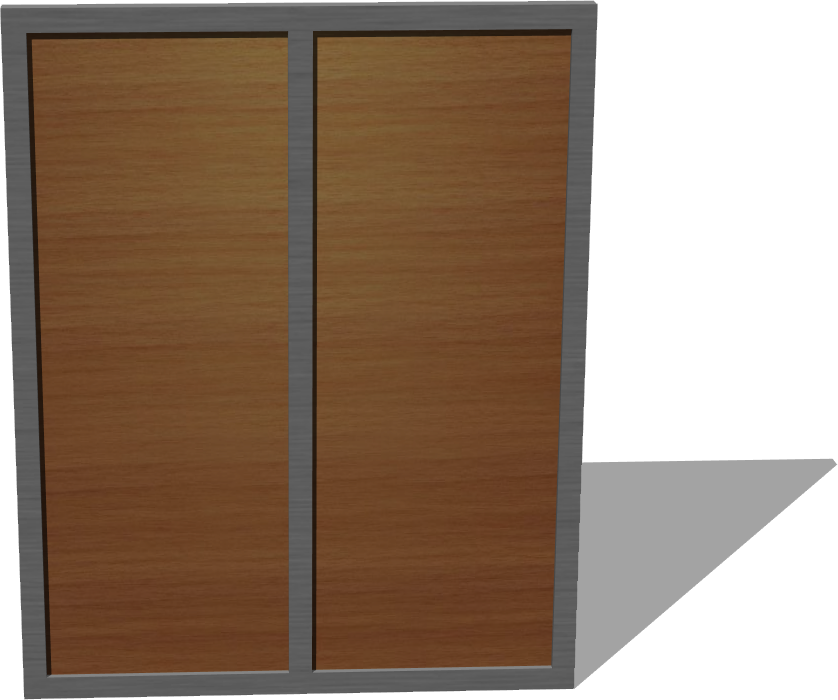
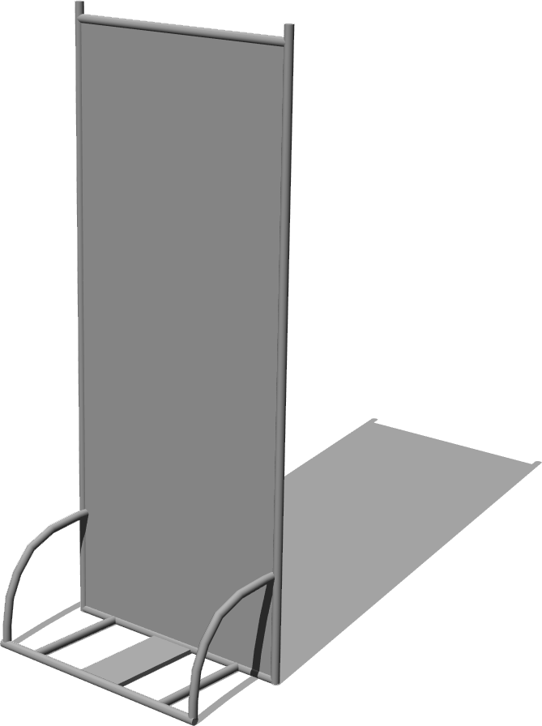

# Panels

## Panel

%figure "Panel"



%end

```
Panel {
      SFVec3f translation 0 0 0
      SFRotation rotation 0 1 0 0
      SFString name "panel"
      SFVec3f size 1.2 1.5 0.05
      SFFloat borderHeight 0.05
      SFFloat internalWidth 0.02
      SFInt32 panelsCount 2
      SFNode appearance Appearance { material Material { } texture ImageTexture { url [ "textures/desktop_wood.jpg" ] } }
      SFNode borderAppearance Appearance { material Material { } texture ImageTexture { url [ "textures/metal.jpg" ] } }
}
```

> **File location**: "WEBOTS\_HOME/projects/objects/panels/protos/Panel.proto"

### Description

Customizable simple panel.

## PannelWithTubes

%figure "PannelWithTubes"



%end

```
PannelWithTubes {
      SFVec3f    translation          0 0 0
      SFRotation rotation             0 1 0 0
      SFString   name                 "panel with tubes"
      SFNode     appearance           Appearance { material Material { } }
}
```

> **File location**: "WEBOTS\_HOME/projects/objects/panels/protos/PannelWithTubes.proto"

### Description

A gray panel with tubes

