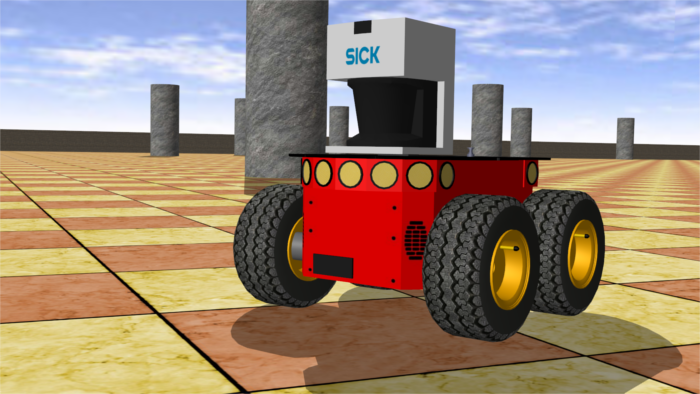

## adept's Pioneer 3-AT

%figure "Pioneer 3-AT, a ready-to-use all terrain base"

%end

The Pioneer 3-AT robot is an all-purpose outdoor base, used for research and prototyping applications involving mapping, navigation, monitoring, reconnaissance and other behaviors.
It is caracterized by a set of features listed in [this table](#pioneer-3-at-characteristics).
This model includes support for 4 motors and 16 sonar sensors (8 forward-facing, 8 rear-facing) for proximity measurements.

More information on the specifications and optional devices is available on the Adept Mobile Robots official [webpage](http://www.mobilerobots.com/ResearchRobots/ResearchRobots/P3AT.aspx).

### Pioneer 3-AT Model

%figure "Pioneer 3-AT characteristics"

| Characteristics             | Values       |
| --------------------------- | ------------ |
| Length                      | 508 mm       |
| Width                       | 497 mm       |
| Height                      | 277 mm       |
| Weight                      | 12 kg        |
| Max. forward/backward speed | 2.2 m/s      |
| Max. rotation speed         | 20 rad/s     |

%end

The standard model of the Pioneer 3-AT is provided in the "pioneer3AT.wbt" file which is located in the "WEBOTS\_HOME/projects/robots/adept/pioneer3/worlds" directory of the Webots distribution.

The Pioneer 3-AT motors are `RotationalMotor` nodes named according to [this figure](#pioneer-3-at-motor-names).
The `wb_set_motor_position` and `wb_set_motor_velocity` functions allow the user to control the rotation of the wheels.

%figure "Pioneer 3-AT motor names"

%end

The sonar sensors are numbered according to [this figure](#sonar-sensors-positions).

%figure "Sonar sensors positions"

%end

The angle between two consecutive sensor directions is 20 degrees except for the four side sensors (so0, so7, so8 and so15) for which the angle is 40 degrees.

### Samples

#### pioneer3at.wbt

 The "pioneer3at.wbt" world file is a simulation example of a simple obstacle avoidance behavior based on the use of a SICK LMS 291 Lidar (see the "obstacle\_avoidance\_with\_lidar.c" controller file in the "WEBOTS\_HOME/projects/robots/adept/pioneer3/controller" directory).
The Lidar depth output is used to compute two stimuli in front of the robot.
These two stimuli are computed by a [Gaussian function](https://en.wikipedia.org/wiki/Gaussian_function) applied slightly on the front left, and respectively on the front right of the robot.
