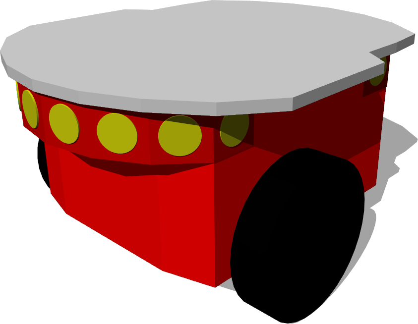

## adept's Pioneer 2

%figure "Pioneer 2 model in Webots"

%end

[adpet's Pioneer 2](https://www.adept.com/) is a three-wheeled robot (2 motorized wheels and one passive caster wheel) mounted with several sensors including 16 IR ultrasonic sensors.

### Samples

You will find the following sample in this folder: "WEBOTS\_HOME/projects/robots/adpet/pioneer2/worlds".

#### pioneer2.wbt

 In this example, you can see a Pioneer 2 robot moving inside an arena while avoiding the walls.
Like many other examples, this one uses the `braitenberg` controller.
