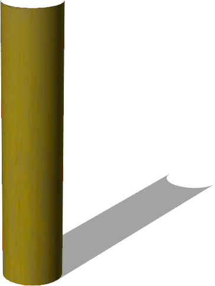

# Pipes

## LJoint

%figure "LJoint"


%end

```
LJoint {
  SFVec3f    translation 0 0.104 0
  SFRotation rotation 0 1 0 0
  SFString   name "L joint pipe"
  SFVec3f    scale 1 1 1
}
```

> **File location**: "WEBOTS\_HOME/projects/objects/factory/pipes/protos/LJoint.proto"

### Description

90-degree L-joint for connecting pipes.

## PipeSection

%figure "PipeSection"



%end

```
PipeSection {
  SFVec3f    translation 0 0.03 0
  SFRotation rotation 0 0 1 1.5708
  SFString   name "pipe section"
  SFFloat    height 0.5
  SFFloat    radius 0.03
  SFInt32    subdivision 24
}
```

> **File location**: "WEBOTS\_HOME/projects/objects/factory/pipes/protos/PipeSection.proto"

### Description

A section of pipe.

## TJoint

%figure "TJoint"


%end

```
TJoint {
  SFVec3f    translation 0 0.95 0
  SFRotation rotation 0 1 0 0
  SFString   name "T joint pipe"
  SFVec3f    scale 1 1 1
}
```

> **File location**: "WEBOTS\_HOME/projects/objects/factory/pipes/protos/TJoint.proto"

### Description

3-slot T-joint for connecting pipes.

