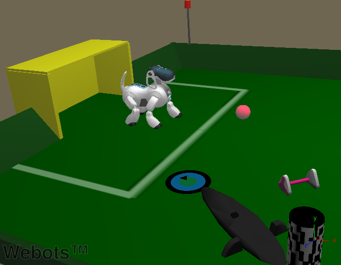
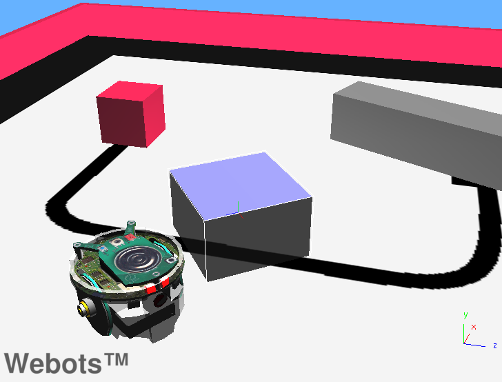
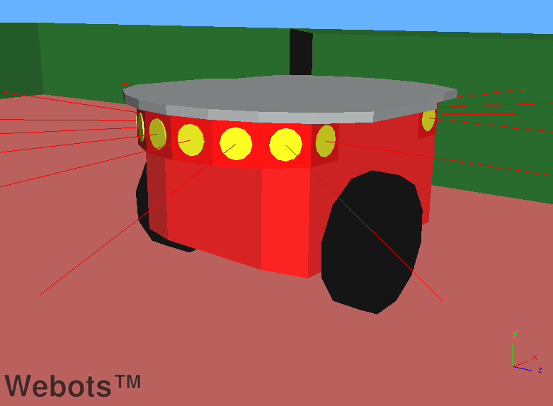

## Real Robots

This section discusses worlds containing models of real robots.
The world files for these examples are located in the "robots/(robot\_name)/worlds" directory, and the corresponding controllers are located in the "robots/(robot\_name)/controllers" directory.

### aibo\_ers7.wbt

**Keywords**: Aibo, ERS-7, legged robot, soccer field, Charger, toys, beacon, bone

%figure "aibo_ers7"

%end

In this example, you can see a silver Aibo ERS-7 robot walking on a textured soccer field.
On this field you can also see its toys : a ball, a charger and a bone.

### alice.wbt

**Keywords**: Alice, Braitenberg, DistanceSensor

%figure "alice"

%end

In this example, you can see an Alice robot moving inside an arena while avoiding the walls.
Its world file is in the "others/worlds" directory.
Like many others, this example uses the `braitenberg` controller.

### boebot.wbt

**Keywords**: BoeBot, DistanceSensor, LED

%figure "boebot"

%end

In this example, BoeBot moves inside an arena while avoiding the walls.
When the robot detects an obstacle with one of its `DistanceSensor`s, it turns the corresponding `LED` on.

### e-puck.wbt

**Keywords**: differential wheels, texture, Braitenberg, Accelerometer, Odometry, E-puck

%figure "e-puck"

%end

In this example, you can see the e-puck robot avoiding obstacles inside an arena by using the Braitenberg technique.
The odometry of the e-puck is computed at each simulation steps.
The accelerometer values and an estimation the coverage distance and the orientation of the e-puck are displayed.
The source code for this controller is in the "WEBOTS\_HOME/projects/default/controllers/braitenberg" directory.

### e-puck\_line.wbt

**Keywords**: differential wheels, line following, texture, behavior-based
    robotics, E-puck

%figure "e-puck_line"

%end

In this example, you can see the E-puck robot following a black line drawn on the ground.
In the middle of this line there is an obstacle which the robot is unable to avoid.
This example has been developed as a practical assignment on behavior-based robotics.
When completed, the controller should allow the E-puck robot to avoid this obstacle and recover its path afterwards.
A solution for this assignment is shown in the world e-puck\_line\_demo.wbt (see [this section](#e-puck_line_demo-wbt)).
The source code for this controller is in the "e-puck\_line" directory.

### e-puck\_line\_demo.wbt

**Keywords**: differential wheels, line following, texture, behavior-based
    robotics, E-puck

%figure "e-puck_line_demo"

%end

This example is the solution for the assignment given in the `e-puck_line_demo.wbt` example (see [this section](#e-puck_line-wbt)).
In this case, you can see that the robot avoids the obstacle, then recovers its path along the line.
As the controller used in this world is the solution to the assignment, the source code is not distributed.

### hemisson\_cross\_compilation.wbt

**Keywords**: differential wheels, Pen, cross-compilation, texture, Hemisson

%figure "hemisson_cross_compilation"

%end

In this example, a Hemisson robot moves on a white floor while avoiding the obstacles.
Its `Pen` device draws a black line which slowly fades.
This example is a cross-compilation example for the real Hemisson robot.
The source code for this controller is in the "hemisson" directory.

### hoap2\_sumo.wbt

**Keywords**: Robot node, humanoid, texture, dancing, Hoap 2, IndexedFaceSet, RotationalMotor,
    active joint, force, TouchSensor

%figure "hoap2_sumo"

%end

In this example, a Hoap2 robot from Fujitsu performs the Shiko dance (the dance sumos perform before a combat).
This robot is equipped with `TouchSensors` on the soles of its feet; it measures and logs the pressure exerted by its body on the ground.
The source code for this controller is in the "hoap2" directory.

### hoap2\_walk.wbt

**Keywords**: Robot node, humanoid, texture, walking, Hoap 2, IndexedFaceSet, RotationalMotor,
    active joint, force, TouchSensor

%figure "hoap2_walk"

%end

In this example, a Hoap2 robot from Fujitsu walks straight forward on a tatami.
This robot is equipped with `TouchSensors` on the soles of its feet; it measures and logs the pressure exerted by its body on the ground.
The source code for this controller is in the "hoap2" directory.

### ipr\_collaboration.wbt

**Keywords**: Robot node, robotic arm, collaboration, TCP/IP, client program, IPR,
    IndexedFaceSet, RotationalMotor, active joint

%figure "ipr_collaboration"

%end

In this example, two IPR robots from Neuronics work together to put three red cubes into a basket which is on the opposite side of the world.
All the IPR robots use the same controller, whose source code is in the "ipr\_serial" directory.
This particular example uses, in addition to this controller, a client program which coordinates the movements of the robots.
The source code for this client is in the "ipr\_serial/client/ipr\_collaboration.c" file.

### ipr\_cube.wbt

**Keywords**: Robot node, robotic arm, TCP/IP, client program, IPR,
    IndexedFaceSet, RotationalMotor, active joint

%figure "ipr_cube"

%end

In this example, an IPR robots from Neuronics moves a small red cube onto a bigger one.
All the IPR robots use the same controller, whose source code is in the "ipr\_serial" directory.
This example also uses a client program which drives the movements of the robot.
The source code of this client is in the "ipr\_serial/client/ipr\_cube.c" file.

### ipr\_factory.wbt

**Keywords**: Robot node, Supervisor, conveyor belt, robotic arm, TCP/IP,
    client program, IPR, IndexedFaceSet, RotationalMotor, active joint

%figure "ipr\_factory"

%end

In this example, two IPR robots from Neuronics take industrial parts from a conveyor belt and place them into slots.
One of the robots detects the objects using an infrared sensor on the conveyor belt, while the other one waits.
All the IPR robots use the same controller, whose source code is in the "ipr\_serial" directory.
This example also uses a client program which coordinates the movements of the robots.
The source code for this client is in the "ipr\_serial/client/ipr\_factory.c" file.

### ipr\_models.wbt

**Keywords**: Robot node, robotic arm, TCP/IP, IPR, IndexedFaceSet, RotationalMotor, active joint

%figure "ipr_models"

%end

In this example, you can see all the different types of IPR model provided by Webots : HD6M180, HD6Ms180, HD6M90 and HD6Ms90.
This world is intended to be the example from which you can copy the models of IPR robots into your own worlds.
All the IPR robots use the same controller, whose source code is in the "ipr\_serial" directory.

### khepera.wbt

**Keywords**: differential wheels, DistanceSensor, Braitenberg, texture, Khepera

%figure "khepera"

%end

In this example, you can see a Khepera robot from K-Team moving inside an arena while avoiding the walls.
Like many other examples, this one uses the `braitenberg` controller.
The source code for this controller is located in the "WEBOTS\_HOME/projects/default/controllers/braitenberg" directory.

### khepera2.wbt

**Keywords**: differential wheels, DistanceSensor, Braitenberg, texture, Khepera II

%figure "khepera2"

%end

In this example, you can see a Khepera II robot from K-Team moving inside an arena while avoiding the walls.
Like many other examples, this one uses the `braitenberg` controller.
The source code for this controller is in the "WEBOTS\_HOME/projects/default/controllers/braitenberg" directory.

### khepera3.wbt

**Keywords**: differential wheels, DistanceSensor, Braitenberg, texture, Khepera III

%figure "khepera3"

%end

In this example, you can see a Khepera III robot from K-Team moving inside an arena while avoiding the walls.
Like many other examples, this one uses the `braitenberg` controller.
The source code for this controller is in the "WEBOTS\_HOME/projects/default/controllers/braitenberg" directory.

### khepera\_kinematic.wbt

**Keywords**: differential wheels, DistanceSensor, Braitenberg, Kinematic, Khepera

%figure "khepera_kinematic"

%end

In this example, you can see two Khepera robots from K-Team moving inside an arena while avoiding each other and the walls.
It is a good example of how to use the kinematic mode of Webots.
Like many other examples, this one uses the `braitenberg` controller.
The source code for this controller is in the "WEBOTS\_HOME/projects/default/controllers/braitenberg" directory.

### khepera\_gripper.wbt

**Keywords**: differential wheels, Gripper, Khepera

%figure "khepera_gripper"

%end

In this example, you can see a Khepera robot from K-Team equipped with a gripper.
The robot uses its gripper to grab a stick, move a bit with it and drop it on the ground.
This behavior is repeated endlessly.
The source code for this controller is in the "khepera\_gripper" directory.

### khepera\_gripper\_camera.wbt

**Keywords**: differential wheels, Gripper, Camera, Khepera

%figure "khepera_gripper_camera"

%end

In this example, you can see a Khepera robot from K-Team equipped with a gripper and a `Camera` device.
The robot uses its gripper to grab a stick, move a bit with it and drop it on the floor.
This behavior is repeated endlessly.
In this world, the robot does not analyse the images it takes with its camera.
The source code for this controller is in the "khepera\_gripper" directory.

### khepera\_k213.wbt

**Keywords**: differential wheels, DistanceSensor, K213, linear Camera, Khepera

%figure "khepera_k213"

%end

In this example, you can see a Khepera robot from K-Team equipped with a K213 `Camera` device.
This camera is a linear vision turret with grayscale images.
Using this device, the robot is able to translate the information contained in the image into text and print this result in the Console window.
When you load this world, the robot will not begin to move immediately.
It will give you enough time to read the explanations printed in the Console window concerning this world.
The source code for this controller is in the "khepera\_k213" directory.

### khepera\_pipe.wbt

**Keywords**: differential wheels, UNIX pipe, client program, Khepera

%figure "khepera_pipe"

%end

In this example, you can see a Khepera robot from K-Team inside an arena.
The controller for this robot opens a UNIX pipe in order to receive commands using the Khepera serial communication protocol.
This example is provided with a sample client program which interacts with the controller of the robot to make it move straight forward until it detects an obstacle.
This client program `client` must be launched separately from Webots.
The source code for this controller and for the client program are in the "pipe" directory.

> **Note**: As this example is based on standard UNIX pipes, it does not work under Windows.

### khepera\_tcpip.wbt

**Keywords**: differential wheels, TCP/IP, client program, Khepera

%figure "khepera_tcpip"

%end

In this example, you can see a Khepera robot from K-Team inside an arena.
The controller for this robot acts as a TCP/IP server, waiting for a connection.
Through this connection, the robot can receive commands using the Khepera serial communication protocol.
This example is provided with a sample client program which displays a command prompt, with which you can control the movements of the robot.
This client program `client` must be launched separately from Webots.
The source code for this controller and for the client program are in the "tcpip" directory.

### koala.wbt

**Keywords**: differential wheels, DistanceSensor, Braitenberg, Koala

%figure "koala"

%end

In this example, you can see a Koala robot from K-Team moving inside an arena while avoiding the walls.
Like many other examples, this one uses the `braitenberg` controller.
The source code for this controller is located in the "WEBOTS\_HOME/projects/default/controllers/braitenberg" directory.

### magellan.wbt

**Keywords**: differential wheels, DistanceSensor, Braitenberg, Magellan

%figure "magellan"

%end

In this example, you can see a Magellan robot moving inside an arena while avoiding the walls.
As this robot is no longer produced, its world file is in the "others/worlds" directory.
Like many other examples, this one uses the `braitenberg` controller.
The source code for this controller is located in the "WEBOTS\_HOME/projects/default/controllers/braitenberg" directory.

### pioneer2.wbt

**Keywords**: differential wheels, DistanceSensor, Braitenberg, Pioneer 2

%figure "pioneer2"

%end

In this example, you can see a Pioneer 2 robot from ActivMedia Robotics moving inside an arena while avoiding the walls.
Like many other examples, this one uses the `braitenberg` controller.
The source code for this controller is in the "WEBOTS\_HOME/projects/default/controllers/braitenberg" directory.

### rover.wbt

**Keywords**: differential wheels, bumper, TouchSensor, line following, Rover, Java

%figure "rover"

%end

In this example you can see the Mindstorms Rover robot from LEGO following a black line drawn on the ground.
In the middle of this line there is an obstacle which the robot navigates around after detecting a collision with it.
The robot will then recover its path.
As this robot is a *Mindstorms* robot, its world file and its controller are in the "mindstorms" directory.
This example is written both in Java and C, as a reference for translating Webots code from one language to another.
The source code for this controller is in the "Rover" directory.

### scout2.wbt

**Keywords**: differential wheels, DistanceSensor, Braitenberg, Scout 2

%figure "scout2"

%end

In this example, a Scout 2 robot moves inside an arena while avoiding the walls.
Its world file is in the "others/worlds" directory.
Like many other examples, this one uses the braitenberg controller.
The source code for this controller is in the "WEBOTS\_HOME/projects/default/controllers/braitenberg" directory.

### shrimp.wbt

**Keywords**: Robot node, custom ODE plugin, keyboard, passive joint, uneven ground
    sponginess, Shrimp, LinearMotor

%figure "shrimp"

%end

This example contains a model of the *Shrimp* robot, which is a mobile platform for rough terrain from [Bluebotics](http://www.bluebotics.ch).
It has 6 wheels and a passive structure that adapts to the terrain profile and climbs obstacles.
It can also turn on the spot.
In this example the robot will first move on its own to the center of the world; then you may drive it yourself using the keyboard.
To find out which keys will allow you to perform these operations, please read the explanation message printed at the beginning of the simulation in the Console window.

Because of its particular structure, this model is also an example of custom ODE plugins for:

- How to create and manage ODE joints.
- How to add custom force.
- How to create spongy tires.

The source code for this controller is in the "WEBOTS\_HOME/projects/robots/shrimp/controllers/shrimp" directory, and the ODE plugin is in the "WEBOTS\_HOME/projects/robots/shrimp/plugins/physics/shrimp" directory.

### bioloid.wbt

**Keywords**: Robot node, legged robot, RotationalMotor, Bioloid, Camera, DistanceSensor, keyboard, modular robots, walking

%figure "bioloid"

%end

In this example, the four-legged robot model ([this figure](#bioloid) (a)) corresponds to a real [Bioloid](http://www.robotis.com) robot ([this figure](#bioloid) (b)) developed by and commercially available from [Tribotix](http://www.tribotix.com).
This dog-robot model was build from the Bioloid Comprehensive Kit.

Both the visual aspect and the physical properties of the real robot have been modeled.
The physical dimensions, friction coefficients and mass distribution have been estimated after various measurements on the components of the real robot.

The source code for the controller of the robot, as well as the model of the robot are located under the Webots installation directory, in the "WEBOTS\_HOME/projects/robots/bioloid" sub folder:

- "controllers/bioloid/": controller directory.
- "worlds/bioloid.wbt": world definition file containing a Bioloid dog robot.

Using the keyboard, the user can control the quadruped robot by setting the walking direction (forward or backwards) and also the heading direction (right or left).
Keyboard actions include:

- Right Arrow: Turn right.
- Left Arrow: Turn left.
- B: Walk backwards.
- F: Walk forward.

The walking gait used in the controller relies on an inverse kinematics model.
Further details are available from [BIRG website](http://birg.epfl.ch/page66584.html).
The included controller illustrates a trotting gait showing the best performance so far.
The turning capabilities of the robot are based on the stride length modulation.
When the robot is asked to turn right, the stride length of the right side and left side are respectively decreased and increased.
During the walk, the extremity of each leg is describing an ellipsoid, the diameters of these ellipsoids are updated according to the stride length to allow the robot to turn either right or left.

Other keyboard actions are also provided to fine-tune the frequency and the stride length factor:

- Q: Increase frequency.
- W: Decrease frequency.
- S: Increase stride length factor.
- A: Decrease stride length factor.
