# Road

## AddLaneRoadSegment

%figure "AddLaneRoadSegment"

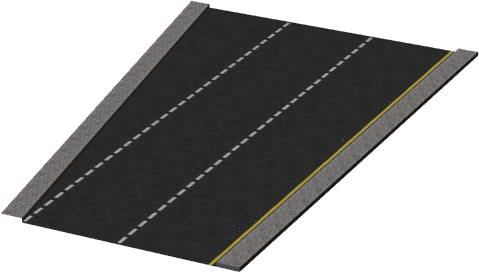

%end

```
AddLaneRoadSegment {
          SFVec3f    translation               0 0 0
          SFRotation rotation                  0 1 0 0
          SFString   name                      "road"                             
          SFString   id                        ""                                 
          MFString   connectedRoadIDs          []                                 
          SFFloat    width                     7                                  
          SFFloat    length                    20                                 
          SFInt32    numberOfLanes             2                                  
          SFBool     newLaneLeft               TRUE                               
          MFBool     dashedLine                TRUE                               
          SFFloat    roadBorderHeight          0.15                               
          SFFloat    roadBorderWidth           0.8                                
          SFBool     rightBorder               TRUE                               
          SFBool     leftBorder                TRUE                               
          SFBool     rightBarrier              FALSE                              
          SFBool     leftBarrier               FALSE                              
          SFBool     bottom                    FALSE                              
          MFString   startLine                 [ ]                                
          MFString   endLine                   [ ]                                
          MFString   texture                   "textures/road.jpg"                
          SFFloat    textureScale              2                                  
          MFString   newLaneTexture            "textures/road_no_border_line.jpg" 
          MFString   pavementTexture           "textures/pavement.jpg"            
          MFString   bottomTexture             []                                 
          SFBool     locked                    TRUE
          SFBool     roadBoundingObject        FALSE                              
          SFBool     rightBorderBoundingObject FALSE                              
          SFBool     leftBorderBoundingObject  FALSE                              
          SFBool     rightBarrierBoundingObject TRUE                              
          SFBool     leftBarrierBoundingObject TRUE                               
          SFBool     castShadows               FALSE                              
          SFString   contactMaterial           "default"                          
}
```

> **File location**: "WEBOTS\_HOME/projects/objects/road/protos/AddLaneRoadSegment.proto"

> **License**: This is a test of license display.

### Description

A simple segment of road allowing to add (or remove) one lane to the road.
The side where the new lane is added is configurable as well as a lot of others parameters of a regular road.
Sponsored by the CTI project RO2IVSim (http://transport.epfl.ch/simulator-for-mobile-robots-and-intelligent-vehicles)

### Field Summary

- `name`: could contain the junction name

- `id`: could contain a unique ID

- `connectedRoadIDs`: list the connected road IDs

- `width`: total width of the road

- `length`: total length of the segment

- `numberOfLanes`: number of lanes before addition of the new one

- `newLaneLeft`: side where to add the new lane

- `dashedLine`: defines for each line if it is continuous or dashed

- `roadBorderHeight`: defines the height of the borders

- `roadBorderWidth`: defines the width of the borders

- `rightBorder`: enable/disable right border

- `leftBorder`: enable/disable left border

- `rightBarrier`: enable/disable right barrier

- `leftBarrier`: enable/disable left barrier

- `bottom`: enable/disable the bottom of the road

- `startLine`: optionally defines the road line at the first way-point

- `endLine`: optionally defines the road line at the last way-point

- `texture`: texture used for the road

- `textureScale`: length of the texture in meter

- `newLaneTexture`: texture used for the new lane (we need to have no border line)

- `pavementTexture`: texture used for the border

- `bottomTexture`: texture used for the bottom

- `roadBoundingObject`: enable/disable the road boundingObject

- `rightBorderBoundingObject`: enable/disable the right border boundingObject

- `leftBorderBoundingObject`: enable/disable the left border boundingObject

- `rightBarrierBoundingObject`: enable/disable the right barrier boundingObject

- `leftBarrierBoundingObject`: enable/disable the left barrier boundingObject

- `castShadows`: defines if the road should cast shadows

- `contactMaterial`: contact material of the road

## AddLanesRoadSegment

%figure "AddLanesRoadSegment"

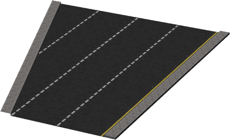

%end

```
AddLanesRoadSegment {
          SFVec3f    translation               0 0 0
          SFRotation rotation                  0 1 0 0
          SFString   name                      "road"                             
          SFString   id                        ""                                 
          MFString   connectedRoadIDs          []                                 
          SFFloat    width                     7                                  
          SFFloat    length                    20                                 
          SFInt32    numberOfLanes             2                                  
          SFInt32    numberOfNewLanes          2                                  
          SFBool     newLaneLeft               TRUE                               
          MFBool     dashedLine                TRUE                               
          SFFloat    roadBorderHeight          0.15                               
          SFFloat    roadBorderWidth           0.8                                
          SFBool     rightBorder               TRUE                               
          SFBool     leftBorder                TRUE                               
          SFBool     rightBarrier              FALSE                              
          SFBool     leftBarrier               FALSE                              
          SFBool     bottom                    FALSE                              
          MFString   startLine                 [ ]                                
          MFString   endLine                   [ ]                                
          MFString   texture                   "textures/road.jpg"                
          SFFloat    textureScale              2                                  
          MFString   newLaneTexture            "textures/road_no_border_line.jpg" 
          MFString   pavementTexture           "textures/pavement.jpg"            
          MFString   bottomTexture             []                                 
          SFBool     locked                    TRUE
          SFBool     roadBoundingObject        FALSE                              
          SFBool     rightBorderBoundingObject FALSE                              
          SFBool     leftBorderBoundingObject  FALSE                              
          SFBool     rightBarrierBoundingObject TRUE                              
          SFBool     leftBarrierBoundingObject TRUE                               
          SFBool     castShadows               FALSE                              
          SFString   contactMaterial           "default"                          
}
```

> **File location**: "WEBOTS\_HOME/projects/objects/road/protos/AddLanesRoadSegment.proto"

### Description

A simple segment of road allowing to add (or remove) several lanes to the road.
The side where the new lanes are added is configurable as well as a lot of others parameters of a regular road.
Sponsored by the CTI project RO2IVSim (http://transport.epfl.ch/simulator-for-mobile-robots-and-intelligent-vehicles)

### Field Summary

- `name`: could contain the junction name

- `id`: could contain a unique ID

- `connectedRoadIDs`: list the connected road IDs

- `width`: total width of the road

- `length`: total length of the segment

- `numberOfLanes`: number of lanes before addition of the new one(s)

- `numberOfNewLanes`: number of lane to add

- `newLaneLeft`: side where to add the new lane

- `dashedLine`: defines for each line if it is continuous or dashed

- `roadBorderHeight`: defines the height of the borders

- `roadBorderWidth`: defines the width of the borders

- `rightBorder`: enable/disable right border

- `leftBorder`: enable/disable left border

- `rightBarrier`: enable/disable right barrier

- `leftBarrier`: enable/disable left barrier

- `bottom`: enable/disable the bottom of the road

- `startLine`: optionally defines the road line at the first way-point

- `endLine`: optionally defines the road line at the last way-point

- `texture`: texture used for the road

- `textureScale`: length of the texture in meter

- `newLaneTexture`: texture used for the new lane (we need to have no border line)

- `pavementTexture`: texture used for the border

- `bottomTexture`: texture used for the bottom

- `roadBoundingObject`: enable/disable the road boundingObject

- `rightBorderBoundingObject`: enable/disable the right border boundingObject

- `leftBorderBoundingObject`: enable/disable the left border boundingObject

- `rightBarrierBoundingObject`: enable/disable the right barrier boundingObject

- `leftBarrierBoundingObject`: enable/disable the left barrier boundingObject

- `castShadows`: defines if the road should cast shadows

- `contactMaterial`: contact material of the road

## CrashBarrier

%figure "CrashBarrier"

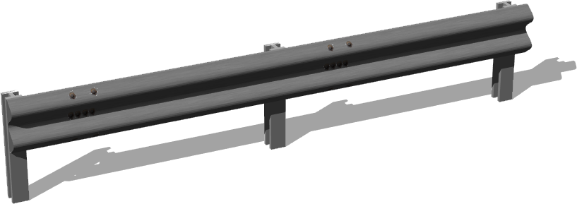

%end

```
CrashBarrier {
      SFVec3f      translation             0 0 0
      SFRotation   rotation                0 1 0 0
      SFString     name                    "crash barrier"
      SFFloat      poleGap                 2
      SFNode       poleAppearance          Appearance { material Material {} }
      MFVec3f      path                    [0 0 0, 5 0 0]
      SFBool       barrierOnRightSide      TRUE
      SFInt32      subdivision             -1
      SFBool       enableBoundingObject    FALSE
}
```

> **File location**: "WEBOTS\_HOME/projects/objects/road/protos/CrashBarrier.proto"

### Description

A customizable crash barrier.

## Crossroad

```
Crossroad {
      SFVec3f    translation      0 0 0
      SFRotation rotation         0 1 0 0
      SFString   name             "crossroad"             
      SFString   id               ""                      
      MFVec3f    shape            [ 0 0 0, 0 0 1, 1 0 0]
      MFString   connectedRoadIDs []                      
      SFBool     boundingObject   FALSE                   
      SFBool     bottom           FALSE                   
      MFString   texture          "textures/asphalt.jpg"  
      SFBool     locked           TRUE
      SFBool     castShadows      FALSE                   
      SFString   contactMaterial  "default"               
}
```

> **File location**: "WEBOTS\_HOME/projects/objects/road/protos/Crossroad.proto"

### Description

A customizable crossroad which can contain optionally references to its connected roads and a shape.

### Field Summary

- `name`: could contain the crossroad name

- `id`: could contain a unique ID

- `connectedRoadIDs`: list the connected road IDs

- `boundingObject`: enable/disable the road boundingObject

- `bottom`: enable/disable the bottom of the road

- `texture`: texture

- `castShadows`: defines if the road should cast shadows

- `contactMaterial`: contact material of the road

## CurvedRoadSegment

%figure "CurvedRoadSegment"

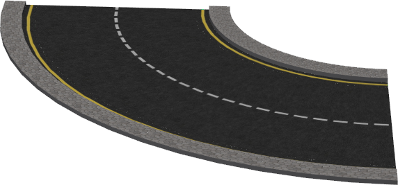

%end

```
CurvedRoadSegment {
       SFVec3f    translation               0 0 0
       SFRotation rotation                  0 1 0 0
       SFString   name                      "road"                  
       SFString   id                        ""                      
       SFString   startJunction             ""                      
       SFString   endJunction               ""                      
       SFFloat    width                     7                       
       SFInt32    numberOfLanes             2                       
       SFInt32    numberOfForwardLanes      1                       
       MFBool     dashedLine                TRUE                    
       SFFloat    roadBorderHeight          0.15                    
       MFFloat    roadBorderWidth           [ 0.8 ]                 
       SFBool     rightBorder               TRUE                    
       SFBool     leftBorder                TRUE                    
       SFBool     rightBarrier              FALSE                   
       SFBool     leftBarrier               FALSE                   
       SFBool     bottom                    FALSE                   
       SFFloat    curvatureRadius           10                      
       SFFloat    totalAngle                1.5708                  
       MFString   startLine                 [ ]                     
       MFString   endLine                   [ ]                     
       SFInt32    subdivision               8                       
       SFFloat    tilt                      0                       
       MFString   texture                   "textures/road.jpg"     
       SFFloat    textureScale              2                       
       MFString   pavementTexture           "textures/pavement.jpg" 
       MFString   bottomTexture             []                      
       SFBool     locked                    TRUE
       SFBool     roadBoundingObject        FALSE                   
       SFBool     rightBorderBoundingObject FALSE                   
       SFBool     leftBorderBoundingObject  FALSE                   
       SFBool     rightBarrierBoundingObject TRUE                   
       SFBool     leftBarrierBoundingObject TRUE                    
       SFBool     castShadows               FALSE                   
       SFString   contactMaterial           "default"               
}
```

> **File location**: "WEBOTS\_HOME/projects/objects/road/protos/CurvedRoadSegment.proto"

### Description

A simple curved road, the number of lanes, the curvature and the dimensions are configurable,
an optional border can be enable.
Sponsored by the CTI project RO2IVSim (http://transport.epfl.ch/simulator-for-mobile-robots-and-intelligent-vehicles)

### Field Summary

- `name`: could contain the street name

- `id`: could contain a unique ID

- `startJunction`: could contain a reference to the junction connected at the first Road waypoint

- `endJunction`: could contain a reference to the junction connected at the last Road waypoint

- `width`: total width of the road

- `numberOfLanes`: number of lanes

- `numberOfForwardLanes`: number of forward lanes. Note this is an information with no impact on the graphical shape.

- `dashedLine`: defines for each line if it is continuous or dashed

- `roadBorderHeight`: defines the height of the borders

- `roadBorderWidth`: defines the width of the borders

- `rightBorder`: enable/disable right border

- `leftBorder`: enable/disable left border

- `rightBarrier`: enable/disable right barrier

- `leftBarrier`: enable/disable left barrier

- `bottom`: enable/disable the bottom of the road

- `curvatureRadius`: radius of the curve

- `totalAngle`: angle traveled by the road (length = totalAngle*curvatureRadius)

- `startLine`: optionally defines the road line at the first way-point

- `endLine`: optionally defines the road line at the last way-point

- `subdivision`: subdivision approximation of the road

- `tilt`: defines the maximum tilt of the road

- `texture`: texture used for the road

- `textureScale`: length of the texture in meter

- `pavementTexture`: texture used for the border

- `bottomTexture`: texture used for the bottom

- `roadBoundingObject`: enable/disable the road boundingObject

- `rightBorderBoundingObject`: enable/disable the right border boundingObject

- `leftBorderBoundingObject`: enable/disable the left border boundingObject

- `rightBarrierBoundingObject`: enable/disable the right barrier boundingObject

- `leftBarrierBoundingObject`: enable/disable the left barrier boundingObject

- `castShadows`: defines if the road should cast shadows

- `contactMaterial`: contact material of the road

## HelicoidalRoadSegment

%figure "HelicoidalRoadSegment"

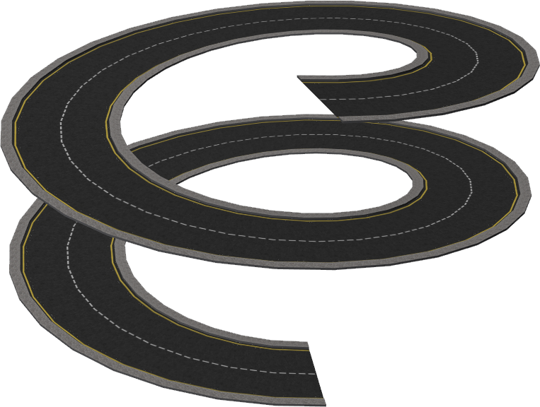

%end

```
HelicoidalRoadSegment {
       SFVec3f    translation               0 0 0
       SFRotation rotation                  0 1 0 0
       SFString   name                      "road"                  
       SFString   id                        ""                      
       SFString   startJunction             ""                      
       SFString   endJunction               ""                      
       SFFloat    width                     7                       
       SFInt32    numberOfLanes             2                       
       SFInt32    numberOfForwardLanes      1                       
       MFBool     dashedLine                TRUE                    
       SFFloat    roadBorderHeight          0.15                    
       SFFloat    roadBorderWidth           0.8                     
       SFBool     rightBorder               TRUE                    
       SFBool     leftBorder                TRUE                    
       SFBool     bottom                    FALSE                   
       SFBool     rightSide                 TRUE                    
       SFBool     leftSide                  TRUE                    
       SFFloat    height                    20                      
       SFFloat    radius                    15                      
       SFFloat    heigthStep                5                       
       MFString   startLine                 [ ]                     
       MFString   endLine                   [ ]                     
       SFFloat    subdivision               64                      
       MFString   texture                   "textures/road.jpg"     
       SFFloat    textureScale              2                       
       MFString   pavementTexture           "textures/pavement.jpg" 
       MFString   bottomTexture             []                      
       SFBool     locked                    TRUE
       SFBool     roadBoundingObject        FALSE                   
       SFBool     rightBorderBoundingObject FALSE                   
       SFBool     leftBorderBoundingObject  FALSE                   
       SFBool     castShadows               FALSE                   
       SFString   contactMaterial           "default"               
}
```

> **File location**: "WEBOTS\_HOME/projects/objects/road/protos/HelicoidalRoadSegment.proto"

### Description

A simple and configurable helicoidal road showing how to use the Road PROTO in order to create 3D roads.
Sponsored by the CTI project RO2IVSim (http://transport.epfl.ch/simulator-for-mobile-robots-and-intelligent-vehicles)

### Field Summary

- `name`: could contain the street name

- `id`: could contain a unique ID

- `startJunction`: could contain a reference to the junction connected at the first Road waypoint

- `endJunction`: could contain a reference to the junction connected at the last Road waypoint

- `width`: total width of the road

- `numberOfLanes`: number of lanes

- `numberOfForwardLanes`: number of forward lanes. Note this is an information with no impact on the graphical shape.

- `dashedLine`: defines for each line if it is continuous or dashed

- `roadBorderHeight`: defines the height of the borders

- `roadBorderWidth`: defines the width of the borders

- `rightBorder`: enable/disable right border

- `leftBorder`: enable/disable left border

- `bottom`: enable/disable the bottom of the road

- `rightSide`: define if side is the end of the road (useful to create a larger road composed of several smaller ones)

- `leftSide`: define if side is the end of the road (useful to create a larger road composed of several smaller ones)

- `height`: height of the helicoid

- `radius`: radius of the helicoid

- `heigthStep`: vertical step of the helicoid

- `startLine`: optionally defines the road line at the first way-point

- `endLine`: optionally defines the road line at the last way-point

- `subdivision`: subdivision of the helicoid

- `texture`: texture used for the road

- `textureScale`: length of the texture in meter

- `pavementTexture`: texture used for the border

- `bottomTexture`: texture used for the bottom

- `roadBoundingObject`: enable/disable the road boundingObject

- `rightBorderBoundingObject`: enable/disable the right border boundingObject

- `leftBorderBoundingObject`: enable/disable the left border boundingObject

- `castShadows`: defines if the road should cast shadows

- `contactMaterial`: contact material of the road

## LaneSeparation

%figure "LaneSeparation"

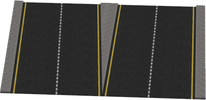

%end

```
LaneSeparation {
          SFVec3f    translation                 0 0 0
          SFRotation rotation                    0 1 0 0
          SFString   name                        "road"                     
          SFString   id                          ""                         
          MFString   connectedRoadIDs            []                         
          SFFloat    width                       14                         
          SFFloat    length                      5                          
          SFInt32    numberOfLanes               4                          
          SFInt32    numberOfleavingLanes        2                          
          SFBool     newLaneLeft                 TRUE                       
          MFBool     dashedLine                  TRUE                       
          SFFloat    roadBorderHeight            0.15                       
          SFFloat    roadBorderWidth             0.8                        
          SFBool     rightBorder                 TRUE                       
          SFBool     leftBorder                  TRUE                       
          SFBool     centralBorder               TRUE                       
          SFBool     rightBarrier                FALSE                      
          SFBool     leftBarrier                 FALSE                      
          SFBool     bottom                      FALSE                      
          MFString   startLine                   [ ]                        
          MFString   endLine                     [ ]                        
          MFString   texture                     "textures/road.jpg"        
          SFFloat    textureScale                2                          
          MFString   pavementTexture             "textures/pavement.jpg"    
          MFString   bottomTexture               []                         
          SFBool     locked                      TRUE
          SFBool     roadBoundingObject          FALSE                      
          SFBool     rightBorderBoundingObject   FALSE                      
          SFBool     leftBorderBoundingObject    FALSE                      
          SFBool     centralBorderBoundingObject FALSE                      
          SFBool     rightBarrierBoundingObject  TRUE                       
          SFBool     leftBarrierBoundingObject   TRUE                       
          SFBool     castShadows                 FALSE                      
          SFString   contactMaterial             "default"                  
}
```

> **File location**: "WEBOTS\_HOME/projects/objects/road/protos/LaneSeparation.proto"

### Description

A simple segment of road allowing to divide a road into two smaller ones (or to assemble two roads into a bigger one).
The number of lanes of each of the two smaller roads is independently configurable as well as a lot of others parameters of a regular road.
Sponsored by the CTI project RO2IVSim (http://transport.epfl.ch/simulator-for-mobile-robots-and-intelligent-vehicles)

### Field Summary

- `name`: could contain the junction name

- `id`: could contain a unique ID

- `connectedRoadIDs`: list the connected road IDs

- `width`: total width of the road

- `length`: length of the segment

- `numberOfLanes`: total number of lanes

- `numberOfleavingLanes`: number of lanes leaving the road

- `newLaneLeft`: direction where goes the leaving lanes

- `dashedLine`: defines for each line if it is continuous or dashed

- `roadBorderHeight`: defines the height of the borders

- `roadBorderWidth`: defines the width of the borders

- `rightBorder`: enable/disable right border

- `leftBorder`: enable/disable left border

- `centralBorder`: enable/disable central border

- `rightBarrier`: enable/disable right barrier

- `leftBarrier`: enable/disable left barrier

- `bottom`: enable/disable the bottom of the road

- `startLine`: optionally defines the road line at the first way-point

- `endLine`: optionally defines the road line at the last way-point

- `texture`: texture used for the road

- `textureScale`: length of the texture in meter

- `pavementTexture`: texture used for the border

- `bottomTexture`: texture used for the bottom

- `roadBoundingObject`: enable/disable the road boundingObject

- `rightBorderBoundingObject`: enable/disable the right border boundingObject

- `leftBorderBoundingObject`: enable/disable the left border boundingObject

- `centralBorderBoundingObject`: enable/disable the central border boundingObject

- `rightBarrierBoundingObject`: enable/disable the right barrier boundingObject

- `leftBarrierBoundingObject`: enable/disable the left barrier boundingObject

- `castShadows`: defines if the road should cast shadows

- `contactMaterial`: contact material of the road

## Road

%figure "Road"

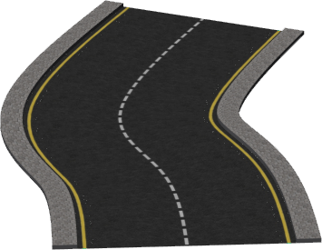

%end

```
Road {
          SFVec3f    translation               0 0 0
          SFRotation rotation                  0 1 0 0
          SFString   name                      "road"                  
          SFString   id                        ""                      
          SFString   startJunction             ""                      
          SFString   endJunction               ""                      
          SFFloat    width                     7                       
          SFInt32    numberOfLanes             2                       
          SFInt32    numberOfForwardLanes      1                       
          SFFloat    speedLimit                -1.0                    
          MFBool     dashedLine                TRUE                    
          SFFloat    roadBorderHeight          0.15                    
          MFFloat    roadBorderWidth           [ 0.8 ]                 
          SFBool     road                      TRUE                    
          SFBool     rightBorder               TRUE                    
          SFBool     leftBorder                TRUE                    
          SFBool     rightBarrier              FALSE                   
          SFBool     leftBarrier               FALSE                   
          SFBool     bottom                    FALSE                   
          SFBool     rightSide                 TRUE                    
          SFBool     leftSide                  TRUE                    
  MFVec3f    wayPoints                 [ 0 0 0, 0 0 1 ]        
          MFFloat    roadTilt                  [ 0, 0]                 
          MFFloat    startingAngle             [ ]                     
          MFFloat    endingAngle               [ ]                     
          MFString   startLine                 [ ]                     
          MFString   endLine                   [ ]                     
          SFInt32    splineSubdivision         4                       
          MFString   texture                   "textures/road.jpg"     
          SFFloat    textureScale              2                       
          MFString   pavementTexture           "textures/pavement.jpg" 
          MFString   bottomTexture             []                      
          SFString   turnLanesForward          ""                      
          SFString   turnLanesBackward         ""                      
          SFBool     locked                    TRUE
          SFBool     roadBoundingObject        FALSE                   
          SFBool     rightBorderBoundingObject FALSE                   
          SFBool     leftBorderBoundingObject  FALSE                   
          SFBool     rightBarrierBoundingObject TRUE                    
          SFBool     leftBarrierBoundingObject TRUE                    
          SFBool     castShadows               FALSE                   
          SFString   contactMaterial           "default"               
}
```

> **File location**: "WEBOTS\_HOME/projects/objects/road/protos/Road.proto"

### Description

A fully customizable road, the number of lanes, the dimensions and the path of the road is configurable.
For each line separating two lanes it is possible to configure if this one is continuous or dashed.
B-Spline can be used in order to interpolate the path of the road and an optional border can be enable.
The boundingObject of each border and the road itself can be independently enable or disable.
Sponsored by the CTI project RO2IVSim (http://transport.epfl.ch/simulator-for-mobile-robots-and-intelligent-vehicles)

### Field Summary

- `name`: could contain the street name

- `id`: could contain a unique ID

- `startJunction`: could contain a reference to the junction connected at the first Road waypoint

- `endJunction`: could contain a reference to the junction connected at the last Road waypoint

- `width`: total width of the road

- `numberOfLanes`: number of lanes

- `numberOfForwardLanes`: number of forward lanes. Note this is an information with no impact on the graphical shape.

- `speedLimit`: could contain the speed limit. The recommended unit is meter per seconds.

- `dashedLine`: defines for each line if it is continuous or dashed

- `roadBorderHeight`: defines the height of the borders

- `roadBorderWidth`: defines the width of the borders for each wayPoints

- `road`: enable/disable road

- `rightBorder`: enable/disable right border

- `leftBorder`: enable/disable left border

- `rightBarrier`: enable/disable right barrier

- `leftBarrier`: enable/disable left barrier

- `bottom`: enable/disable the bottom of the road

- `rightSide`: define if side is the end of the road (useful to create a larger road composed of several smaller ones)

- `leftSide`: define if side is the end of the road (useful to create a larger road composed of several smaller ones)

- `wayPoints`: defines the way-points of the road

- `roadTilt`: defines the tilt of the road for each wayPoints (0 if not set)

- `startingAngle`: optionally defines the orientation of the road at the first way-point

- `endingAngle`: optionally defines the orientation of the road at the last way-point

- `startLine`: optionally defines the road line at the first way-point

- `endLine`: optionally defines the road line at the last way-point

- `splineSubdivision`: if greater than 0 the path of the road is computed using B-Spline, furthermore, if bigger than 1, the segments are subdivided

- `texture`: texture used for the road

- `textureScale`: length of the texture in meter

- `pavementTexture`: texture used for the border

- `bottomTexture`: texture used for the bottom

- `turnLanesForward`: defines painted arrows before the end of the lanes using the same format as the OSM "turn:lanes:forward" key (e.g. "through|left;through|none")

- `turnLanesBackward`: idem for the OSM "turn:lanes:backward" key

- `roadBoundingObject`: enable/disable the road boundingObject

- `rightBorderBoundingObject`: enable/disable the right border boundingObject

- `leftBorderBoundingObject`: enable/disable the left border boundingObject

- `rightBarrierBoundingObject`: enable/disable the right barrier boundingObject

- `leftBarrierBoundingObject`: enable/disable the left barrier boundingObject

- `castShadows`: defines if the road should cast shadows

- `contactMaterial`: contact material of the road

## RoadIntersection

%figure "RoadIntersection"

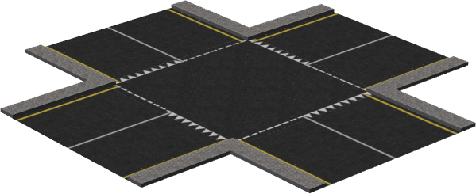

%end

```
RoadIntersection {
        SFVec3f    translation                    0 0 0
        SFRotation rotation                       0 1 0 0
        SFString   name                           "road intersection"                 
        SFString   id                             ""                                  
        MFString   connectedRoadIDs               []                                  
        SFInt32    roadNumber                     4                                   
        SFFloat    roadsWith                      7                                   
        SFBool     startRoads                     TRUE                                
        SFFloat    startRoadsLength               5                                   
        SFInt32    startRoadsNumberOfLanes        2                                   
        MFString   startRoadsStartLine            [ "textures/road_line_dashed.png",
                                                      "textures/road_line_triangle.png" ]   
        MFString   startRoadsEndLine              [ ]                                 
        MFBool     startRoadsDashedLine           FALSE                               
        SFBool     startRoadBorder                TRUE                                
        SFFloat    startRoadBorderHeight          0.15                                
        SFFloat    startRoadBorderWidth           0.8                                 
        SFBool     startRoadBorderboundingObject  FALSE                               
        SFBool     boundingObject                 FALSE                               
        SFBool     castShadows                    FALSE                               
        SFString   contactMaterial                "default"                           
        SFBool     bottom                         FALSE                               
        SFBool     locked                         TRUE
        MFString   texture                        "textures/asphalt.jpg"              
        MFString   startRoadsTexture              "textures/road.jpg"                 
}
```

> **File location**: "WEBOTS\_HOME/projects/objects/road/protos/RoadIntersection.proto"

### Description

A simple and customizable roads intersection, all the road are crossing at the same point
and equally separated in orientation.

### Field Summary

- `name`: could contain the road intersection name

- `id`: could contain a unique ID

- `connectedRoadIDs`: list the connected road IDs

- `roadNumber`: number of intersecting roads

- `roadsWith`: width of the intersecting roads

- `startRoads`: include beginning of each roads or not

- `startRoadsLength`: length of the roads

- `startRoadsNumberOfLanes`: number of lanes of the roads

- `startRoadsEndLine`: optionally defines the road line at the last way-point

- `startRoadsDashedLine`: defines for each line if it is continuous or dashed

- `startRoadBorder`: enable/disable the border of the roads

- `startRoadBorderHeight`: height of the border of the roads

- `startRoadBorderWidth`: width of the border of the roads

- `startRoadBorderboundingObject`: enable/disable the bounding object for the border of the roads

- `boundingObject`: enable/disable the bounding object of the road

- `castShadows`: defines if the road should cast shadows

- `contactMaterial`: contact material of the road

- `bottom`: enable/disable the bottom

- `texture`: texture

- `startRoadsTexture`: texture for the intersecting roads

## RoadPillars

%figure "RoadPillars"

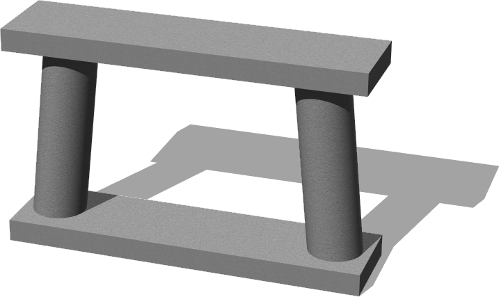

%end

```
RoadPillars {
       SFVec3f    translation        0 0 0
       SFRotation rotation           0 1 0 0
       SFString   name               "road pillar"
       SFFloat    height             5                         
       SFFloat    width              8                         
       SFFloat    depth              2                         
       SFFloat    pylonsRadius       0.6                       
       SFFloat    pylonsDistance     6                         
       SFFloat    pylonsInclination  0.1                       
       SFFloat    upperTilt          0                         
       MFString   texture            "textures/concrete.jpg"
       SFBool     boundingObject     TRUE                      
}
```

> **File location**: "WEBOTS\_HOME/projects/objects/road/protos/RoadPillars.proto"

### Description

Generic and customizable road pillars which can be used for easily creating bridges or elevated roads.
The boundingObject can be optionally enable or not.
Sponsored by the CTI project RO2IVSim (http://transport.epfl.ch/simulator-for-mobile-robots-and-intelligent-vehicles)

### Field Summary

- `height`: Total height of the structure

- `width`: Lateral with of the structure

- `depth`: Depth of the structure

- `pylonsRadius`: Radius of the two pylons

- `pylonsDistance`: Distance between the two pylons (should be smaller than the width)

- `pylonsInclination`: Optional angle of inclination of the pylons

- `upperTilt`: Tilt of the upper support

- `boundingObject`: Enable/disable the box boundingObject

## Roundabout

%figure "Roundabout"

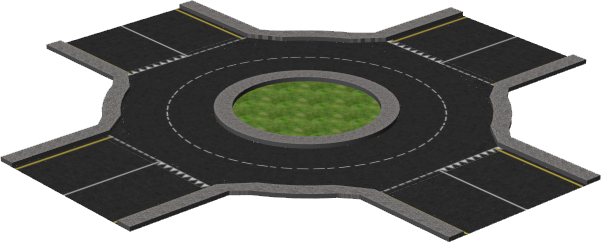

%end

```
Roundabout {
        SFVec3f    translation              0 0 0
        SFRotation rotation                 0 1 0 0
        SFString   name                     "roundabout"                        
        SFString   id                       ""                                  
        MFString   connectedRoadIDs         []                                  
        SFInt32    subdivision              16
        SFInt32    numberOfLanes            2                                   
        SFBool     bottom                   FALSE                               
        SFBool     border                   TRUE                                
        SFFloat    borderWidth              0.8                                 
        SFFloat    borderHeight             0.2                                 
        SFFloat    innerRadius              4                                   
        SFFloat    outerRadius              8                                   
        SFBool     center                   TRUE                                
        SFVec2f    centerTextureScale       4 4                                 
        SFInt32    roadNumber               4                                   
        SFFloat    startRoadsLength         5                                   
        SFFloat    startRoadsWith           7                                   
        SFInt32    startRoadsNumberOfLanes  2                                   
        MFString   startRoadsStartLine      [ "textures/road_line_dashed.png",
                                                "textures/road_line_triangle.png" ] 
        MFString   startRoadsEndLine        [ ]                                 
        MFBool     startRoadsDashedLine     FALSE                               
        SFBool     roadBoundingObject       FALSE                               
        SFBool     borderBoundingObject     FALSE                               
        SFBool     centerBoundingObject     FALSE                               
        SFBool     castShadows              FALSE                               
        SFString   contactMaterial          "default"                           
        SFBool     locked                   TRUE
        MFString   centerTexture            "textures/grass.jpg"                
        MFString   texture                  "textures/road_no_border_line.jpg"  
        SFFloat    textureScale              2                                  
        MFString   junctionTexture          "textures/asphalt.jpg"              
        MFString   startRoadsTexture        "textures/road.jpg"                 
}
```

> **File location**: "WEBOTS\_HOME/projects/objects/road/protos/Roundabout.proto"

### Description

A simple and customizable roundabout, all the roads are equally separated in orientation.

### Field Summary

- `name`: could contain the roundabout name

- `id`: could contain a unique ID

- `connectedRoadIDs`: list the connected road IDs

- `numberOfLanes`: number of lanes

- `bottom`: enable/disable the bottom of the road

- `border`: enable/disable the border

- `borderWidth`: width of the central border

- `borderHeight`: height of the central border

- `innerRadius`: inner radius of the roundabout

- `outerRadius`: outer radius of the roundabout

- `center`: enable/disable the central part

- `centerTextureScale`: scale of the central texture

- `roadNumber`: number of intersecting roads

- `startRoadsLength`: length of the intersecting roads

- `startRoadsWith`: width of the intersecting roads

- `startRoadsNumberOfLanes`: number of lanes of the roads

- `startRoadsEndLine`: optionally defines the road line at the last way-point

- `startRoadsDashedLine`: defines for each line if it is continuous or dashed

- `roadBoundingObject`: enable/disable the road boundingObject

- `borderBoundingObject`: enable/disable the border boundingObject

- `centerBoundingObject`: enable/disable the central part boundingObject

- `castShadows`: defines if the road should cast shadows

- `contactMaterial`: contact material of the road

- `centerTexture`: texture used for the central part

- `texture`: texture used for the road

- `textureScale`: length of the texture in meter

- `junctionTexture`: texture of the small junction part

- `startRoadsTexture`: texture for the intersecting roads

## StraightRoadSegment

%figure "StraightRoadSegment"

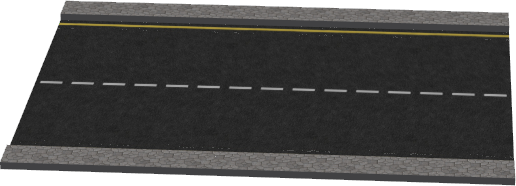

%end

```
StraightRoadSegment {
       SFVec3f    translation               0 0 0
       SFRotation rotation                  0 1 0 0
       SFString   name                      "road"                  
       SFString   id                        ""                      
       SFString   startJunction             ""                      
       SFString   endJunction               ""                      
       SFFloat    width                     7                       
       SFInt32    numberOfLanes             2                       
       SFInt32    numberOfForwardLanes      1                       
       MFBool     dashedLine                TRUE                    
       SFFloat    roadBorderHeight          0.15                    
       SFFloat    startingRoadBorderWidth   0.8                     
       SFFloat    endingRoadBorderWidth     0.8                     
       SFBool     rightBorder               TRUE                    
       SFBool     leftBorder                TRUE                    
       SFBool     rightBarrier              FALSE                   
       SFBool     leftBarrier               FALSE                   
       SFBool     bottom                    FALSE                   
       SFBool     rightSide                 TRUE                    
       SFBool     leftSide                  TRUE                    
       SFFloat    length                    10                      
       MFString   startLine                 [ ]                     
       MFString   endLine                   [ ]                     
       SFFloat    startingRoadTilt          0                       
       SFFloat    endingRoadTilt            0                       
       MFString   texture                   "textures/road.jpg"     
       SFFloat    textureScale              2                       
       MFString   pavementTexture           "textures/pavement.jpg" 
       MFString   bottomTexture             []                      
       SFBool     locked                    TRUE
       SFBool     roadBoundingObject        FALSE                   
       SFBool     rightBorderBoundingObject FALSE                   
       SFBool     leftBorderBoundingObject  FALSE                   
       SFBool     rightBarrierBoundingObject TRUE                   
       SFBool     leftBarrierBoundingObject TRUE                    
       SFBool     castShadows               FALSE                   
       SFString   contactMaterial           "default"               
}
```

> **File location**: "WEBOTS\_HOME/projects/objects/road/protos/StraightRoadSegment.proto"

### Description

A simple straight road, the number of lanes and the dimensions are configurable,
an optional border can be enable.
Sponsored by the CTI project RO2IVSim (http://transport.epfl.ch/simulator-for-mobile-robots-and-intelligent-vehicles)

### Field Summary

- `name`: could contain the street name

- `id`: could contain a unique ID

- `startJunction`: could contain a reference to the junction connected at the first Road waypoint

- `endJunction`: could contain a reference to the junction connected at the last Road waypoint

- `width`: total width of the road

- `numberOfLanes`: number of lanes

- `numberOfForwardLanes`: number of forward lanes. Note this is an information with no impact on the graphical shape.

- `dashedLine`: defines for each line if it is continuous or dashed

- `roadBorderHeight`: defines the height of the borders

- `startingRoadBorderWidth`: defines the width of the borders at the beginning

- `endingRoadBorderWidth`: defines the width of the borders at the end

- `rightBorder`: enable/disable right border

- `leftBorder`: enable/disable left border

- `rightBarrier`: enable/disable right barrier

- `leftBarrier`: enable/disable left barrier

- `bottom`: enable/disable the bottom of the road

- `rightSide`: define if side is the end of the road (useful to create a larger road composed of several smaller ones)

- `leftSide`: define if side is the end of the road (useful to create a larger road composed of several smaller ones)

- `length`: length of the road

- `startLine`: optionally defines the road line at the first way-point

- `endLine`: optionally defines the road line at the last way-point

- `startingRoadTilt`: defines the tilt of the road at the beginning

- `endingRoadTilt`: defines the tilt of the road at the end

- `texture`: texture used for the road

- `textureScale`: length of the texture in meter

- `pavementTexture`: texture used for the border

- `bottomTexture`: texture used for the bottom

- `roadBoundingObject`: enable/disable the road boundingObject

- `rightBorderBoundingObject`: enable/disable the right border boundingObject

- `leftBorderBoundingObject`: enable/disable the left border boundingObject

- `rightBarrierBoundingObject`: enable/disable the right barrier boundingObject

- `leftBarrierBoundingObject`: enable/disable the left barrier boundingObject

- `castShadows`: defines if the road should cast shadows

- `contactMaterial`: contact material of the road

