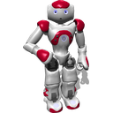

# Robots

## Sections

| | |
| --- | --- |
|  | [Aibo ERS7](aibo-ers7.md) | Sony |
|  | [Altino](altino.md) | Saeon |
|  | [Atlas](atlas.md) | Boston Dynamics |
|  | [BB-8](bb8.md) | Sphero |
|  | [Create](create.md) | iRobot |
|  | [DARwIn-OP](darwin-op.md) | Robotis |
|  | [Elisa 3](elisa3.md) | GCTronics |
|  | [e-puck](epuck.md) | GCTronics |
|  | [FireBird 6](firebird6.md) | NEXics |
|  | [HOAP-2](hoap2.md) | Fujitsu |
|  | [IPR](ipr.md) | Neuronics |
|  | [Khepera III](khepera3.md) | K-Team |
|  | [Khepera IV](khepera4.md) | K-Team |
|  | [KHR-2HV](khr-2hv.md) | KONDO |
|  | [Microbot](microbot.md) | Picaxe |
|  | [Nao](nao.md) | SoftBankics |
|  | [Pioneer 3-AT](pioneer-3at.md) | adept |
|  | [Pioneer 3-DX](pioneer-3dx.md) | adept |
|  | [Portal](portal.md) | A4 |
|  | [PR2](pr2.md) | Clearpath Robotics |
|  | [Robotis-OP2](robotis-op2.md) | Robotis |
|  | [Thymio II](thymio2.md) | Mobsya |
|  | [youBot](youbot.md) | KUKA |
