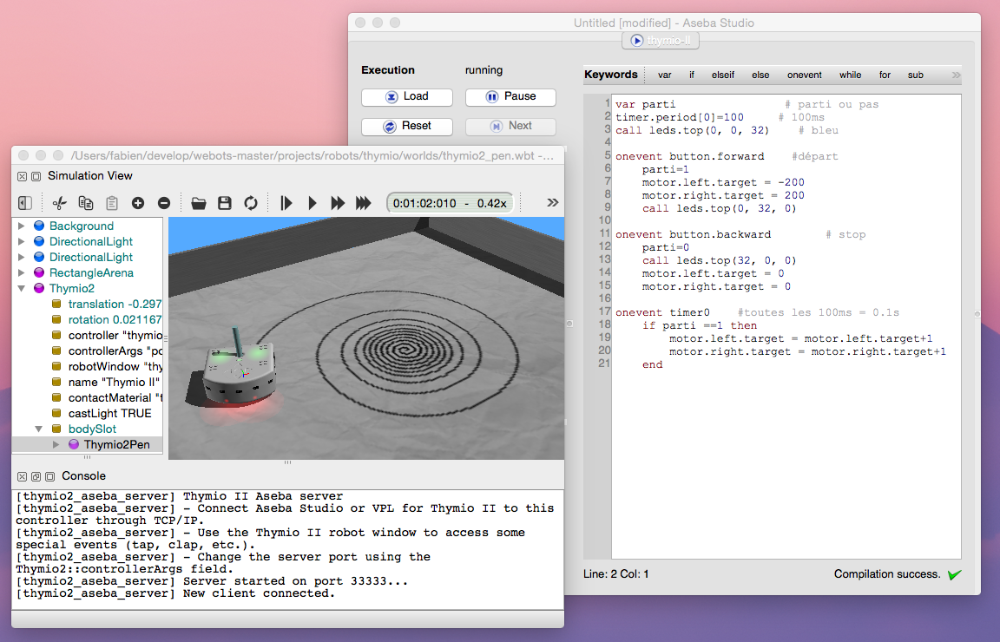

# Robots

## Using the e-puck robot

In this section, you will learn how to use Webots with the e-puck robot ().
E-puck is a miniature mobile robot originally developed at the EPFL for teaching
purposes by the designers of the successful Khepera robot. The hardware and
software of e-puck is fully open source, providing low level access to every
electronic device and offering unlimited extension possibilities. The official
`e-puck web site` provides the most up-to-date information about this robot.
E-puck is also available for purchase from Cyberbotics Ltd.

### Overview of the robot


**The e-puck robot at work**

E-puck was designed to fulfill the following requirements:

E-puck is equipped with a large number of devices, as summarized in .

### Simulation model


**The e-puck model in Webots**

The e-puck model in Webots is depicted in . This model includes support for the
differential wheel motors (encoders are also simulated), the infra-red sensors
for proximity and light measurements, the accelerometer, the camera, the 8
surrounding LEDs, the body and front LEDs; the other e-puck devices are not yet
simulated in the current model. Besides standard e-puck devices, the model also
provides two slots that can be used to extend the functionality and to equip the
robot with additional devices. In particular, the ground sensors module
extension of the real e-puck robot is modeled in Webots to provide 3 optional
infra-red sensors pointing to the ground in front of the robot. The  displays
the names of the simulated devices which are to be used as an argument of the
function `wb_robot_get_device()` (see the Robot section of `Reference Manual`).

The e-puck dimensions and speed specifications are shown in . The functions
`wb_differential_wheels_set_speed()`,
`wb_differential_wheels_get_left_encoder()` and
`wb_differential_wheels_get_right_encoder()` will allow you to set the speed of
the robot and to use its encoders.

As is the case for any Differential Wheels robot set at its default position in
Webots, the forward direction of the e-puck is given by the negative `z`-axis of
the world coordinates. This is also the direction the eye of the camera is
looking to; in keeping with the VRML standard, the direction vector of the
camera is pointing in the opposite direction, namely the direction of the
positive `z`-axis. The axle's direction is given by the positive `x`-axis.
Proximity sensors, light sensors and LEDs are numbered clockwise; their location
and orientation are shown in and . The last column of  lists the angles between
the negative `x`-axis and the direction of the devices, the plane `zOx` being
oriented counter-clockwise. Note that the proximity sensors and the light
sensors are actually the same devices of the real robot used in a different
mode, so their direction coincide. Proximity sensors responses are simulated in
accordance with the lookup table in ; this table is the outcome of calibration
performed on the real robot.


**Proximity sensor response against distance**

The resolution of the camera was limited to 52x39 pixels, as this is the maximum
rectangular image with a 4:3 ratio which can be obtained from the remote control
interface with the real robot.

The standard model of the e-puck is provided in the "E-puck.proto" PROTO file
which is located in the "WEBOTS_MODULES_PATH/projects/robots/e-puck/protos"
directory of the Webots distribution (see also "E-puckDistanceSensor.proto"
PROTO file and "E-puckGroundSensors.proto" PROTO file); you will find complete
specifications in it. The two PROTO fields `groundSensorSlot` and `turretSlot`
have been included in the simulation model in order to support extension
modules.


**Sensors, LEDs and camera**

Several simulation examples are located in the
"WEBOTS_MODULES_PATH/projects/robots/e-puck/worlds" directory of the Webots
distribution. The "e-puck_line.wbt" world (see ) especially examplifies the use
of ground sensors. Ground sensors can be added to a real e-puck robot by
inserting a special extension card with three sensors just below the camera of
the robot. These sensors are actually simple infra-red sensors which allow the
e-puck robot to see the color level of the ground at three locations in a line
across its front. The `groundSensorSlot` field of the standard E-puck PROTO is
expressly provided for equipping the simulated e-puck robot with the ground
sensors extension modeled in the `E-puckGroundSensors` PROTO. This is
particularly useful for implementing line following behaviors. The "e-puck_line"
controller program contains the source code for a simple line following system
which, as an exercise, can be improved upon to obtain the behavior demonstrated
in the "e-puck_line_demo.wbt" demo, in which the e-puck robot is able to follow
the line drawn on the floor, but also to avoid obstacles and return to the line
following behavior afterwards. This model was contributed by Jean-Christophe
Zufferey from the EPFL, who sets up a series of exercises with Webots and
extended e-puck robots.


**An e-puck extension for line following**

The directory "WEBOTS_MODULES_PATH/projects/samples/curriculum" contains a rich
collection of simulations involving the e-puck robot. You will find inside it
all the worlds and controllers corresponding to the exercices of Cyberbotics
robotics `curriculum`. Written in collaboration with professors and master
students of EPFL, Cyberbotics curriculum is an educational document intended for
all level of learnings in robotics. It addresses a dozen of topics ranging from
finite state automata to particle swarm optimization, all illustated through the
real or the simulated e-puck robot; you can browse it `here`.  The e-puck models
of Webots distribution are open source and you are welcome to modify them. If
you develop a useful modification and would like to share it, please let us know
so that we can improve these models using your contribution.

### Control interface

#### Control window


**The e-puck control window for simulation**

When opening a world containing an e-puck robot, Webots displays the e-puck
control window (which also appears when you double-click on the e-puck robot).
This window is depicted in . It allows visualizing the devices of the robot. The
distance measurements are displayed in red, outside the body of the robot. The
light measurements are displayed in yellow, above the distance measurements. The
10 LEDs are displayed in black when off and red (or green) when on. The motor
speeds are displayed in blue, and the motor position is displayed in the Encoder
box in the bottom right hand corner of the window. The camera image (if
present), the ground sensor values (if present) and the accelerometer values are
displayed in the corresponding boxes on the right side of the window.

This e-puck control window appears because the `robotWindow` field of the
`DifferentialWheel` node in the world file was set to "e-puck_window". Changing
this `robotWindow` to an empty string will disable this control window.

#### BotStudio

BotStudio is a user interface for programming graphically the e-puck thanks to a
finite state automaton. Behaviors such as wall follower, collision avoider or
line follower can be implemented quickly thanks to this interface. BotStudio is
typically destinated for the education field, particularly for beginners in
robotics.

An automaton state of BotStudio corresponds to a state of the e-puck actuators
while a transition corresponds to a condition over its sensor values. A
transition is fired when all of its conditions are fulfilled (logical AND). A
logical OR can be performed by several transitions between two states.

The actuators available in BotStudio are the LEDs and the motors. Each automaton
state have two sliders for setting the motor speed value. Note that these values
can be unset by clicking on the cursor of the slider. Each state have also 10
square buttons for setting the LEDs states. A red button means the LED is turned
on, a black one means it is turned off and a grey one means there is no
modification.

The sensor available in BotStudio are the distance sensors and the camera.
Moreover a timer can be used to temporize the conditions by dragging the
corresponding slider. Conditions over the IR sensors can be set by dragging the
8 red sliders. A condition can be reversed by clicking on the grey part of the
slider. Finally, the camera is used for giving a clue on the front environment
of the e-puck. An algorithm is applied on the last line of the camera and
returns a integer between -10 and 10 indicating if a black line is perceived
respectively at the left and at the right of the e-puck field of view. A
condition can be set on this value for getting a line follower behavior.

BotStudio is depicted in the . An example of BotStudio can be found by opening
the "WEBOTS_MODULES_PATH/projects/robots/e-puck/world/e-puck_botstudio.wbt"
world file.

The BotStudio windows appears when the e-puck's controller points on a *.bsg*
file.


**BotStudio**

#### Bluetooth setup

The e-puck has a Bluetooth interface allowing it to communicate with Webots.
This feature is available under Windows, Linux and Mac OS X. The Bluetooth
interface must be set up according to your operating system (OS). Generally it
is as simple as using the Bluetooth interface of your OS in order to discover
and to pair the e-puck as a regular Bluetooth device. The complete instructions
about pairing can be found on the `GCTronic website`.

On linux, the pairing has to be done manually (without using the Bluetooth
interface of the OS). This can be done by using the `rfcomm` command. Once
generated, the rfcomm file has to be given to Webots through an environment
variable. It may also occur that the rfcomm file doesn't have the read rights. A
typical pairing can be done using the following commands:


```

# Get the e-puck MAC adress
$ hcitool scan
Scanning ...
	10:00:E8:52:BF:32	e-puck_1368
# Bind the MAC adress of the e-puck with a non-existing rfcomm file
sudo rfcomm bind /dev/rfcomm1 10:00:E8:52:BF:32
# (Optional) Grant the read rights to the rfcomm file
sudo chmod 666 /dev/rfcomm1
# Export the WEBOTS_COM? environment variable (with ? between 1 to 9)
export WEBOTS_COM1=/dev/rfcomm1
# Launch Webots
webots
   
```

#### Bluetooth remote control

Once properly set up, your Bluetooth connection to your e-puck should appear in
the popup menu of the control. If it doesn't appear there, it means that your
computer was not properly configured to interface with your e-puck robot through
Bluetooth. Please refer to the instructions given in the previous section.

When selecting a specific Bluetooth connection from the popup menu of the
control window, Webots will try to establish a connection with your e-puck
robot. Once connected, it will display the version of the e-puck serial
communication software on the Webots console (e.g. 'Running real e-puck (Version
1.4.3 March 2010 (Webots))'), and will switch the control to the real robot.
That is, it will send motor commands to the real robot and display sensor
information (proximity, light, camera image, etc.) coming from the real robot.
This makes the transfer from the simulation to the real robot trivially simple.
Note that in the same popup menu, the `Refresh ports` menu item can be used for
updating the COM ports.

The remote control has two requirements: the Bluetooth must be correctly set up
(computer side) and the e-puck must be programmed with the Webots last firmware.
For setting up Bluetooth, please refer to the official e-puck website. For
uploading the last firmware on your robot, switch on your robot, press the
`Upload to e-puck robot...` button on the control window and finally select the
select the COM port which corresponds to your robot and the "WEBOTS_MODULES_PATH
/projects/robots/e-puck/transfer/firmware/firmware-x.x.x.hex" file located in
your Webots directory (*x.x.x* has to be replaced by the current firmware's
version).

#### Cross-compilation

An alternative to the remote-control session for running the real e-puck is to
cross-compile your code and to upload it on the e-puck.

For using this feature, your code has to be written in C and to use the C Webots
API. Moreover, you need to define a specific Makefile called "Makefile.e-puck"
in the controller directory. This Makefile must include the following file:
`include $(WEBOTS_MODULES_PATH)/projects/robots/e-puck/transfer/libepuck/Makefil
e.include` Thanks to this, it is possible to cross-compile with Webots by using
the `Build > Cross-compile` menu item of the text editor. Note that the `Upload
to e-puck robot...` button of the e-puck control window allows you to upload a
file generated by the cross-compilation extended by ".hex" on the e-puck robot.

An example of cross-compilation is given in the
"WEBOTS_MODULES_PATH/projects/robots/e-puck/controllers/e-puck_cross-compilation
" subdirectory of your Webots directory.

#### Cross-compilation issues on Linux 64 bit

When cross-compiling on Linux 64 bit, it may occur such kind of error: `/bin/sh:
1: pic30-elf-gcc: not found make: *** [e-puck_cross-compilation-pic30.o] Error
127` This error can be fixed simply by installing the following packets from a
terminal: `sudo apt-get install gcc-4.6-base:i386 libgcc1:i386 libc6:i386`

## Using the Nao robot

### Introduction

The Nao robot is a humanoid robot developed by `Aldebaran Robotics`. This
section explains how to use Nao robot simulated in Webots together with the
Choregraphe program of `Aldebaran Robotics`. Currently Webots supports the Nao
v3.3, v4.0 and v5.0 versions, with and without their articulated fingers
(respectively with 25 and 21 degrees of freedom) for the first two.

The Webots installation includes several world files with Nao robots. You will
find some in this folder:
"WEBOTS_MODULES_PATH/projects/robots/aldebaran/worlds". The "nao.wbt" and
"nao_indoors.wbt" are meant to be used with Choregraphe (see below). The
"nao_demo.wbt" is a demonstration of a very simple controller that uses Webots C
API instead of Choregraphe. The "nao_matlab.wbt" world is an example of
programming Webots using the Matlab API. The "nao_robocup.wbt" world is an
example of how to use the NAOqi API inside Webots. It is the same API that is
used in Choregraphe, meaning that you can program Nao inside Webots without
using Choregraphe if you want to. In this world, Nao tries to shoot the ball in
the goal. You can find another NAOqi example in the
"WEBOTS_MODULES_PATH/projects/contests/nao_challenge/2013-2014/worlds" folder.
The "challenge.wbt" file in this folder is a solution to the NAO Challenge
contest (edition 2013-2014).

In addition Nao robots are also used in the world files of the `Robotstadium`
contest. These files are located in this folder:
"WEBOTS_MODULES_PATH/projects/contests/robotstadium/worlds".

### Using Webots with Choregraphe

These instructions have been tested with Webots 8.0.0 and Choregraphe 2.1.1.10.
Please note that Webots must not be launched as root when using any world
containing naoqisim, otherwise Choregraphe won't be able to send instructions to
the robot in Webots.

Start Webots and open this world file:
"WEBOTS_MODULES_PATH/projects/robots/aldebaran/worlds/nao.wbt" You should see a
red Nao in an empty environment. If the simulation is paused, then please start
it by pushing the `Real-time` button in Webots.

The camera images in Webots (small purple viewports) should reflect what the
robot sees.

Several lines of text information corresponding to the output of NAOqi should be
printed to Webots console.

Now you can start Choregraphe with the --no-naoqi option. Please make sure the
Choregraphe version matches the NAOqi version printed in Webots console. In
Choregraphe choose the menu `Connection > Connect to...`. Then in the list,
select the NAOqi that was started by Webots, on you local machine, it will have
the port number 9559, unless you change it. Note that the NAOqi will not appear
in the list if the simulation was not started in Webots. If the simulation was
started but the robot still doesn't appear in the list, force the IP and port to
127.0.0.1 and 9559 in Choregraphe and then press connect.

At this point a Nao model matching the Webots model should appear in
Choregraphe. Now, in Choregraphe toggle the "Wake up" button, which is a little
sun in the rop right of the window. Nao is currently in the "Stand Zero" pose,
you can change its starting pose using the posture library in Choregraphe.

Then double-click on any of the Nao parts in Choregraphe: a small window with
control sliders appears. Now, move any of the sliders: the motor movement in
Choregraphe should be reflected in the Webots simulation. If you open the Video
monitor in Choregraphe you should see the picture of the Nao camera simulated by
Webots.

### Nao models

You can switch between the Nao model thanks to the following Nao PROTO fields:

### Using motion boxes

Now we can test some of the motion boxes of Choregraphe. A simple example is a
sit down -> stand up motion. In Choregraphe, select the "Sit Down" and "Stand
Up" boxes from `Box libraries > default`. Drag and drop them in central view.
Then connect the global "onStart" input to the "Sit Down" box's "onStart" input,
and the output of this box to the "Stand Up" box's "onStart" input. Now make
sure the simulation is running, and, push the `Play` button in Choregraphe. This
will make the robot sit down, and then stand up once he is done sitting down.

### Using the cameras

Webots simulates Nao's top and bottom cameras. Using Aldebaran's Choregraphe or
the Monitor programs, it is possible to switch between these cameras. In
Choregraphe, use the "Select Camera" box in `Box Library > Vision`. The
simulated camera image can be viewed in Choregraphe: `View > Video monitor`. The
resolution of the image capture can be changed in Webots using the `cameraWidth`
and `cameraHeight` fields of the robot. Note that the simulation speed decreases
as the resolution increases. It is possible to hide the camera viewports (purple
frame) in Webots, by setting the `cameraPixelSize` field to 0. It is also
possible to completely switch off the simulation of the cameras by adding the
"-nocam" option before the NAOqi port number in the `controllerArgs` field, e.g.
"-nocam 9559".

### Using Several Nao robots

It is possible to have several Nao robots in your simulation, however each Nao
robot must use a different NAOqi port. Here how to copy a Nao and assign the
NAOqi port number:

Repeat the above procedure for each additional robot that you need. Remember
that every robot must have a different port number specified in
`controllerArgs`.

### Getting the right speed for realistic simulation

Choregraphe uses exclusively real-time and so the robot's motions are meant to
be carried out in real-time. The Webots simulator uses a virtual time base that
can be faster or slower than real-time, depending on the CPU and GPU power of
the host computer. If the CPU and GPU are powerful enough, Webots can keep up
with real-time, in this case the speed indicator in Webots shows approximately
1.0x, otherwise the speed indicator goes below 1.0x. Choregraphe motions will
play accurately only if Webots simulation speed is around 1.0x. When Webots
simulation speed drifts away from 1.0x, the physics simulation gets wrong
(unnatural) and thus Choregraphe motions don't work as expected any more. For
example if Webots indicates 0.5x, this means that it is only able to simulate at
half real-time the motion provided by Choregraphe: the physics simulation is too
slow. Therefore it is important to keep the simulation speed as much as possible
close to 1.0x. There are currently no means of synchronizing Webots and
Choregraphe, but this problem will be addressed in a future release. It is often
possible to prevent the simulation speed from going below 1.0x, by keeping the
CPU and GPU load as low as possible. There are several ways to do that, here are
the most effective ones:

### Known Problems

If for some unexpected reason Webots crashes, it is possible that the `hal` or
`naoqi-bin` processes remain active in memory. In this case we recommend you to
terminate these processes manually before restarting Webots.

On Windows, use the Task Manager (the Task Manager can be started by pressing
Ctrl-Alt-Delete): In the Task Manager select the `Processes` tab, then select
each `hal.exe` and `naoqi-bin.exe` line and push the "End Process" button for
each one.

On Linux, you can use the `killall` or the `pkill` commands, e.g.: `$ killall
hal naoqi-bin`

## Using the Thymio II robot


**Thymio II model in Webots**

Thymio II is an affordable educational robot. It provides three main features: a
large number of sensors and actuators, an educative interactivity based on light
and touch, a programming environment featuring graphical and text programming.

More information about the Thymio II is available from `its official website`.

Webots contains an accurate model of the Thymio II robot (see the ). Almost all
the Thymio II devices have been modeled and calibrated. Moreover Aseba studio
and VPL for Thymio II can be connected on the simulated model allowing you to
program the simulated robot using Aseba. Many Aseba examples are working
directly with the simulated robot. Finally several objects related to the Thymio
II are available, including a pen which can draw on any 3D object.

### Thymio II model

The  shows which devices are supported by the model, and their names (using the
Webots terminology).

The Thymio II distance sensor feedback is given on . The calibration was
performed using a regular A4 white paper.


**Proximity sensor response versus distance**

### Connect Aseba to the Thymio II model

The default controller of the Thymio II PROTO is the `thymio2_demo` controller.
It should be changed to `thymio2_aseba` to allow the connection to Aseba
programming environment. However, most world files including the Thymio II robot
are already configured to use `thymio2_aseba` as a controller for the Thymio II
robot. Technically, `thymio2_aseba` creates a TCP/IP server on which Aseba can
be connected, and it wraps the Aseba API with the Webots API.

Here is how to proceed to connect Aseba to the Thymio II model in Webots. Make
sure that the simulation is running (the controller has started) and that the
controller of the Thymio II robot is `thymio2_aseba`. You can check this from
the Webots scene tree, by opening the Thymio2 node. Aseba Studio or VPL for
Thymio II can then be started. From the Aseba target selection dialog (see the
.), select the `Network TCP/IP` option with the following parameters: `Host =
localhost` and `Port = 33333`. Then just click on the `Connect` button.

In case of a simulation containing several Thymio II, the TCP/IP port of the
`thymio2_aseba` controller should be unique for each robot instance. This value
can be modified by editing the `Thymio2::controllerArgs` field.


**Aseba Studio and VPL target selection dialog**

The Thymio II window (see the ) can help you to raise some events easily. These
events are mainly useful when using the VPL for Thymio II software. To open the
Thymio II window, just double click on the 3D model of the robot.


**Thymio II robot window**

### Thymio II Pen

You can easily add a pen in the simulated model by adding a `Thymio2Pen` node to
the `Thymio2::bodySlot` field. This pen can draw on every 3D object. This is
particularily useful to perform `these exercises`. An example of this is located
there (see the ):
"WEBOTS_MODULES_PATH/projects/robots/thymio/worlds/thymio2_pen.wbt"


**Simulation of a Thymio II having a pen.**

### Thymio II Ball

`These exercises` can be reproduced by adding a `Thymio2Ball` node in your
world. The ball can be slightly moved by applying a force on it (`ALT + mouse
left click`). An example of this is located there (see the ):
"WEBOTS_MODULES_PATH/projects/robots/thymio/worlds/thymio2_ball.wbt"


**Simulation of a Thymio II above a ball.**

## Using the Pioneer 3-AT and Pioneer 3-DX robots

### Pioneer 3-AT

In this section, you will learn how to use Webots simulation model of the
Pioneer 3-AT robot. ().

#### Overview of the robot


**Pioneer 3-AT, a ready-to-use all terrain base**

The Pioneer 3-AT robot is an all-purpose outdoor base, used for research and
prototyping applications involving mapping, navigation, monitoring,
reconnaissance and other behaviors. It provides a ready-to-use set of devices
listed in .

More information on the specifications and optional devices is available on
Adept Mobile Robots official `webpage`.

#### Simulation model


**The Pioneer 3-AT model in Webots**

The Pioneer 3-AT model in Webots is depicted in . This model includes support
for 4 motors and 16 sonar sensors (8 forward-facing, 8 rear-facing) for
proximity measurements. The standard model of the Pioneer 3-AT is provided in
the "pioneer3AT.wbt" file which is located in the
"WEBOTS_MODULES_PATH/projects/robots/pioneer/pioneer3at/worlds" directory of the
Webots distribution.


**Pioneer 3-AT motor names**

The "pioneer3at.wbt" world file is a simulation example of a simple obstacle
avoidance behavior based on the use of a SICK LIDAR (see the
"obstacle_avoidance_with_lidar.c" controller file in the
"WEBOTS_MODULES_PATH/projects/robots/pioneer/pioneer3at/controller" directory).

The Pioneer 3-AT motors are RotationalMotor nodes named according to . The
`wb_set_motor_position()` and `wb_set_motor_velocity()` functions allow the user
to manage the rotation of the wheels. The sonar sensors are numbered according
to .


**Sonar sensors positions**

The angle between two consecutive sensor directions is 20 degrees except for the
four side sensors (so0, so7, so8 and so15) for which the angle is 40 degrees.

### Pioneer 3-DX

In this section, you will learn how to use Webots simulation model of the
Pioneer 3-DX robot. ().

#### Overview of the robot


**Pioneer 3-DX, an all-purpose base, used for research and applications**

The base Pioneer 3-DX platform is assembled with motors featuring 500-tick
encoders, 19 cm wheels, tough aluminum body, 8 forward-facing ultrasonic (sonar)
sensors, 8 optional real-facing sonar, 1, 2 or 3 hot-swappable batteries, and a
complete software development kit. The base Pioneer 3-DX platform can reach
speeds of 1.6 meters per second and carry a payload of up to 23 kg.

The Pioneer 3-DX robot is an all-purpose base, used for research and
applications involving mapping, teleoperation, localization, monitoring,
reconnaissance and other behaviors. Pioneer 3-DX is provided with a ready-to-use
set of devices listed in .

More information on the specifications and optional devices is available on
Adept Mobile Robots official `webpage`.

#### Simulation model


**The Pioneer 3-DX model in Webots**

The Pioneer 3-DX model in Webots is depicted in . This model includes support
for two motors, the caster wheel, 7 LEDs on the control panel and 16 sonar
sensors (8 forward-facing, 8 rear-facing) for proximity measurements. The
standard model of the Pioneer 3-DX is provided in the "pioneer3dx.wbt" file
which is located in the
"WEBOTS_MODULES_PATH/projects/robots/pioneer/pioneer3dx/worlds" directory of the
Webots distribution.


**Pioneer 3-DX motor names**

The "pioneer3dx.wbt" world file shows a simulation example of the Braitenberg
avoidance algorithm based on the use of the 16 sonar sensors (see the
"braitenberg.c" controller file in the
"WEBOTS_MODULES_PATH/projects/robots/pioneer/pioneer3dx/controller" directory).
The "pioneer3dx_with_kinect.wbt" world file in the same directory is a simple
simulation example of an obstacle avoidance behaviour based on a Microsoft
kinect sensor (see the "obstacle_avoidance_kinect.c" controller file).

The Pioneer 3-DX motors are RotationalMotor nodes named according to . The
`wb_set_motor_position()` and `wb_set_motor_velocity()` functions allow the user
to manage the rotation of the wheels. The sonar sensors are numbered according
to .

The angle between two consecutive sensor directions is 20 degrees except for the
four side sensors (so0, so7, so8 and so15) for which the angle is 40 degrees.

