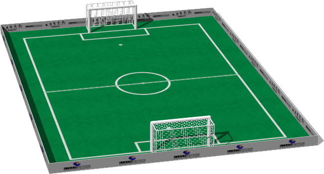

# Robotstadium

## RobotstadiumGoal

%figure "RobotstadiumGoal"


%end

```
RobotstadiumGoal {
      SFVec3f translation 0 0 0
      SFRotation rotation 0 1 0 0
      SFString name "robotstadium goal"
      SFFloat postRadius 0.05
      SFColor frameColor 1 1 1
}
```

> **File location**: "WEBOTS\_HOME/projects/objects/robotstadium/protos/RobotstadiumGoal.proto"

### Description

Robot soccer goal inspired from the RoboCup 2013-2014 Standard Platform League
The color of the goal and the support polygons can be modified.

## RobotstadiumSoccerField

%figure "RobotstadiumSoccerField"



%end

```
RobotstadiumSoccerField {
      SFVec3f translation 0 0 0
      SFRotation rotation 0 1 0 0
      SFString name "robotstadium soccer    "
      SFString contactMaterial "default"
      SFColor frame1Color 1 1 1
      SFColor frame2Color 1 1 1
      SFFloat postRadius 0.05
}
```

> **File location**: "WEBOTS\_HOME/projects/objects/robotstadium/protos/RobotstadiumSoccerField.proto"

### Description

Robot soccer field inspired from the RoboCup 2014 Standard Platform League
The soccer field is built on a total carpet area of length 10.4 m and width 7.4 m
The field dimensions (within the white lines) are 9 x 6 m

