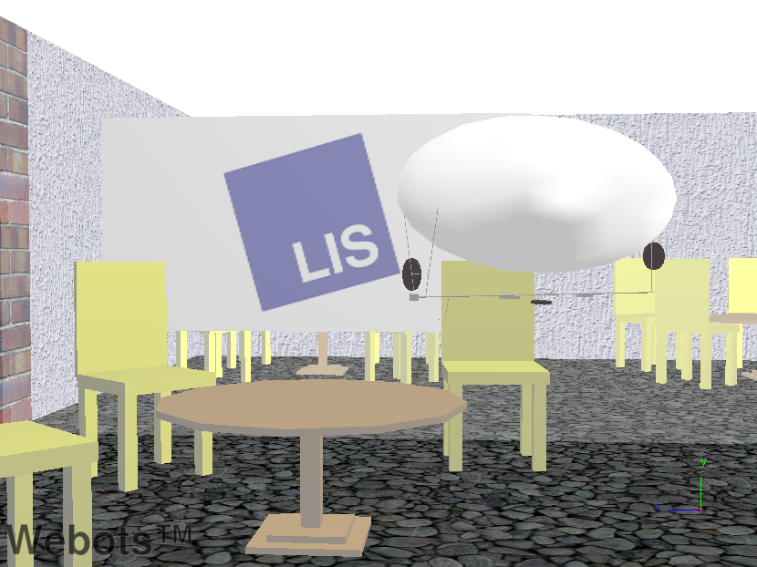
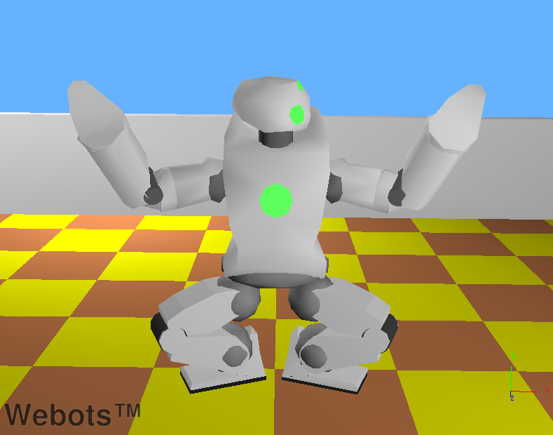
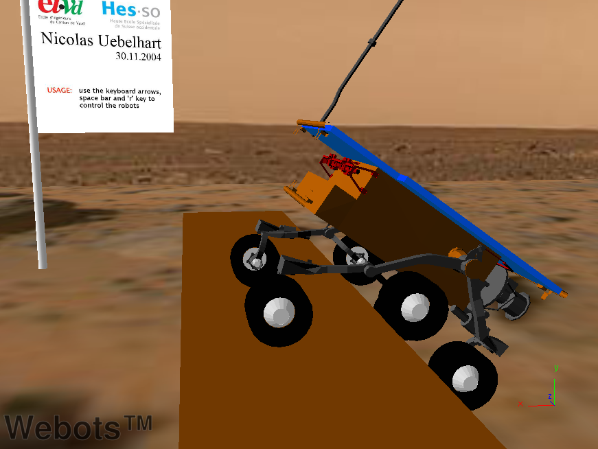

## Samples

This section provides a list of interesting worlds that broadly illustrate
Webots capabilities. Several of these examples have stemmed from research or
teaching projects. You will find the corresponding ".wbt" files in the
"WEBOTS_MODULES_PATH/projects/samples/demos/worlds" directory, and their
controller source code in the
"WEBOTS_MODULES_PATH/projects/samples/demos/controllers" directory. For each
demo, the world file and its corresponding controller have the same name.

### blimp_lis.wbt

**blimp_lis.wbt**

This is an example of the flying blimp robot developed at the Laboratory of
Intelligent Systems (LIS) at EPFL. You can use your keyboard, or a joystick to
control the blimp's motion across the room. Use the up, down, right, left, page
up, page down and space (reset) keys. Various `Transform` and `IndexedFaceSet`
nodes are used to model the room using textures and transparency. A *physics
plugin* is used to add thrust and other forces to the simulation.

### gantry.wbt

**gantry.wbt**

In this example, a gantry robot plays "Towers of Hanoi" by stacking three
colored boxes. The gantry robot is modeled using a combination of `LinearMotor`
and `RotationalMotor` devices. A recursive algorithm is used to solve the Hanoi
Towers problem.

### hexapod.wbt

**hexapod.wbt**

In this example, an insect-shaped robot is made of a combination of
`LinearMotor` and `RotationalMotor` devices. The robot moves using an
alternating tripod gait.

### humanoid.wbt

**humanoid.wbt**

In this example, a humanoid robot performs endless gymnastic movements.

### moon.wbt

**moon.wbt**

In this example, two Koala robots (K-Team) circle on a moon-like surface. You
can modify their trajectories with the arrow keys on your keyboard. The moon-
like scenery is made of `IndexedFaceSet` nodes. Both robots use the same
controller code.

### ghostdog.wbt

**ghostdog.wbt**

This example shows a galloping quadruped robot made of active hip joints and
passive knee joints (using spring and dampers). The keyboard can be used to
control the robot's direction and to change the amplitude of the galloping
motion. Each knee is built of two embedded HingeJoint nodes, one active and one
passive, sharing the same rotation axis. The passive HingeJoint simulates the
spring and damping. The active HingeJoint is not actuated in this demo but it
could be used for controlling the knee joints.

### salamander.wbt

**salamander.wbt**

A salamander-shaped robot walks down a slope and reaches a pool where it starts
to swim. The controller uses two different types of locomotion: it walks on the
ground and swims in the water. This demo simulates propulsive forces caused by
the undulations of the body and the resistance caused by the robot's shape. In
addition, the buoyancy of the robot's body is also simulated using Archimedes'
principle.

### soccer.wbt

**soccer.wbt**

In this example, two teams of simple `DifferentialWheels` robots play soccer. A
`Supervisor` is used as the referee; it counts the goals and displays the
current score and the remaining time in the 3D view. This example shows how a
`Supervisor` can be used to read and change the position of objects.

### sojourner.wbt

**sojourner.wbt**

This is a realistic model of the "Sojourner" Mars exploration robot (NASA). A
large obstacle is placed in front of the robot so that it is possible to observe
how the robot manages to climb over it. The keyboard can be used to control the
robot's motion.

### yamor.wbt

**yamor.wbt**

In this example, eight "Yamor" robot modules attach and detach to and from each
other using `Connector` devices. Connector devices are used to simulate the
mechanical connections of docking systems. In this example, the robot modules go
through a sequence of loops and worm-like configurations while changing their
mode of locomotion. All modules use the same controller code, but their actual
module behaviour is chosen according to the name of the module.

### stewart_platform.wbt

**stewart_platform.wbt**

This is an example of a *Stewart platform*. A Stewart platform is a kind of
parallel manipulator that uses an octahedral assembly of linear actuators. It
has six degrees of freedom (*x*, *y*, *z*, pitch, roll, and yaw). In this
example, the Stewart platform is loaded with a few stacked boxes, then the
platform moves and the boxes stumble apart. This simulation attaches both ends
of the linear actuators (hydraulic pistons) to the lower and the upper parts of
the Stewart platform.

