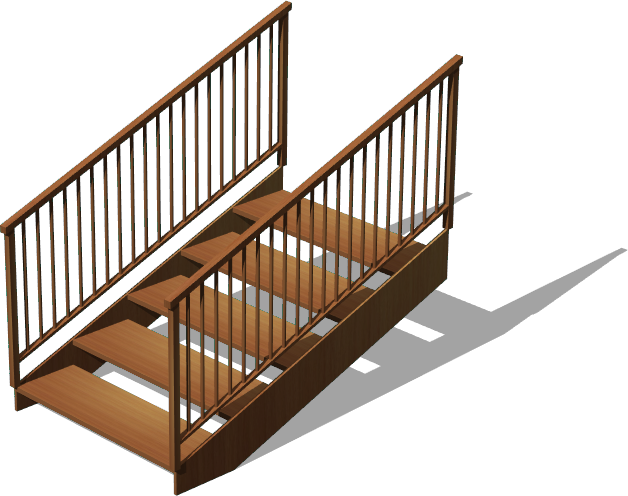
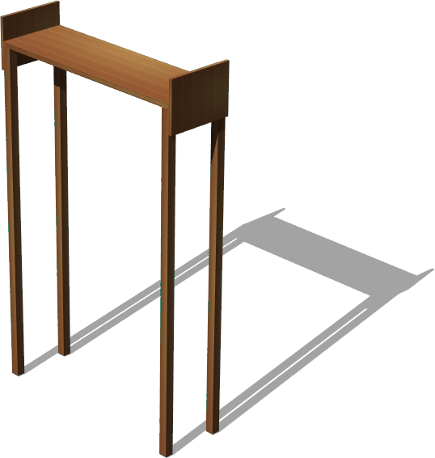
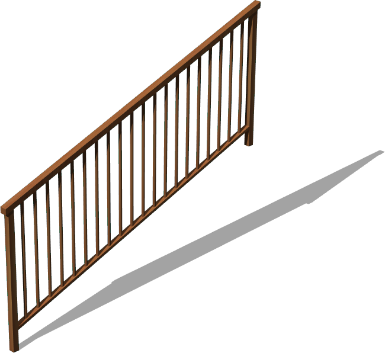

# Stairs

## StraightStairs

%figure "StraightStairs"



%end

```
StraightStairs {
   SFVec3f translation 0 0 0
   SFRotation rotation 0 1 0 0
   SFString name "straight stairs"
   SFVec3f stepSize 0.4 0.03 1.27
   SFFloat stepRise 0.15
   SFInt32 nSteps 5
   SFNode stepAppearance Appearance { material Material {} texture ImageTexture { url [ "textures/desktop_wood.jpg" ] } textureTransform TextureTransform { rotation 1.5708 } }
   SFNode stringerAppearance Appearance { material Material {} texture ImageTexture { url [ "textures/desktop_wood.jpg" ] } textureTransform TextureTransform { rotation 1.5708 } }
   MFNode leftRail StraightStairsRail {}
   MFNode rightRail StraightStairsRail {}
   SFBool startingStairs TRUE
   SFString contactMaterial "default"
}
```

> **File location**: "WEBOTS\_HOME/projects/objects/stairs/protos/StraightStairs.proto"

### Description

Generic and customizable stairs model

## StraightStairsLanding

%figure "StraightStairsLanding"



%end

```
StraightStairsLanding {
   SFVec3f translation 0 0 0
   SFRotation rotation 0 1 0 0
   SFString name "straight stairs landing"
   SFVec3f landingSize 0.4 0.03 1.27
   SFFloat height 2.0
   SFVec2f stringerSize 0.3 0.02 
   SFBool stringerLeft TRUE
   SFBool stringerRight TRUE
   SFBool stringerBack FALSE
   SFVec2f supportPoleSize 0.05 0.05
   SFNode appearance Appearance { material Material {} texture ImageTexture { url [ "textures/desktop_wood.jpg" ] } textureTransform TextureTransform { rotation 1.5708 } }
   SFNode floorAppearance Appearance { material Material {} texture ImageTexture { url [ "textures/desktop_wood.jpg" ] } textureTransform TextureTransform { rotation 1.5708 } }
   MFNode rail [ ]
   SFString contactMaterial "default"
}
```

> **File location**: "WEBOTS\_HOME/projects/objects/stairs/protos/StraightStairsLanding.proto"

### Description

Generic and customizable landing model for straight stairs.

### Field Summary

- `stringerSize`: height and width

## StraightStairsRail

%figure "StraightStairsRail"



%end

```
StraightStairsRail {
   SFVec3f translation 0 0 0
   SFRotation rotation 0 1 0 0
   SFString name "straight stairs rail"
   SFFloat run 2.0
   SFFloat rise 0.75
   SFFloat width 0.04
   SFFloat newelHeight 0.93
   SFFloat balusterHeight 0.8
   SFFloat balusterRadius 0.01
   SFInt32 nBalusters 20
   SFNode appearance Appearance { material Material {} texture ImageTexture { url [ "textures/desktop_wood.jpg" ] } textureTransform TextureTransform { rotation 1.5708 } }
   SFString contactMaterial "default"
}
```

> **File location**: "WEBOTS\_HOME/projects/objects/stairs/protos/StraightStairsRail.proto"

### Description

Default stairs handrail.

