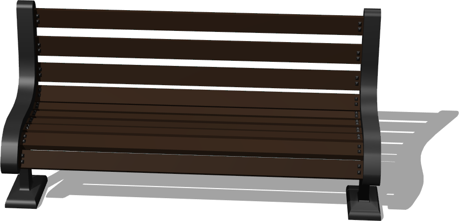
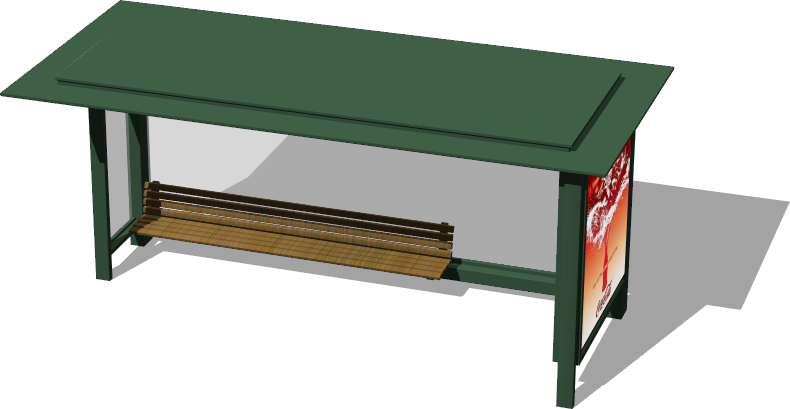
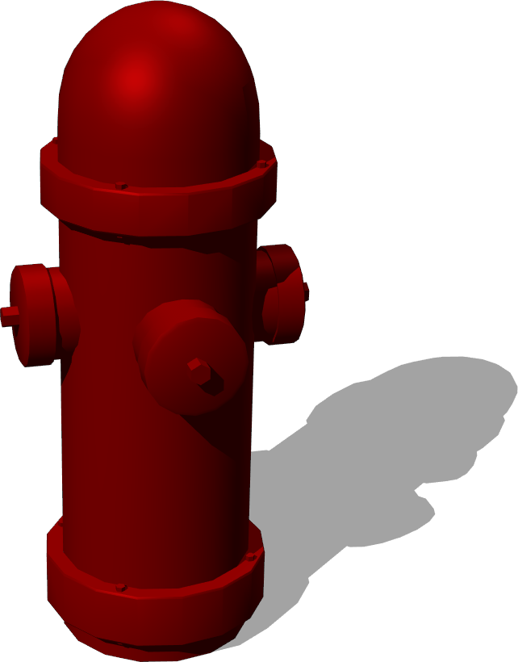
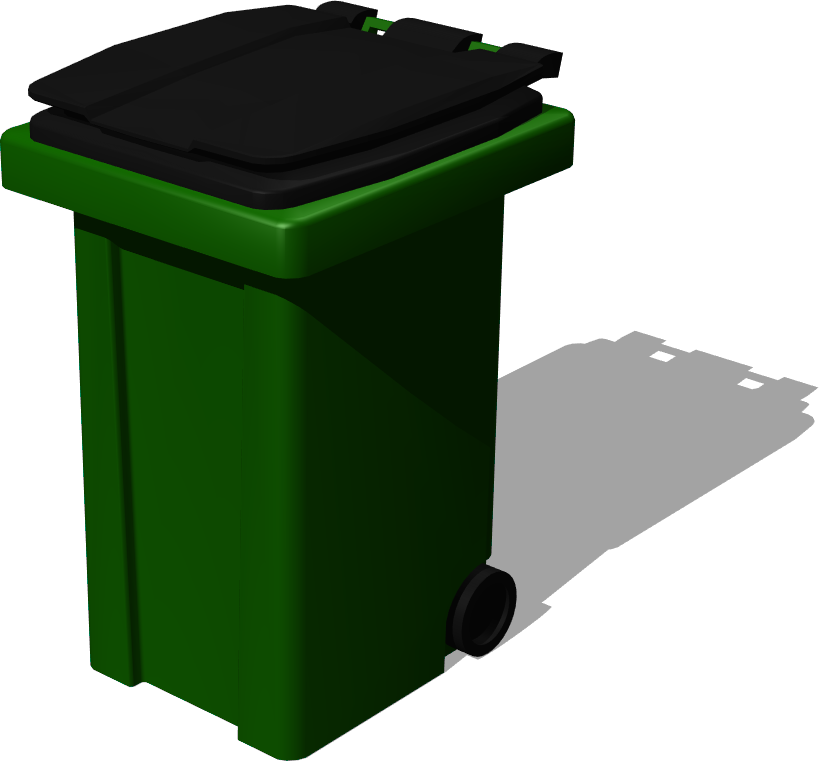

# Street Furniture

## Bench

%figure "Bench"



%end

```
Bench {
         SFVec3f    translation          0 0 0
         SFRotation rotation             0 1 0 0
         SFString   name                 "bench"
         SFColor    metalColor           0.17 0.17 0.17
         SFColor    woodColor            0.25 0.17 0.12
         MFColor    recognitionColors    [0.17 0.17 0.17, 0.25 0.17 0.12]
}
```

> **File location**: "WEBOTS\_HOME/projects/objects/street_furniture/protos/Bench.proto"

### Description

A bench.

## BusStop

%figure "BusStop"



%end

```
BusStop {
   SFVec3f     translation                 0 0 0
   SFRotation  rotation                    0 1 0 0
   SFString    name                        "bus stop"
   SFBool      bench                       TRUE
   SFNode      appearance                  Appearance { material Material { diffuseColor 0.3 0.45 0.33 } }
   MFString    internalAdvertisingTexture  [ "textures/cocacola_advertising.jpg" ]
   MFString    externalAdvertisingTexture  [ "textures/cocacola_advertising.jpg" ]
   SFBool      advertisingLightOn          TRUE
}
```

> **File location**: "WEBOTS\_HOME/projects/objects/street_furniture/protos/BusStop.proto"

### Description

Simple bus stop with customizable appearance and an optional bench
based on the blender model of Ringbarkis (http://www.blendswap.com/blends/view/66783)
Sponsored by the CTI project RO2IVSim (http://transport.epfl.ch/simulator-for-mobile-robots-and-intelligent-vehicles)

## BusStopBench

```
BusStopBench {
   SFString name "bus stop bench"
   SFNode appearance Appearance { material Material { diffuseColor 0.3 0.45 0.33 } }
}
```

> **File location**: "WEBOTS\_HOME/projects/objects/street_furniture/protos/BusStopBench.proto"

### Description


## BusStopMesh

```
BusStopMesh {
   SFNode appearance Appearance { material Material { diffuseColor 0.3 0.45 0.33 } }
}
```

> **File location**: "WEBOTS\_HOME/projects/objects/street_furniture/protos/BusStopMesh.proto"

### Description


## EmergencyPhone

%figure "EmergencyPhone"


%end

```
EmergencyPhone {
         SFVec3f    translation          0 0 0
         SFRotation rotation             0 1 0 0
         SFString   name                 "emergency phone"
         SFColor    poleColor            1 0.44 0
         MFColor    recognitionColors    [1 0.44 0]
}
```

> **File location**: "WEBOTS\_HOME/projects/objects/street_furniture/protos/EmergencyPhone.proto"

### Description

An emergency phone.

## Fence

```
Fence {
   SFVec3f      translation             0 0 0
   SFRotation   rotation                0 1 0 0
   SFString     name                    "fence"
   SFFloat      height                  1.5
   SFFloat      poleGap                 0.5
   SFFloat      poleRadius              0.04
   SFString     poleShape               "cylinder"
   SFNode       poleAppearance          Appearance { material Material {} }
   MFVec3f      path                    [0 0 0, 5 0 0]
   SFInt32      subdivision             -1
   SFInt32      horizontalBarsNumber    2
   MFVec2f      horizontalBarShape      [0.06 0.02, 0.06 -0.02, -0.06 -0.02, -0.06 0.02, 0.06 0.02]
   SFNode       horizontalBarAppearance Appearance { material Material {} }
   SFNode       boundingObject          NULL
  hiddenField SFNode appearance              NULL     
}
```

> **File location**: "WEBOTS\_HOME/projects/objects/street_furniture/protos/Fence.proto"

### Description

A customizable fence.
Dimensions, path and appearance of the fence can be set.
If subdivision is bigger than 1, B-Splines are used to interpolate path of the fence
Sponsored by the CTI project RO2IVSim (http://transport.epfl.ch/simulator-for-mobile-robots-and-intelligent-vehicles)

### Field Summary

- `appearance`: for backward compatibility warning

## FireHydrant

%figure "FireHydrant"



%end

```
FireHydrant {
   SFVec3f translation 0 0 0
   SFRotation rotation 0 1 0 0
   SFString name "fire hydrant"
   SFNode appearance Appearance { material Material { diffuseColor 0.643 0 0 specularColor 0.473 0.027 0.027} }
}
```

> **File location**: "WEBOTS\_HOME/projects/objects/street_furniture/protos/FireHydrant.proto"

### Description

A fire hydrant.

## Fountain

%figure "Fountain"


%end

```
Fountain {
   SFVec3f     translation            0 0 0
   SFRotation  rotation               0 1 0 0
   SFString    name                   "fountain"
   SFFloat     height                 1.5
   SFFloat     radius                 1
   SFInt32     sudivision             16
}
```

> **File location**: "WEBOTS\_HOME/projects/objects/street_furniture/protos/Fountain.proto"

### Description

Simple fountain

## PublicBin

%figure "PublicBin"


%end

```
PublicBin {
         SFVec3f    translation          0 0 0
         SFRotation rotation             0 1 0 0
         SFString   name                 "public bin"
         SFColor    color                0.27 0.27 0.27
         MFColor    recognitionColors    [0.27 0.27 0.27]
}
```

> **File location**: "WEBOTS\_HOME/projects/objects/street_furniture/protos/PublicBin.proto"

### Description

A public bin.

## PublicToilet

%figure "PublicToilet"


%end

```
PublicToilet {
   SFVec3f     translation         0 0 0
   SFRotation  rotation            0 1 0 0
   SFString    name                "public toilet"
   SFFloat     height              3.2
   SFFloat     length              3.5
   SFFloat     width               2.1
   SFColor     mainColor           0.4 0.4 0.4
   SFColor     secondaryColor      0.5 0.5 0.5
   SFColor     mainTopColor        0.22 0.22 0.22
   SFColor     secondaryTopColor   1 0.95 0.33
   SFColor     windowColor         0.8 1 0.93
   SFString    text                "TOILET"
   SFFloat     textScale           80
   MFString    backDisplayTexture  "textures/webots_billboard.jpg"
   SFBool      backDisplayLight    FALSE
   MFNode      frontDisplay        [ AdvertisingBoard {
                                            frontTexture ["textures/webots_billboard.jpg"]
                                            backTexture []
                                            displayBackLight FALSE
                                            displayWidth 0.90
                                            displayHeight 1.35
                                            frameThickness 0.1
                                          } ]
}
```

> **File location**: "WEBOTS\_HOME/projects/objects/street_furniture/protos/PublicToilet.proto"

### Description

Resizable public toilet with two different displays.

## PublicToiletMesh

```
PublicToiletMesh {
}
```

> **File location**: "WEBOTS\_HOME/projects/objects/street_furniture/protos/PublicToiletMesh.proto"

### Description


## TrashBin

%figure "TrashBin"



%end

```
TrashBin {
         SFVec3f    translation          0 0 0
         SFRotation rotation             0 1 0 0
         SFString   name                 "trash bin"
         SFColor    coverColor           0.1 0.1 0.1
         SFColor    binColor             0.08 0.46 0
         MFColor    recognitionColors    [0.1 0.1 0.1, 0.08 0.46 0]
}
```

> **File location**: "WEBOTS\_HOME/projects/objects/street_furniture/protos/TrashBin.proto"

### Description

A trash bin.

