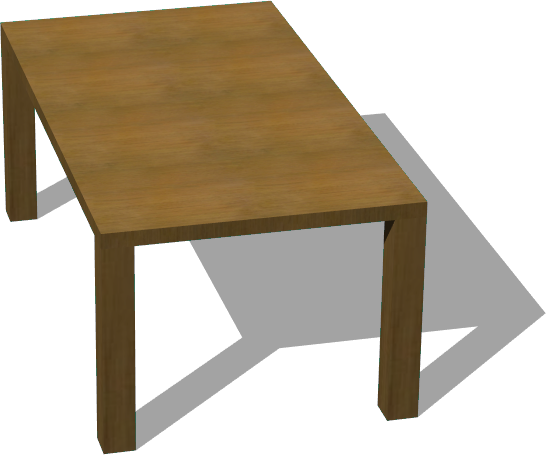

# Tables

## Desk

%figure "Desk"


%end

```
Desk {
      SFVec3f translation 0 0 0
      SFRotation rotation 0 1 0 0
      SFString name "desk"
      SFColor color 1 1 1
      MFString textureUrl "textures/desk.jpg"
      SFNode physics NULL
}
```

> **File location**: "WEBOTS\_HOME/projects/objects/tables/protos/Desk.proto"

### Description

A desk (1.2 x 0.72 x 0.7 m)

## RoundTable

%figure "RoundTable"


%end

```
RoundTable {
      SFVec3f translation 0 0 0
      SFRotation rotation 0 1 0 0
      SFString name "round table"
      SFColor color 1 1 1
      MFString textureUrl "textures/wood.jpg"
      SFNode physics NULL
}
```

> **File location**: "WEBOTS\_HOME/projects/objects/tables/protos/RoundTable.proto"

### Description

A round table (2 x 0.76 x 2 m)

## Table

%figure "Table"



%end

```
Table {
      SFVec3f    translation         0 0 0
      SFRotation rotation            0 1 0 0
      SFString   name                "table"
      SFVec3f    size                1.8 0.74 1
      SFVec2f    feetSize            0.1 0.1
      SFFloat    feetPadding         0
      SFFloat    frameThickness      0.05
      SFFloat    trayTransparency    0
      MFString   trayTextureUrl      "textures/wood.jpg"
      SFVec2f    trayTileSize        0.5 0.5
      MFString   feetTextureUrl      "textures/wood.jpg"
      SFVec2f    feetTileSize        0.5 0.5
}
```

> **File location**: "WEBOTS\_HOME/projects/objects/tables/protos/Table.proto"

### Description

Customizable table

