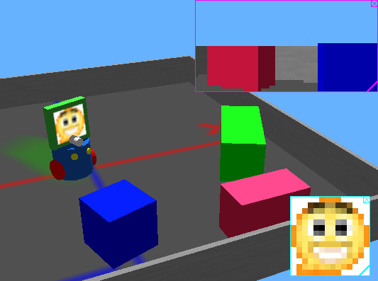

## The 3D Window

### Selecting an object

A single mouse click allows to select a solid object. The bounding object of a
selected solid is represented by white lines. These lines turn rose if the solid
is colliding with another one and blue when the solid is idle, i.e., it comes to
rest and it doesn't interact with any other active solid. Selecting a robot
enables the `Show Robot Window` item in the `Tools` menu. Double-clicking on a
solid object opens the Robot Window and if it was closed, the Scene Tree.

If an object has a solid subpart, then it is also possible to select only this
subpart by clicking on it once the whole object is already selected, or by
clicking on it while holding down the Alt key. Linux users should also hold down
the Control key (Ctrl) together with the Alt key.

### Navigation in the scene

Dragging the mouse while pressing a mouse button moves the camera of the 3D
window.

### Moving a solid object

Currently Webots provides two different ways to move solid objects: axis-aligned
handles and keyboard shortcuts.

#### Axis-aligned handles

When a solid object is selected, some arrow-shaped handles appear in the 3D
window (see ). These handles can be used to translate and rotate the object
along the corresponding axis. For moving the object you can simply click on the
handle and drag it to the desired position. A label will show the currect
relative translation or rotation during the movement, as shown in .

If the Control key (Ctrl), the handles for resizing the solid object will be
displayed instead of translation and rotation handles. These resize handles can
also be enabled from the Field Editor.

**Axis-aligned handles to move solid objects**

**Labels displaying relative translation and rotation when moving objects with handles**

#### Translation using keyboard shurtcuts

### Applying a force to a solid object with physics

To apply a force to an object, place the mouse pointer where the force will
apply, hold down the Alt key and left mouse button together while dragging the
mouse. Linux users should also hold down the Control key (Ctrl) together with
the Alt key. This way your are drawing a 3D-vector whose end is located in the
plane parallel to the view which passes through the point of application. The
intensity of the applied force is directly proportional to the cube of the
length of this vector.

### Applying a torque to a solid object with physics

To apply a torque to an object, place the mouse pointer on it, hold down the Alt
key and right mouse button together while dragging the mouse. Linux users should
also hold down the Control key (Ctrl) together with the Alt key. Also, Mac OS X
users with a one-button mouse should hold down the Control key (Ctrl) to emulate
the right mouse button. This way your are drawing a 3D-vector with origin the
center of mass and whose end is located in the plane parallel to the view which
passes through this center. The object is prompted to turn around the vector
direction, the intensity of the applied torque being directly proportional to
the product of the mass by the length of the 3D-vector.

### Moving and resizing Overlays

By default for each Camera and Display device, an overlay showing the recorded
or displayed image is visible in the 3D view. The device type is indicated by
the border color: magenta for Camera devices and cyan for Display devices, see .
This overlay can be moved to the desired position on the view by clicking on it
and dragging the mouse. In order to resize the overlay the user has to click on
the icon located at the bottom right corner and drag the mouse, during this
action the original not scaled image size will be indicated using darker areas,
as depicted in Additionally a close button is available on the top right corner
to hide the overlay. Once the robot is selected, it is also possible to show or
hide the overlay images from the `Camera Devices` and `Display Devices` items in
`Robot` menu.

**Camera and Display overlays**

**Camera overlay resizing**

### Show Camera and Display images in separate window

Overlay images can also be displayed outside the 3D window, see . When double-
clicking with the left mouse button on the overlay, a new external window
displaying the device image is created and the overlay in the 3D window is
disabled. It is possible to restore the 3D window overlay simply by closing the
window.

**Camera and Display image window**

