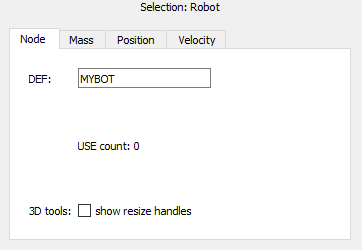

## The Scene Tree

As seen in the previous section, to access to the Scene Tree Window you can
either choose `Scene Tree` in the `Tools` menu, or press the `Show Scene Tree`
button in the main toolbar. The scene tree contains the information that
describes a simulated world, including robots and environment, and its graphical
representation. The scene tree of Webots is structured like a VRML97 file. It is
composed of a list of nodes, each containing fields. Fields can contain values
(text strings, numerical values) or other nodes.

This section describes the user interface of the Scene Tree, and gives an overview
of the VRML97 nodes and Webots nodes.

%figure "Scene Tree Window"

%end

### Field Editor

Nodes can be expanded with a double-click. When a field is selected, its value
can be edited at the bottom of the Scene Tree. All changes will be immediately
reflected in the 3D window. The following buttons are available in the field
editor section:

 `Reset`: Resets a field to its default
value.

 `Help`: Context sensitive help for the
currently selected node.

Additionally, when a node is selected, other actions are available as shown in
[this figure](#webots-node-editor):

%figure "Webots node editor"

%end

`Tranform to`: Allows to change the type of the selected node by chosing the
target type from a given list of suitable types. This action is not available
for all node types.

`Export...`: Exports nodes that can then be imported in other worlds.

`Source`: Displayed only when a PROTO node is selected, opens the corresponding
PROTO definition file in the text editor.

`Result`: Displayed only when a procedural PROTO node is selected, opens the
PROTO definition file generated by the template engine in the text editor.

`Show resize handles`: Displays the handles for resizing and scaling the
selected node from the 3D Window. This option is disabled for PROTO nodes and
only displayed for Geometry nodes and nodes derived from Transform.

> **Note**:
We recommend to use the Scene Tree to write Webots world files. However, because
the nodes and fields are stored in a human readable form, it is also possible to
edit world files with a regular text editor. Some search and replace operations
may actually be easier that way. Please refer to Webots Reference Manual for
more info on the available nodes and the world file format.
