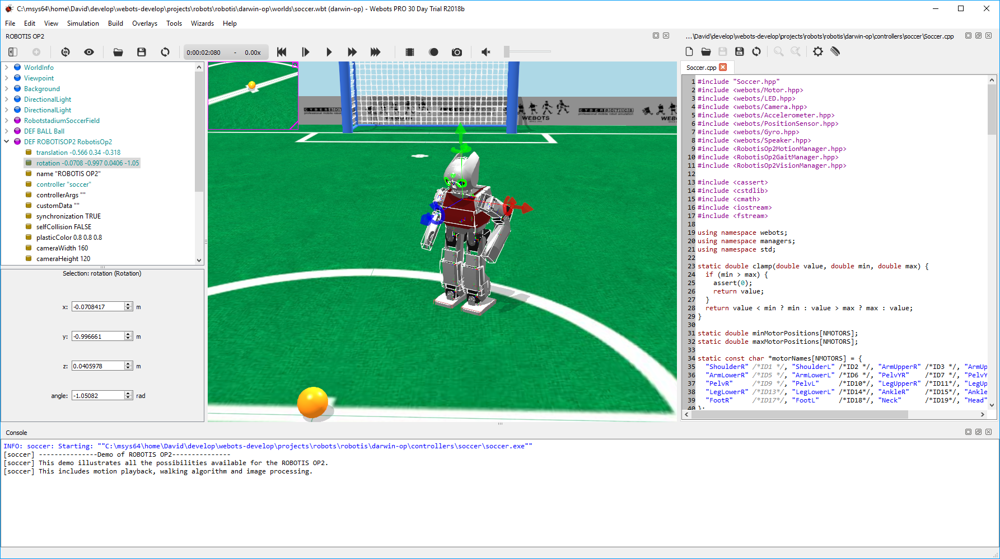
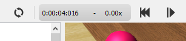

## The User Interface

Webots GUI is composed of four principal windows: the *3D window* that displays
and allows to interact with the 3D simulation, the *Scene tree* which is a
hierarchical representation of the current world, the *Text editor* that allows
to edit source code, and finally, the *Console* that displays both compilation
and controller outputs.

%figure "Webots GUI"

%end

The GUI has nine menus: `File, Edit, View, Simulation, Build, Robot, Tools,
Wizards` and `Help`.

### File Menu

The `File` menu allows you to perform usual file operations: loading, saving,
etc.

The `New World` menu item (and button) opens a new world in the simulation
window containing only an `ElevationGrid`, displayed as a chessboard of 10 x 10
squares on a surface of 1 m x 1 m.

 The `Open World...` menu item (and button)
opens a file selection dialog that allows you to choose a ".wbt" file to load.

The `Open Recent World` menu item gives the possibility of reopening a ".wbt"
file that was opened recently by choosing it from the list displayed in the
submenu.

The `Open Sample World` menu item opens a dialog listing all the available
sample worlds where it is possible to search for a specific ".wbt" file to load
by entering the file name or part of it in the search field.

 The `Save World` menu item (and button) saves
the current world using the current filename (the filename that appears at the
top of the main window). On each `Save` the content of the ".wbt" file is
overwritten and no backup copies are created by Webots, therefore you should use
this button carefully and eventually do safety copies manually.

The `Save World As...` menu item (and button) saves the current world with a new
filename entered by the user. Note that a ".wbt" file should always be saved in
a Webots project directory, and in the "worlds" subdirectory, otherwise it will
not be possible to reopen the file.

 The `Revert World` menu item (and button)
reloads the current world from the saved version and restarts the simulation
from the beginning.

> **note**:
When opening (or reverting) a world, if the world takes more than 2 seconds to
load a window will pop up and show the progression. Using this window it is
possible to cancel the loading of the world, in that case, the empty world will
be opened instead.

 The `New Text File` menu item (and button)
opens an empty text file in the text editor.

 The `Open Text File...` menu item (and
button) opens a file selection dialog that allows you to choose a text file (for
example a ".java" file) to load.

 The `Save Text File` menu item (and button)
saves the current text file.

 The `Save Text File As...` menu item (and
button) saves the current text file with a new filename entered by the user.

The `Save All Text Files` menu item saves all the opened and unsaved text files.

 The `Revert Text File` menu item (and
button) reloads the text file from the saved version.

The `Print Preview...` menu item opens a window allowing you to manage the page
layout in order to print files from the text editor.

The `Print...` menu item opens a window allowing you to print the current file
of the text editor.

The `Import VRML 2.0...` menu item adds VRML97 objects at the end of the scene
tree. These objects come from a VRML97 file you must specify. This feature is
useful for importing complex shapes that were modeled in a 3D modelling program,
then exported to VRML97 (or VRML 2.0). Most 3D modelling software, like 3D
Studio Max, Maya, AutoCAD, Pro Engineer, AC3D, or Art Of Illusion, include the
VRML97 (or VRML 2.0) export feature. Be aware that Webots cannot import files in
VRML 1.0 format. Once imported, these objects appear as `Group`, `Transform` or
`Shape` nodes at the bottom of the scene tree. You can then either turn these
objects into Webots nodes (like `Solid`, `DifferentialWheels`, etc.) or cut and
paste them into the `children` list of existing Webots nodes.

The `Export VRML 2.0...` item allows you to save the currently loaded world as a
".wrl" file, conforming to the VRML97 standard. Such a file can, in turn, be
opened with any VRML97 viewer and most 3D modeling software.

 The `Take Screenshot...` item allows
you to take a screenshot of the current view in Webots. It opens a file dialog
to save the current view as a PNG or JPG image.

 The `Make Movie...` item allows you to
create MPEG movies (Linux and Mac OS X) or AVI movies (Windows). Once the movie
recording is started, this item is changed in `Stop Movie...`. During the
recording, it is possible to the change the running mode and pause the
simulation. However, frames are only captured during Webots steps and not when
the simulation is paused.

The `Export HTML5 Model...` item allows you to export the current world as an
interactive 3D ".html" file, using the X3DOM web standard, based on WebGL. This
is especially useful for publishing Webots-created worlds on the Web. X3DOM is
supported in recent versions of Firefox, Chrome, Internet Explorer and Safari on
Mac OS X (see details on the [X3DOM web site](http://www.x3dom.org)).

> **note**:
With the Chrome browser, in order to be able to open HTML/X3DOM files locally,
e.g., not from the Web, you may need to allow Chrome to open local files
referred to by the HTML/X3DOM file, e.g., textures. This can be achieved by
passing the `--allow-file-access-from-files` option at Chrome startup. Otherwise
textures won't show up in the 3D models.

 The `Make HTML5 Animation...` item
allows you to record a simulation as a 3D animation and publish it on a HTML5
web page. The result is similar to a movie with playback controls, except that
you can change the viewpoint at any time. Several files are generated: an X3D
file containing the 3D scene, a JSON file containing the animation data and a
HTML5 file displaying the result using X3DOM and jQuery. Once the animation
recording is started, this item is changed to `Stop HTML5 Animation...` and can
be used to stop the animation recording.

The `Quit Webots` terminates the current simulation and closes Webots.

### Edit Menu

The `Edit` menu provides usual text edition functions to manipulate files opened
in the *Text editor*, such as Copy, Paste, Cut, etc.

### View Menu

The `View` menu allows to control the viewing in the simulation window.

The `Follow Object` menu item allows to switch between a fixed (static)
viewpoint and a viewpoint that follows a mobile object (usually a robot). If you
want the viewpoint to follow an object, first you need to select the object with
the mouse and then check the `Follow Object` menu item. Note that the `Follow
Object` state is saved in the ".wbt" file.

The `Restore Viewpoint` item restores the viewpoint's position and orientation
to their initial settings when the file was loaded or reverted. This feature is
handy when you get lost while navigating in the scene, and want to return to the
original viewpoint.

The `Fullscreen` item enables and disables displaying the 3D window on the
entire screen.

The `Projection` radio button group allows to choose between the `Perspective
Projection` (default) and the `Orthographic Projection` mode for Webots
simulation window. The *perspective* mode corresponds to a natural projection:
in which the farther an object is from the viewer, the smaller it appears in the
image. With the *orthographic* projection, the distance from the viewer does not
affect how large an object appears. Furthermore, with the *orthographic* mode,
lines which are parallel in the model are drawn parallel on the screen,
therefore this projection is sometimes useful during the modelling phase. No
shadows are rendered in the *orthographic* mode.

The `Rendering` radio button group allows to choose between the `Plain
Rendering` (default) and the `Wireframe` modes for Webots simulation window. In
*plain rendering* mode, the objects are rendered with their geometrical faces,
materials, colors and textures, in the same way they are usually seen by an eye
or a camera. In *wireframe rendering* mode, only the segments of the renderable
primitives are rendered. This mode can be useful to debug your meshes. If the
*wireframe rendering* mode and the `View > Optional Rendering > Show All
Bounding Objects` toggle button are both activated, then only bounding objects
are drawn (not the renderable primitives). This can be used to debug a problem
with the collision detection.

Finally, the `Optional Rendering` submenu allows to display, or to hide,
supplementary information. These rendering are displayed only in the main
rendering and hide in the robot camera. They are used to understand better the
behavior of the simulation.

The `Show Coordinate System` allows to display, or to hide, the global
coordinate system at the bottom right corner of the 3D window as red, green and
blue arrows representing the x, y and z axes respectively.

The `Show All Bounding Objects` allows to display, or to hide, all the bounding
objects (defined in the *boundingObject* fields of every *Solid* node). Bounding
objects are represented by white lines. These lines turn rose when a collision
occurs and blue when the solid is idle, i.e., it comes to rest and it doesn't
interact with any other active solid.

The `Show Contact Points` allows to display, or to hide, the contact points
generated by the collision detection engine. Contact points that do not generate
a corresponding contact force are not shown. A contact force is generated only
for objects simulated with physics (`Physics` node required). A step is required
for taking this operation into account.

The `Show Connector axes` allows to display, or to hide, the connector axes. The
rotation alignments are depicted in black while the y and z axes respectively in
green and blue.

The `Show Joint axes` allows to display, or to hide, the joint axes. The joint
axes are represented by black lines.

The `Show RangeFinder frustums` allows to display, or to hide, the OpenGL
culling frustum and the recorded image for every range-finder in the scene,
using a yellow wire frame. The OpenGL culling frustum is a truncated pyramid
corresponding to the field of view of a range-finder. The recorded image is
displayed on the plane described by the frustum at a distance corresponding to
the minimum range of the range-finder from the device center. More information
about this concept is available in the OpenGL documentation.

The `Show Lidar Rays Paths` allows to display, or to hide, the layers (the laser
ray paths) for every lidar in the scene, using a cyan wire frame.

The `Show Lidar Point Cloud` allows to display, or to hide, the point cloud for
every lidar enabled in point cloud mode in the scene. The point cloud is
represented by the location of the points themselves and by the rays from the
lidar origin to the points using a gradient from blue (top layer) to red (bottom
layer). This optional rendering is computationally expensive and can therefore
significantly slow-down the simulation speed. Note that if the point cloud
contains more than 2500 points, the rays from the lidar origin to the point are
not displayed.

The `Show Camera frustums` allows to display, or to hide, the OpenGL culling
frustum and the recorded image for every camera in the scene, using a magenta
wire frame. The OpenGL culling frustum is a truncated pyramid corresponding to
the field of view of a camera. The back of the pyramid is not represented
because the far plane is set to infinity. The recorded image is displayed on the
camera's near plane. More information about this concept is available in the
OpenGL documentation.

The `Show Distance Sensor rays` allows to display, or to hide, the rays casted
by the distance sensor devices. These rays are drawn as red lines (which become
green beyond collision points). Their length corresponds to the maximum range of
the device.

The `Show Light Sensor rays` allows to display, or to hide, the rays casted by
the light sensor devices. These rays are drawn as yellow lines.

The `Show Lights` allows to display, or to hide, the lights (including
PointLights and SpotLights). DirectionalLights aren't represented. PointLights
and SpotLights are represented by a colored circle surrounded by a flare.

The `Show Pen Painting Rays` allows to display, or to hide, the rays in which
the pen devices paint. These rays are drawn as violet lines if painting is
enabled, otherwise as gray lines.

The `Show Center Of Mass and Support Polygon` allows to display, or to hide,
both the global center of mass of a selected solid (with non NULL `Physics`
node) and its support polygon. By support polygon we mean the projection of the
convex hull of the solid's contact points on the horizontal plane which contains
the lowest one. In addition, the projection of the center of mass in the latter
plane is rendered in green if it lies inside the support polygon (static
equilibrium), red otherwise. This rendering option can be activated only for
solids with no other solid at their top.

If the `Disable selection` option is enabled, it prevents you from changing the
selected solid node when clicking on the 3D window. This is particularly useful
during the modeling phase, when you want to change the viewpoint without
modifying the visible and selected fields in the scene tree.

### Simulation Menu

The `Simulation` menu is used to control the simulation mode.

 The `Pause` menu item (and button) pauses
the simulation.

 The `Step` menu item (and button) executes
one basic time step of simulation. The duration of this step is defined in the
`basicTimeStep` field of the `WorldInfo` node, and can be adjusted in the scene
tree window to suit your needs.

 The `Real-time` menu item (and button)
runs the simulation at real-time until it is interrupted by `Pause` or `Step`.
In run mode, the 3D display of the scene is refreshed every *n* basic time
steps, where *n* is defined in the `displayRefresh` field of the `WorldInfo`
node.

 The `Run` menu item (and button) is like
`Real-time`, except that it runs as fast as possible (Webots PRO only).

 The `Fast` menu item (and button) is like
`Run`, except that no graphical rendering is performed (Webots PRO only). As the
graphical rendering is disabled (black screen) this allows for a faster
simulation and therefore this is well suited for cpu-intensive simulations
(genetic algorithms, vision, learning, etc.).

### Build Menu

The `Build` menu provides the functionality to compile (or cross-compile)
controller code. The build menu is described in more details
[here](webots-built-in-editor.md).

### Robot Menu

The `Robot` menu provides actions specific to `Robot` nodes. Some actions of
this menu are active only when a robot is selected in the 3D window or when
there is only one robot in the simulation:

The `Edit Controller` menu item opens the source file of the controller of the
selected robot.

The `Camera Devices` submenu contains the list of all the camera devices of the
selected robot and lets the user show or hide single camera overlay images by
checking or unchecking the corresponding item. Camera overlays differ from the
display overlays because of their magenta border. Note that if the `Hide All
Camera Overlays` item is checked, then the camera device overlays will not be
visible in the 3D view independently from the status of `Camera Devices` menu
items. A `Camera Devices` menu item is disabled if the overlay's texture is
shown in an external window by double-clicking on it.

The `RangeFinder Devices` submenu contains the list of all the range-finder
devices of the selected robot and lets the user show or hide single range-finder
overlay images by checking or unchecking the corresponding item. Range-finder
overlays differ from the camera overlays because of their yellow border. Note
that if the `Hide All RangeFinder Overlays` item is checked, then the
range-finder device overlays will not be visible in the 3D view independently
from the status of `RangeFinder Devices` menu items. A `RangeFinder Devices`
menu item is disabled if the overlay's texture is shown in an external window by
double-clicking on it.

The `Display Devices` submenu contains the list of all the display devices of
the selected robot and lets the user show or hide single display overlay images
by checking or unchecking the corresponding item. Display overlays differ from
the camera overlays because of their cyan border. Note that if the `Hide All
Display Overlays` item is checked, then the display device overlays will not be
visible in the 3D view independently from the status of `Display Devices` menu
items. A `Display Devices` menu item is disabled if the overlay's texture is
shown in an external window by double-clicking on it.

On the other hand the following items are always active and apply to all the
robot in the world:

The `Hide All Camera Overlays` option hides all the camera devices overlays in
the 3D view independently from the specific robot's device option set in `Camera
Devices` submenu.

The `Hide All RangeFinder Overlays` option hides all the camera devices overlays
in the 3D view independently from the specific robot's device option set in
`RangeFinder Devices` submenu.

The `Hide All Display Overlays` option hides all the display devices overlays in
the 3D view independently from the specific robot's device option set in
`Display Devices` submenu.

### Tools Menu

The `Tools` menu allows you to open various Webots windows.

The `3D View` menu item shows or hides the

The `Scene Tree` menu item opens the

The `Scene Tree` menu item opens the `Scene Tree` window in which you can edit
the virtual world. Alternatively it is also possible to double-click on some of
the objects in the main window: this automatically opens the Scene Tree with the
corresponding object selected.

The `Text Editor` menu item opens the Webots text editor. This editor can be
used for editing and compiling controller source code.

The `Console` menu item opens the Webots Console, which is a read-only console
that is used to display Webots error messages and controller outputs.

The `Restore Layout` menu item restores the factory layout of the panes of the
main window.

The `Clear Console` menu item clears the console.

The `Edit Physics Plugin` menu item opens the source code of the physics plugin
in the text editor.

The `License Manager...` item opens the `Webots License Manager` window that
allows you to see which licenses are in use and optionally to transfer some
license to your local computer for off-line use. Please note that the transfer
of license may be limited by your local license administrator: It may not be
possible to transfer some license to your local computer or only for a limited
duration depending on the configuration defined by your local license
administrator. Please ask your local license administrator in case of problem.

The `Preferences` item pops up a window described in [this
section](preferences.md).

### Wizards Menu

The `Wizards` menu makes it easier to create new projects and new controllers.

The `New Project Directory...` menu item first prompts you to choose a
filesystem location and then it creates a project directory. A project directory
contains several subdirectories that are used to store the files related to a
particular Webots project, i.e. world files, controller files, data files,
plugins, etc. Webots remembers the current project directory and automatically
opens and saves any type of file from the corresponding subdirectory of the
current project directory.

The `New Robot Controller...` menu item allows you to create a new controller
program. You will first be prompted to choose between a C, C++, Java, Python or
*MATLAB*TM controller. Then, Webots will ask you to enter the name of
your controller and finally it will create all the necessary files (including a
template source code file) in your current project directory.

The `New Physics Plugin...` menu item will let you create a new physics plugin
for your project. Webots asks you to choose a programming language (C or C++)
and a name for the new physics plugin. Then it creates a directory, a template
source code file and a Makefile in your current project.

### Help menu

In the `Help` menu, the `About...` item opens the `About...` window that
displays the license information.

The `Webots Guided Tour...` menu item starts a guided tour that demonstrates
Webots capabilies through a series of examples.

The `OpenGL Information...` menu item gives you information about your current
OpenGL hardware and driver. It can be used to diagnose rendering problems.

The remaining menu items bring up various information as indicated, in the form
of HTML pages, PDF documents, etc.

### Main toolbar

The main toolbar contains items for editing the world and the speedometer (see
subsection [this section](#speedometer-and-virtual-time)), other than shortcuts
to items of the `File`, `Simulation` and `View` menus. Edit actions always apply
on the selected object, that is highlighted both in the 3D window and in the
Scene Tree.

 `Hide/Show Scene Tree`: shows or
hides the Scene Tree and resizes the 3D window consequently.

 `Cut`: Cuts the selected object.

 `Copy`: Copies the selected object.

 `Paste`: Pastes the copied or cut object.

Note that the first three nodes of the Scene Tree (`WorldInfo, Viewpoint,` and
`Background`) cannot be cut, copied or pasted. One single instance of each of
these nodes must be present in every Webots world, and in that precise order.

 `Add`: Adds a node or an object. For nodes,
this triggers a dialog that will let you choose a node type from a list. The new
node is created with default values that can be modified afterwards. You can
only insert a node suitable for the corresponding field. The dialog also gives
the possibility to load a previously exported node by clicking on the
`Import...` button. Further information about how to export a node are available
[here](the-scene-tree.md#field-editor).

 `Delete`: Deletes the selected object.

### Speedometer and Virtual Time

A speedometer (see [this figure](#speedometer)) indicates the speed of the
simulation on your computer. It is displayed on the main toolbar, and indicates
how fast the simulation runs compared to real time. In other words, it
represents the speed of the virtual time. If the value of the speedometer is 2,
it means that your computer simulation is running twice as fast as the
corresponding real robots would. This information is valid both in `Run` mode
and `Fast` mode.

%figure "Speedometer"

%end

To the left of the speedometer, the *virtual time* is displayed using following
format:

*H:MM:SS:MMM*

where *H* is the number of hours (may be several digits), *MM* is the number of
minutes, *SS* is the number of seconds, and *MMM* is the number of milliseconds
(see [this figure](#speedometer)). If the speedometer value is greater than one,
the virtual time is progressing faster than real time.

The basic time step for simulation can be set in the `basicTimeStep` field of
the `WorldInfo` node in the scene tree window. It is expressed in virtual time
milliseconds. The value of this time step defines the length of the time step
executed during the `Step` mode. This step is multiplied by the `displayRefresh`
field of the same `WorldInfo` node to define how frequently the display is
refreshed.

