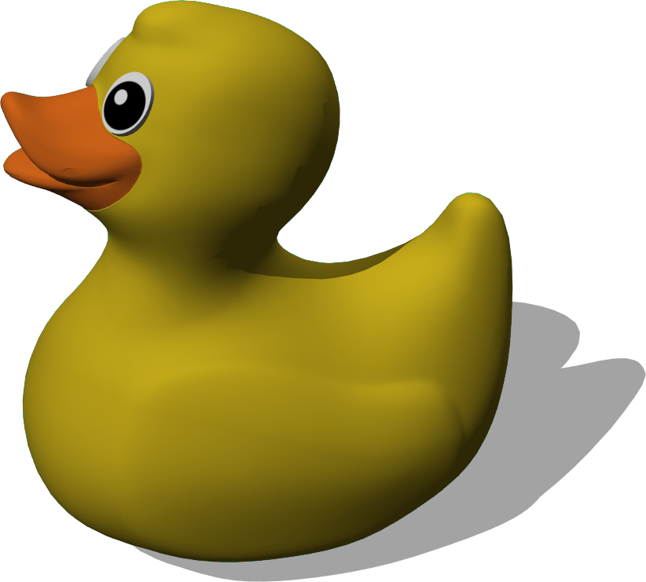

# Toys

## PaperBoat

%figure "PaperBoat"


%end

```
PaperBoat {
   SFVec3f translation 0 0 0
   SFRotation rotation 0 1 0 0
   SFString name "paper boat"
   SFFloat scale 1
   MFString textureUrl "textures/newspaper.jpg"
   SFFloat mass 0.25
   MFNode immersionProperties [
      ImmersionProperties {
        fluidName "water"
        dragForceCoefficients 0.05 0 0
        viscousResistanceForceCoefficient 200
      }
    ]
}
```

> **File location**: "WEBOTS\_HOME/projects/objects/toys/protos/PaperBoat.proto"

### Description

A paper boat (42.8 x 14.2 x 10.6 cm).

## RubberDuck

%figure "RubberDuck"



%end

```
RubberDuck {
   SFVec3f translation 0 0 0
   SFRotation rotation 0 1 0 0
   SFString name "rubber duck"
   SFFloat scale 1
   SFColor bodyColor 0.87451 0.756863 0.113725
   SFFloat density 400
   MFNode immersionProperties [
      ImmersionProperties {
        fluidName "water"
        viscousResistanceForceCoefficient 400
        viscousResistanceTorqueCoefficient 0.5
      }
    ]
}
```

> **File location**: "WEBOTS\_HOME/projects/objects/toys/protos/RubberDuck.proto"

### Description

A rubber yellow duck (7.42 x 10.66 x 10.13 cm).

