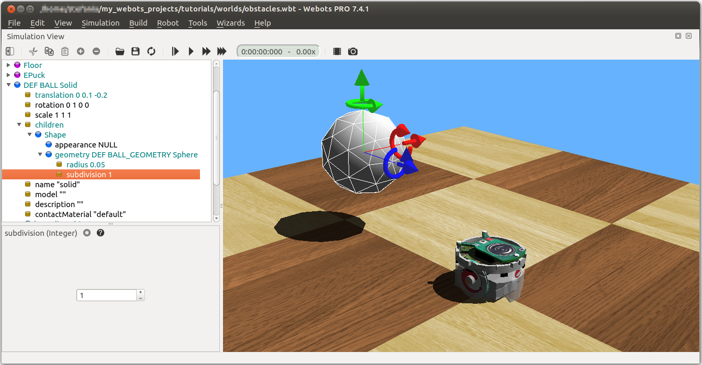
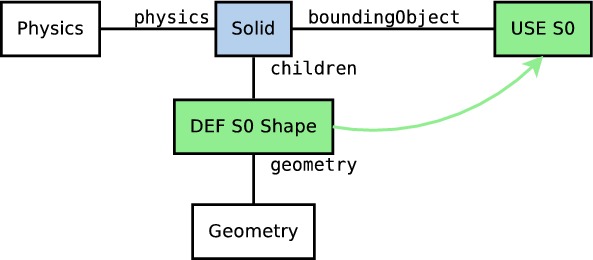

## Tutorial 2: Modification of the Environment (20 minutes)

In this tutorial, we will teach you how to create simple objects in the
environment. The first step will be to create a ball which will interact with
the environment. We will tackle several concepts related to the nodes: what is
their meaning, how to create them, how they have to be affiliated, etc. Moreover
we will see how to set up physics.

Several kinds of nodes will be introduced. We won't define each of them
precisely. Their detailed definition can be found in chapter 3 of the `Reference
Manual`. Having the nodes chart diagram (chapter 2 of the `Reference Manual`) in
front of you, will also help understanding the nodes inheritance relationship.

### A new Simulation

First we create a new simulation based on the one created in Tutorial 1.

### Modification of the Floor

The default `RectangleArena` PROTO defines a simple floor pinned on the statical
environment, i.e. without Physics node, and surrounded by walls.

Other pre-built floors are available in the Webots objects library. We will now
delete the default arena and add a simple floor that we will manually surround
the walls later in this this tutorial.

The newly added `Floor` PROTO has a default size of 10mx10m, but it is possible
to adjust its size, its position and texture by changing the corresponding
fields.

### The Solid Node

This subsection introduces the most important node in Webots: the `Solid` node.
But let's start with a definition.

The physics engine of Webots is designed for simulating rigid bodies. An
important steps, when designing a simulation, is to break up the various
entities into undividable rigid bodies.

To define a rigid body, you will have to create a Solid node. Inside this node
you will find different subnodes corresponding to the characteristics of the
rigid body. The  depicts a rigid body and its subnodes. The graphical
representation of the Solid is defined by the Shape nodes populating its
`children` list. The collision bounds are defined by its `boundingObject` field.
The graphical representation and the collision shape are often but not
necessarily identical. Finally the `physics` field defines if the object belongs
to the dynamical or to the statical environment. All these subnodes are
optional, but the `physics` field needs the `boundingObject` to be defined.

%figure "The simplest model of a rigid body in Webots having a graphical representation (Shape),
     a physical bound (boundingObject) and being in the dynamical environment (Physics)."

%end

The Geometry box (in ) stands for any kind of geometrical primitive. In fact it
can be substituted by a Sphere, a Box, a Cylinder, etc.

### Create a Ball

We will now add a ball to the simulation. That ball will be modeled as a rigid
body as shown in the . As Geometry nodes we will use Spheres.

%figure "Your first rigid body in Webots."

%end

### Geometries

To define the ball, we used the Sphere node in two different contexts: for the
graphical representation (`children`) and to define the physical bounds
(`boundingObject`). All Geometry node (such as the Sphere node) can be used in a
graphical context. However, only a subset of them can be used in a physical
context. Take a look at the schema of the chapter 2 of the `Reference Manual` to
now which primitive you can use.

We want now to reduce the size of the Sphere and to increase its graphical
quality by increasing the number of triangles used to represent it.

### DEF-USE mechanism

We will see in this subsection a mechanism which can be useful to avoid
redundancy in the world files.

The two Sphere definitions that we have used earlier to define the ball, are
redundant. We will now merge these two Spheres into only once using the DEF-USE
mechanism.

%figure "DEF-USE mechanism on the Sphere node called "BALL_GEOMETRY"."

%end

%figure "DEF-USE mechanism applied on the Shape node of a Solid."

%end

### Add Walls

In order to verify your progression, implement by yourself four walls to
surround the environment. The walls have to be defined statically to the
environment, and use as much as possible the DEF-USE mechanism at the Shape
level rather than at the Geometry level. Indeed it's more convenient to add an
intermediate Shape node in the `boundingObject` field of the Solid node. The
best Geometry primitive to implement the walls is the Box node. Only one Shape
has to be defined for all the walls. The expected result is shown in .

The solution is located in the solution directory under the "obstacle.wbt".

%figure "The simulation state at the end of this second tutorial."

%end

### Efficiency

### Conclusion

At the end of this tutorial, you are able to create simple environments based on
rigid bodies. You are able to add nodes from the scene tree view and to modify
their fields. You have a more precise idea of what are the Solid, the Physics,
the Shape, the Sphere and the Box nodes. You saw also the DEF-USE mechanism that
allows to reduce node redundancy of the scene tree.

