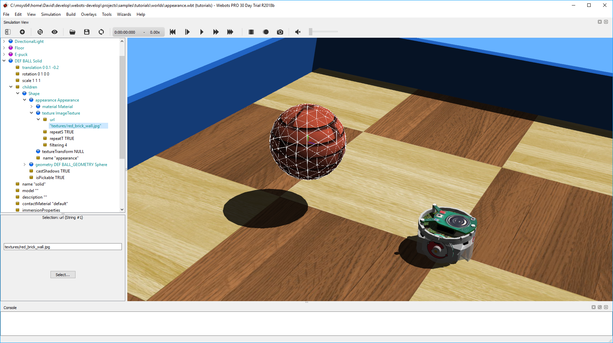

## Tutorial 3: Appearance (15 minutes)

The aim of this tutorial is to familiarize yourself with some nodes related to
the graphical rendering. Good looking simulations can be created very quickly
when these nodes are used adequately. A good graphics quality does not only
enhance the user's experience, it is also essential for simulations where robots
perceive their environment (camera image processing, line following, etc.).

The result at the end of this tutorial is shown in [this
figure](#simulation-after-having-setup-the-light-and-the-appearance-nodes).

### New simulation

> **Hands on**:
From the results of the previous tutorial, create a new simulation called
"appearance.wbt" by using the `File / Save World As...` menu.

### Lights

> **Theory**:
The lighting of a world is determined by light nodes. There are three types of
light nodes: the DirectionalLight, the PointLight and the SpotLight. A
DirectionalLight simulates a light which is infinitely far (ex: the sun), a
PointLight simulates light emitted from a single point (ex: a light bulb), and a
SpotLight simulates a conical light (ex: a flashlight). Each type of light node
can cast shadows. You can find their complete documentation in the `Reference
Manual`.

<!-- -->

> **Note**:
Lights are costly in term of performance. Minimizing the number of lights
increases the rendering speed. A maximum of 8 lights is allowed if the shaders
are disabled in the Webots preferences. A PointLight is more efficient than a
SpotLight, but less than a DirectionalLight. Note finally that casting shadows
can reduce the simulation speed drastically.

Your simulation is currently lighted by a PointLight node at the top of the
scene. We want to replace this light node by a DirectionalLight node casting
shadows.

> **Hands on**:
Remove the PointLight node, and add a new DirectionalLight node instead. Set its
`ambientIntensity` field to *0.5*, its `castShadows` field to *TRUE*, and its
`direction` field to *{1, -2, 1}*.

### Modify the Appearance of the Walls

The aim of this subsection is to color the walls with blue.

> **Theory**:
The **Appearance** node of the Shape node determines the graphical appearance of
the object. Among other things, this node is responsible for the color and
texture of objects.

<!-- -->

> **Hands on**:
In the Shape node representing graphically the first wall, add an Appearance
node to the `appearance` field. Then add a Material node to the `material` field
of the freshly created Appearance node. Set its `diffuseColor` field to blue
using the color selector. If the DEF-USE mechanism of the previous tutorial has
been correctly implemented, all the walls should turn blue.

### Add a Texture to the Ball

The aim of this subsection is to apply a texture on the ball. A texture on a
rolling object can help to appreciate its movement.

> **handson**:
Similarly add an Appearance node to the ball. Instead of a Material node, add an
ImageTexture node to the `texture` field of the Appearance node. Add an item to
the `url` field using the `Add` button. Then set the value of the newly added
`url` item to "WEBOTS\_HOME/projects/default/worlds/textures/bricks.png" using
the file selection dialog.

<!-- -->

> **Note**:
The texture URLs must be defined either relative to the "worlds" directory of
your project directory or relative to the default project directory
"WEBOTS\_HOME/projects/default/worlds". In the default project directory you
will find textures that are available for every world.

<!-- -->

> **note**:
Open the "bricks.png" texture in an image viewer while you observe how it is
mapped onto the Sphere node in Webots.

<!-- -->

> **Theory**:
Textures are mapped onto Geometry nodes according to predefined **UV mapping**
functions described in the `Reference Manual`. A UV mapping function maps a 2D
image representation to a 3D model.

%figure "Simulation after having setup the Light and the Appearance nodes."

%end

### Rendering Options

Webots offers several rendering modes available in the `View` menu.

> **Hands on**:
View the simulation in wireframe mode by using the `View / Wireframe Rendering`
menu item. Then restore the plain rendering mode: `View / Plain Rendering`.

### Conclusion

In this tutorial, you have learnt how to set up a good looking environment using
the Appearance node and the light nodes.

You can go further on this topic by reading the detailed description of these
nodes in the `Reference Manual`. This
[section](modeling.md#how-to-get-a-realisitc-and-efficient-rendering) will give
you a method to efficiently setup these nodes.
