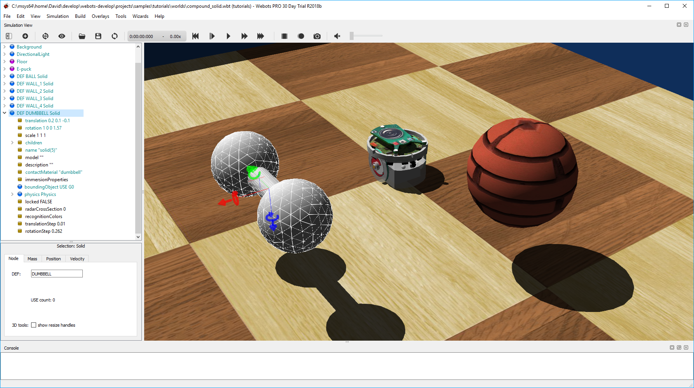

## Tutorial 5: Compound Solid and Physics Attributes (15 minutes)

The aim of this chapter is to explore in more detail the physics simulation by
creating a solid with several bounding objects: a dumbbell made of two spheres
and one cylinder. The expected result is depicted in [this
figure](#expected-result-at-the-end-of-the-tutorial-about-compound-solids).

%figure "Expected result at the end of the tutorial about compound solids."

%end

### New simulation

> **Hands on**:
Start from the results of the previous tutorial and create a new simulation
called "compound\_solid.wbt" by using the menu `File / Save World As...`.

### Compound Solid

It is possible to build Solid nodes more complex than what we have seen before
by aggregating Shape nodes. In fact, both the physical and the graphical
properties of a Solid can be made of several Shape nodes. Moreover each Shape
node can be placed in a Transform node in order to change its relative position
and orientation. Group nodes can also be used to group several subnodes.

We want to implement a dumbbell made of a handle (Cylinder) and of two weights
(Sphere) located at each end of the handle. This
[figure](#representation-of-the-subnodes-of-a-compound-solid-made-of-several-transformed-geometries)
depicts the Solid nodes and its subnodes required to implement the dumbbell.

> **Hands on**:
Create the dumbbell by following the
[figure](#representation-of-the-subnodes-of-a-compound-solid-made-of-several-transformed-geometries).
Create the handle first without placing it in a Transform node (so the handle
axis will have the same direction as the *y*-axis of the solid). The handle
should have a length of 0.1 m and a radius of 0.01 m. The weights should have a
radius of 0.03 m and a subdivision of 2. The weights can be moved at the handle
extremities thanks to the `translation` field of their Transform nodes.

%figure "Representation of the subnodes of a compound solid made of several transformed geometries."

%end

### Physics Attributes

The aim of this subsection is to learn how to set some simple physics properties
for a Solid node. The Physics node contains fields related to the physics of the
current rigid body (Solid).

> **Theory**:
The **mass** of a Solid node is given by its `density` or `mass` field. Only one
of these two fields can be specified at a time (the other should be set to
*-1*). When the `mass` is specified, it defines the total mass of the solid (in
[kg]). When the `density` is specified, its value (in [kg/m3]) is multiplied by
the volume of the bounding objects, and the product gives the total mass of the
solid. A density of 1000 [kg/m^3] corresponds to the density of water (default
value).

<!-- -->

> **Hands on**:
Set the mass of the dumbbell to *2* [kg]. The density is not used and should be
set to *-1*.

<!-- -->

> **Theory**:
By default, the **center of mass** of a Solid node is set at its origin (defined
by the translation field of the solid). The center of mass can be modified using
the `centerOfMass` field of the Physics node. The center of mass is specified
relatively to the origin of the Solid.

<!-- -->

> **Hands on**:
Let's say that one of the weights is heavier than the other one. Move the center
of mass of the dumbbell of *0.01* [m] along the *y*-axis.

<!-- -->

> **Note**:
Note that when the solid is selected, the center of mass is represented in the
3D view by a coordinate system which is darker than the coordinate system
representing the solid center.

### The Rotation Field

> **Theory**:
The `rotation` field of the Transform node determines the rotation of this node
(and of its children) using the **Euler axis and angle** representation. A
**Euler axis and angle** rotation is defined by four components. The first three
components are a unit vector that defines the rotation axis. The fourth
component defines the rotation angle about the axis (in [rad]).

> The rotation occurs in the sense prescribed by the right-hand rule.

<!-- -->

> **Hands on**:
Modify the rotation of the Solid node of the dumbbell in order to move the
handle's axis (*y*-axis) parallel to the ground. A unit axis of *(1, 0, 0)* and
an angle of *π/2* is a possible solution.

### How to choose bounding Objects?

As said before, minimizing the number of bounding objects increases the
simulation speed. However, choosing the bounding objects primitives carefully is
also crucial to increase the simulation speed.

Using a combination of Sphere, Box, Capsule and Cylinder nodes for defining
objects is very efficient. Generally speaking, the efficiency of these
primitives can be sorted like this: Sphere > Box > Capsule > Cylinder, where the
Sphere is the most efficient. But this can be neglected for a common usage.

The IndexedFaceSet geometry primitive can also be used in a bounding object.
But this primitive is less efficient than the other primitives listed above.
Moreover its behavior is sometimes buggy. For this reasons, we don't recommend
using the IndexedFaceSet when another solution using a combination of the other
primitives is possible.

Grounds can be defined using the Plane or the ElevationGrid primitives. The
Plane node is much more efficient than the ElevationGrid node, but it can only
be used to model a flat terrain while the ElevationGrid can be used to model an
uneven terrain.

### Contacts

> **Theory**:
When two solids collide, **contacts** are created at the collision points.
ContactProperties nodes can be used to specify the desired behavior of the
contacts (e.g. the friction between the two solids).

> Each solid belongs to a material category referenced by their `contactMaterial`
field (*"default"* by default). The WorldInfo node has a `contactProperties`
field that stores a list of ContactProperties nodes. These nodes allow to define
the contact properties between two categories of Solids.

We want now to modify the friction model between the dumbbell and the other
solids of the environment.

> **Hands on**:
Set the `contactMaterial` field of the dumbbell to *"dumbbell"*. In the
WorldInfo node, add a ContactProperties node between the *"default"* and
*"dumbbell"* categories. Try to set the `coulombFriction` field to *0* and
remark that the dumbbell slides (instead of rotating) on the floor because no
more friction is applied.

### basicTimeStep, ERP and CFM

The most critical parameters for a physics simulation are stored in the
`basicTimeStep`, `ERP` and `CFM` fields of the WorldInfo node.

The `basicTimeStep` field determines the duration (in [ms]) of a physics step.
The bigger this value is, the quicker the simulation is, the less precise the
simulation is. We recommend values between *8* and *16* for a regular use of
Webots.

It's more difficult to explain the behavior of the `ERP` and `CFM` fields. These
values are directly used by the physics engine to determine how the constraints
are solved. The default values are well defined  for a regular use of Webots. We
recommend to read the `Reference Manual` and the documentation of
[ODE](http://ode-wiki.org/wiki/index.php?title=Manual) (physics engine used in
Webots) to understand completely their purpose.

### Minor physics Parameters

There are also other physics parameters which are less useful in a regular use
of Webots. A complete description of these parameters can be found in the
`Reference Manual`. Remark simply that the Physics, WorldInfo and
ContactProperties nodes contains other fields.

> **Hands on**:
Search in the `Reference Manual` how to add a linear damping on all the objects,
how to use the inertia matrix and how to use the physicsDisableTime property.

### Conclusion

You are now able to build a wide range of solids including those being composed
of several rigid bodies. You know that a Geometry node can be moved and rotated
if it is included in a Transform node. You are aware about all the physics
parameters allowing you to design robust simulations. The next step will be to
create your own robot.

You can test your skills by creating common objects such as a table.
