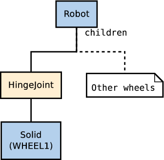

## Tutorial 6: 4-Wheels Robot

The aim of this tutorial is to create your first robot from scratch. This robot
will be made of a body, four wheels, and two distance sensors. The result is
depicted in . The  shows the robot from a top view.

%figure "3D view of the 4 wheels robot.
    Note that the coordinate system representations of the robot body
    and of its wheels are oriented the same way.
    Their +x-vector (in red) defines the left of the robot,
    their +y-vector (in green) defines the top of the robot, and
    their +z-vector (in blue) defines the front of the robot.
    The distance sensors are oriented in a different way,
    their +x-vector indicates the direction of the sensor."

%end

%figure "Top view of the 4 wheels robot.
    The grid behind the robot has a dimension of 0.2 x 0.3 [m].
    The text labels correspond to the name of the devices."
![Top view of the 4 wheels robot.
    The grid behind the robot has a dimension of 0.2 x 0.3 [m].
    The text labels correspond to the name of the devices.](png/tutorial_4_wheels_top_schema.png)
%end

### New simulation

### Separating the Robot in Solid Nodes

Some definitions are required before giving rules to create a robot model.

The set containing the Solid node and all its derived nodes is called the *solid
nodes*. A similar definition is applied for the Device, Robot, Joint and Motor
nodes. You can get more information about the node hierarchy in the `Reference
Manual`. Note that the solid nodes and device nodes is close but don't match
perfectly.

Having these rules in mind, we can start to design the node hierarchy used to
model the robot. The first step is to determine which part of the robot should
be modeled as a solid node.

In our example, this operation is quite obvious. The robot has 4 DOF
corresponding to the wheel motors. It can be divided in five solid nodes: the
body and the four wheels.

Depending on the expected application of the robot model, reducing the number of
DOF when modeling could be important to get an efficient simulation. For
example, when modeling a caster wheel, a realistic approach implies to model 2
DOF. But if this degree of precision is useless for the simulation, a more
efficient approach can be found. For example, to model the caster wheel as a
Sphere having a null friction coefficient with the ground.

The second step is to determine which solid node is the robot node (the root
node). This choice is arbitrary, but a solution is often much easier to
implement. For example, in the case of an humanoid robot, the robot node would
be typically the robot chest, because the robot symmetry facilitates the
computation of the joint parameters.

In our case, the body box is obviously the better choice. The  depicts the solid
nodes hierarchy of the robot.

%figure "High level representation of the 4 wheels robot"

%end

%figure "Low level representation of the 4 wheels robot"

%end

### HingeJoints

The initial position of the Wheel is defined by the translation and the rotation
fields of the Solid node. While the rotation origin (anchor) and the rotation
axis (axis) are defined by the optional HingeJointParameters child of the
HingeJoint node.

For the first wheel, the Solid translation should be defined to *(0.06, 0,
0.05)* in order to define the relative gap between the body and the wheel. The
HingeJointParameters anchor should also be defined to *(0.06, 0, 0.05)* to
define the rotation origin (relatively to the body). Finally the
HingeJointParameters axis should define the rotation axis. In our case it's
along the x-axis (so *(1, 0, 0)*).

We want now to implement the cylinder shape of the wheels. As the Cylinder node
is defined along the *y*-axis, a Transform node should encapsulate the Shape to
rotate the Cylinder along the along the *x*-axis.

### Sensors

The last part of the robot modeling is to add the two distance sensors to the
robot. This can be done by adding two DistanceSensor nodes as direct children of
the Robot node. Note that the distance sensor acquires its data along the
+*x*-axis. So rotating the distance sensors in order to point their *x*-axis
outside the robot is necessary (see the ).

### Controller

In the previous tutorials, you learnt how to setup a feedback loop and how to
read the distance sensor values. However actuating the RotationalMotor nodes is
new. The following note explain how to proceed.

### Conclusion

You are now able to design simple robot models, to implement them and to create
their controllers.

More specifically you learnt the different kind of nodes involved in the
building of the robot models, the way to translate and rotate a solid relatively
to another, the way that a rotational motor is actuated by the controller.

