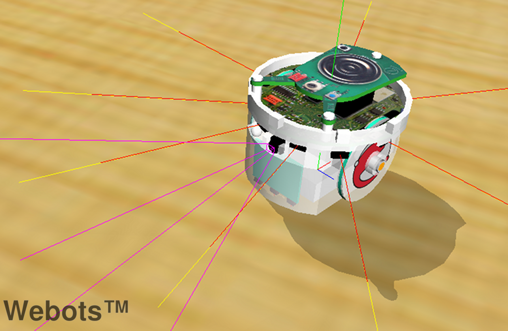
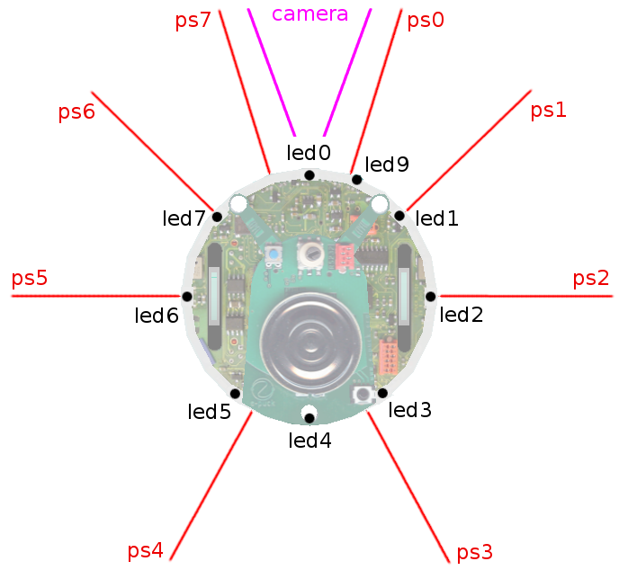

## Using the e-puck robot

In this section, you will learn how to use Webots with the e-puck robot ([this
figure](#the-e-puck-robot-at-work)). E-puck is a miniature mobile robot
originally developed at the EPFL for teaching purposes by the designers of the
successful Khepera robot. The hardware and software of e-puck is fully open
source, providing low level access to every electronic device and offering
unlimited extension possibilities. The official [e-puck web
site](http://www.e-puck.org) provides the most up-to-date information about this
robot. E-puck is also available for purchase from Cyberbotics Ltd.

### Overview of the robot

%figure "The e-puck robot at work"


%end

E-puck was designed to fulfill the following requirements:

- *Elegant design*: the simple mechanical structure, electronics design and
software of e-puck is an example of a clean and modern system.
- *Flexibility*: e-puck covers a wide range of educational activities, offering
many possibilities with its sensors, processing power and extensions.
- *Simulation software*: e-puck is integrated with Webots simulation software for
easy programming, simulation and remote control of the (physical) robot.
- *User friendly*: e-puck is small and easy to setup on a tabletop next to a
computer. It doesn't need any cables, providing optimal working comfort.
- *Robustness and maintenance*: e-puck is resilient under student use and is
simple to repair.
- *Affordable*: the price tag of e-puck is friendly to university budgets.

E-puck is equipped with a large number of devices, as summarized in [this
table](#e-puck-features).

%figure "e-puck features"

| Feature        | Description                                                                                                                      |
| -------------- | -------------------------------------------------------------------------------------------------------------------------------- |
| Size           | 7.4 cm in diameter, 4.5 cm high                                                                                                  |
| Weight         | 150 g                                                                                                                            |
| Battery        | about 3 hours with the provided 5Wh LiION rechargeable battery                                                                   |
| Processor      | Microchip dsPIC 30F6014A @ 60MHz (about 15 MIPS)                                                                                 |
| Motors         | 2 stepper motors with 20 steps per revolution and a 50:1 reduction gear                                                          |
| IR sensors     | 8 infra-red sensors measuring ambient light and proximity of obstacles in a 4 cm range                                           |
| Camera         | color camera with a maximum resolution of 640x480 (typical use: 52x39 or 640x1)                                                  |
| Microphones    | 3 omni-directional microphones for sound localization                                                                            |
| Accelerometer  | 3D accelerometer along the X, Y and Z axis                                                                                       |
| LEDs           | 8 red LEDs on the ring and one green LED on the body                                                                             |
| Speaker        | on-board speaker capable of playing WAV or tone sounds.                                                                          |
| Switch         | 16 position rotating switch                                                                                                      |
| Bluetooth      | Bluetooth for robot-computer and robot-robot wireless communication                                                              |
| Remote Control | infra-red LED for receiving standard remote control commands                                                                     |
| Expansion bus  | expansion bus to add new possibilities to your robot                                                                             |
| Programming    | C programming with the GNU GCC compiler system                                                                                   |
| Simulation     | Webots EDU or PRO facilitates the programming of e-puck with a powerful simulation, remote control and cross-compilation system. |

%end

### Simulation model

%figure "The e-puck model in Webots"



%end

The e-puck model in Webots is depicted in [this
figure](#the-e-puck-model-in-webots). This model includes support for the
differential wheel motors (encoders are also simulated), the infra-red sensors
for proximity and light measurements, the accelerometer, the camera, the 8
surrounding LEDs, the body and front LEDs; the other e-puck devices are not yet
simulated in the current model. Besides standard e-puck devices, the model also
provides two slots that can be used to extend the functionality and to equip the
robot with additional devices. In particular, the ground sensors module
extension of the real e-puck robot is modeled in Webots to provide 3 optional
infra-red sensors pointing to the ground in front of the robot. The
[table](#devices-names) displays the names of the simulated devices which are to
be used as an argument of the function `wb_robot_get_device()` (see the Robot
section of [Reference Manual](http://www.cyberbotics.com/reference/)).

%figure "Devices names"

| Device                     | Name                                                     |
| -------------------------- | -------------------------------------------------------- |
| Differential wheels        | differential wheels                                      |
| Proximity sensors          | ps0 to ps7                                               |
| Light sensors              | ls0 to ls7                                               |
| LEDs                       | led0 to led7 (e-puck ring), led8 (body) and led9 (front) |
| Camera                     | camera                                                   |
| Accelerometer              | accelerometer                                            |
| Ground sensors (extension) | gs0, gs1 and gs2                                         |

%end

%figure "e-puck specifications"

| Main specifications   | Values        |
| --------------------- | ------------- |
| Robot radius          | 37 mm         |
| Wheel radius          | 20.5 mm       |
| Axle length           | 52 mm         |
| Encoder resolution    | 159.23        |
| Speed unit            | 0.00628 rad/s |
| Maximum angular speed | 1000 units    |

%end

The e-puck dimensions and speed specifications are shown in [this
table](#e-puck-specifications). The functions
`wb_differential_wheels_set_speed()`,
`wb_differential_wheels_get_left_encoder()` and
`wb_differential_wheels_get_right_encoder()` will allow you to set the speed of
the robot and to use its encoders.

%figure "Devices orientations"

| Device | x (m)  | y (m) | z (m)  | Orientation (rad) |
| ------ | ------ | ----- | ------ | ----------------- |
| ps0    | 0.010  | 0.033 | -0.030 | 1.27              |
| ps1    | 0.025  | 0.033 | -0.022 | 0.77              |
| ps2    | 0.031  | 0.033 | 0.00   | 0.00              |
| ps3    | 0.015  | 0.033 | 0.030  | 5.21              |
| ps4    | -0.015 | 0.033 | 0.030  | 4.21              |
| ps5    | -0.031 | 0.033 | 0.00   | 3.14159           |
| ps6    | -0.025 | 0.033 | -0.022 | 2.37              |
| ps7    | -0.010 | 0.033 | -0.030 | 1.87              |
| camera | 0.000  | 0.028 | -0.030 | 4.71239           |

%end

As is the case for any Differential Wheels robot set at its default position in
Webots, the forward direction of the e-puck is given by the negative *z*-axis of
the world coordinates. This is also the direction the eye of the camera is
looking to; in keeping with the VRML standard, the direction vector of the
camera is pointing in the opposite direction, namely the direction of the
positive *z*-axis. The axle's direction is given by the positive *x*-axis.
Proximity sensors, light sensors and LEDs are numbered clockwise; their location
and orientation are shown in [this table](#e-puck-specifications) and [this
table](#devices-orientations). The last column of [this
table](#devices-orientations) lists the angles between the negative *x*-axis and
the direction of the devices, the plane *zOx* being oriented counter-clockwise.
Note that the proximity sensors and the light sensors are actually the same
devices of the real robot used in a different mode, so their direction coincide.
Proximity sensors responses are simulated in accordance with the lookup table in
[this figure](#proximity-sensor-response-against-distance); this table is the
outcome of calibration performed on the real robot.

%figure "Proximity sensor response against distance"


%end

The resolution of the camera was limited to 52x39 pixels, as this is the maximum
rectangular image with a 4:3 ratio which can be obtained from the remote control
interface with the real robot.

The standard model of the e-puck is provided in the "E-puck.proto" PROTO file
which is located in the "WEBOTS\_HOME/projects/robots/e-puck/protos" directory
of the Webots distribution (see also "E-puckDistanceSensor.proto" PROTO file and
"E-puckGroundSensors.proto" PROTO file); you will find complete specifications
in it. The two PROTO fields `groundSensorSlot` and `turretSlot` have been
included in the simulation model in order to support extension modules.

%figure "Sensors, LEDs and camera"



%end

Several simulation examples are located in the
"WEBOTS\_HOME/projects/robots/e-puck/worlds" directory of the Webots
distribution. The "e-puck\_line.wbt" world (see [this
figure](#an-e-puck-extension-for-line-following)) especially examplifies the use
of ground sensors. Ground sensors can be added to a real e-puck robot by
inserting a special extension card with three sensors just below the camera of
the robot. These sensors are actually simple infra-red sensors which allow the
e-puck robot to see the color level of the ground at three locations in a line
across its front. The `groundSensorSlot` field of the standard E-puck PROTO is
expressly provided for equipping the simulated e-puck robot with the ground
sensors extension modeled in the `E-puckGroundSensors` PROTO. This is
particularly useful for implementing line following behaviors. The
"e-puck\_line" controller program contains the source code for a simple line
following system which, as an exercise, can be improved upon to obtain the
behavior demonstrated in the "e-puck\_line\_demo.wbt" demo, in which the e-puck
robot is able to follow the line drawn on the floor, but also to avoid obstacles
and return to the line following behavior afterwards. This model was contributed
by Jean-Christophe Zufferey from the EPFL, who sets up a series of exercises
with Webots and extended e-puck robots.

%figure "An e-puck extension for line following"


%end

The directory "WEBOTS\_HOME/projects/samples/curriculum" contains a rich
collection of simulations involving the e-puck robot. You will find inside it
all the worlds and controllers corresponding to the exercices of Cyberbotics
robotics [curriculum](http://www.cyberbotics.com/publications/RiE2011.pdf).
Written in collaboration with professors and master students of EPFL,
Cyberbotics curriculum is an educational document intended for all level of
learnings in robotics. It addresses a dozen of topics ranging from finite state
automata to particle swarm optimization, all illustated through the real or the
simulated e-puck robot; you can browse it
[here](http://www.cyberbotics.com/curriculum).  The e-puck models of Webots
distribution are open source and you are welcome to modify them. If you develop
a useful modification and would like to share it, please let us know so that we
can improve these models using your contribution.

### Control interface

#### Control window

%figure "The e-puck control window for simulation"


%end

When opening a world containing an e-puck robot, Webots displays the e-puck
control window (which also appears when you double-click on the e-puck robot).
This window is depicted in [this
figure](#the-e-puck-control-window-for-simulation). It allows visualizing the
devices of the robot. The distance measurements are displayed in red, outside
the body of the robot. The light measurements are displayed in yellow, above the
distance measurements. The 10 LEDs are displayed in black when off and red (or
green) when on. The motor speeds are displayed in blue, and the motor position
is displayed in the Encoder box in the bottom right hand corner of the window.
The camera image (if present), the ground sensor values (if present) and the
accelerometer values are displayed in the corresponding boxes on the right side
of the window.

This e-puck control window appears because the `window` field of the
`DifferentialWheel` node in the world file was set to "e-puck\_window". Changing
this `window` to an empty string will disable this control window.

#### BotStudio overview

BotStudio is a user interface for programming graphically the e-puck thanks to a
finite state automaton. Behaviors such as wall follower, collision avoider or
line follower can be implemented quickly thanks to this interface. BotStudio is
typically destinated for the education field, particularly for beginners in
robotics.

An automaton state of BotStudio corresponds to a state of the e-puck actuators
while a transition corresponds to a condition over its sensor values. A
transition is fired when all of its conditions are fulfilled (logical AND). A
logical OR can be performed by several transitions between two states.

The actuators available in BotStudio are the LEDs and the motors. Each automaton
state have two sliders for setting the motor speed value. Note that these values
can be unset by clicking on the cursor of the slider. Each state have also 10
square buttons for setting the LEDs states. A red button means the LED is turned
on, a black one means it is turned off and a gray one means there is no
modification.

The sensor available in BotStudio are the distance sensors and the camera.
Moreover a timer can be used to temporize the conditions by dragging the
corresponding slider. Conditions over the IR sensors can be set by dragging the
8 red sliders. A condition can be reversed by clicking on the gray part of the
slider. Finally, the camera is used for giving a clue on the front environment
of the e-puck. An algorithm is applied on the last line of the camera and
returns a integer between -10 and 10 indicating if a black line is perceived
respectively at the left and at the right of the e-puck field of view. A
condition can be set on this value for getting a line follower behavior.

BotStudio is depicted in the [figure](#botstudio-window). An example of
BotStudio can be found by opening the
"WEBOTS\_HOME/projects/robots/e-puck/world/e-puck\_botstudio.wbt" world file.

The BotStudio windows appears when the e-puck's controller points on a *.bsg*
file.

%figure "BotStudio window"


%end

#### Bluetooth setup

The e-puck has a Bluetooth interface allowing it to communicate with Webots.
This feature is available under Windows, Linux and Mac OS X. The Bluetooth
interface must be set up according to your operating system (OS). Generally it
is as simple as using the Bluetooth interface of your OS in order to discover
and to pair the e-puck as a regular Bluetooth device. The complete instructions
about pairing can be found on the [GCTronic
website](http://www.gctronic.com/doc/index.php/E-Puck#Getting_started).

On linux, the pairing has to be done manually (without using the Bluetooth
interface of the OS). This can be done by using the `rfcomm` command. Once
generated, the rfcomm file has to be given to Webots through an environment
variable. It may also occur that the rfcomm file doesn't have the read rights. A
typical pairing can be done using the following commands:

```sh
# Get the e-puck MAC adress
$ hcitool scan
Scanning ...
	10:00:E8:52:BF:32	e-puck_1368
# Bind the MAC adress of the e-puck with a non-existing rfcomm file
sudo rfcomm bind /dev/rfcomm1 10:00:E8:52:BF:32
# (Optional) Grant the read rights to the rfcomm file
sudo chmod 666 /dev/rfcomm1
# Export the WEBOTS_COM? environment variable (with ? between 1 to 9)
export WEBOTS_COM1=/dev/rfcomm1
# Launch Webots
webots
```

#### Bluetooth remote control

Once properly set up, your Bluetooth connection to your e-puck should appear in
the popup menu of the control. If it doesn't appear there, it means that your
computer was not properly configured to interface with your e-puck robot through
Bluetooth. Please refer to the instructions given in the previous section.

When selecting a specific Bluetooth connection from the popup menu of the
control window, Webots will try to establish a connection with your e-puck
robot. Once connected, it will display the version of the e-puck serial
communication software on the Webots console (e.g. 'Running real e-puck (Version
1.4.3 March 2010 (Webots))'), and will switch the control to the real robot.
That is, it will send motor commands to the real robot and display sensor
information (proximity, light, camera image, etc.) coming from the real robot.
This makes the transfer from the simulation to the real robot trivially simple.
Note that in the same popup menu, the `Refresh ports` menu item can be used for
updating the COM ports.

The remote control has two requirements: the Bluetooth must be correctly set up
(computer side) and the e-puck must be programmed with the Webots last firmware.
For setting up Bluetooth, please refer to the official e-puck website. For
uploading the last firmware on your robot, switch on your robot, press the
`Upload to e-puck robot...` button on the control window and finally select the
select the COM port which corresponds to your robot and the
"WEBOTS\_HOME/projects/robots/e-puck/transfer/firmware/firmware-x.x.x.hex" file
located in your Webots directory (*x.x.x* has to be replaced by the current
firmware's version).

#### Cross-compilation

An alternative to the remote-control session for running the real e-puck is to
cross-compile your code and to upload it on the e-puck.

For using this feature, your code has to be written in C and to use the C Webots
API. Moreover, you need to define a specific Makefile called "Makefile.e-puck"
in the controller directory. This Makefile must include the following file:

```makefile
include $(WEBOTS_HOME)/projects/robots/e-puck/transfer/libepuck/Makefile.include
```

Thanks to this, it is possible to cross-compile with Webots by using the `Build
/ Cross-compile` menu item of the text editor. Note that the `Upload to e-puck
robot...` button of the e-puck control window allows you to upload a file
generated by the cross-compilation extended by ".hex" on the e-puck robot.

An example of cross-compilation is given in the
"WEBOTS\_HOME/projects/robots/e-puck/controllers/e-puck\_cross-compilation "
subdirectory of your Webots directory.

#### Cross-compilation issues on Linux 64 bit

When cross-compiling on Linux 64 bit, it may occur such kind of error:

```sh
/bin/sh: 1:
pic30-elf-gcc: not found
make: *** [e-puck_cross-compilation-pic30.o] Error 127
```

This error can be fixed simply by installing the following packets from a
terminal:

```sh
sudo apt-get install gcc-4.6-base:i386 libgcc1:i386 libc6:i386
```
