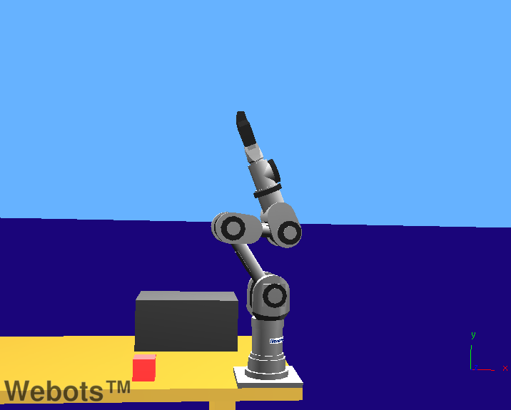

### ipr\_collaboration.wbt

**Keywords**: Robot node, robotic arm, collaboration, TCP/IP, client program, IPR,
    IndexedFaceSet, RotationalMotor, active joint

%figure "ipr_collaboration"

%end

In this example, two IPR robots from Neuronics work together to put three red cubes into a basket which is on the opposite side of the world.
All the IPR robots use the same controller, whose source code is in the "ipr\_serial" directory.
This particular example uses, in addition to this controller, a client program which coordinates the movements of the robots.
The source code for this client is in the "ipr\_serial/client/ipr\_collaboration.c" file.

### ipr\_cube.wbt

**Keywords**: Robot node, robotic arm, TCP/IP, client program, IPR,
    IndexedFaceSet, RotationalMotor, active joint

%figure "ipr_cube"

%end

In this example, an IPR robots from Neuronics moves a small red cube onto a bigger one.
All the IPR robots use the same controller, whose source code is in the "ipr\_serial" directory.
This example also uses a client program which drives the movements of the robot.
The source code of this client is in the "ipr\_serial/client/ipr\_cube.c" file.

### ipr\_factory.wbt

**Keywords**: Robot node, Supervisor, conveyor belt, robotic arm, TCP/IP,
    client program, IPR, IndexedFaceSet, RotationalMotor, active joint

%figure "ipr\_factory"

%end

In this example, two IPR robots from Neuronics take industrial parts from a conveyor belt and place them into slots.
One of the robots detects the objects using an infrared sensor on the conveyor belt, while the other one waits.
All the IPR robots use the same controller, whose source code is in the "ipr\_serial" directory.
This example also uses a client program which coordinates the movements of the robots.
The source code for this client is in the "ipr\_serial/client/ipr\_factory.c" file.

### ipr\_models.wbt

**Keywords**: Robot node, robotic arm, TCP/IP, IPR, IndexedFaceSet, RotationalMotor, active joint

%figure "ipr_models"

%end

In this example, you can see all the different types of IPR model provided by Webots : HD6M180, HD6Ms180, HD6M90 and HD6Ms90.
This world is intended to be the example from which you can copy the models of IPR robots into your own worlds.
All the IPR robots use the same controller, whose source code is in the "ipr\_serial" directory.
