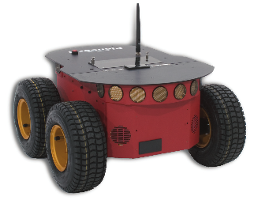
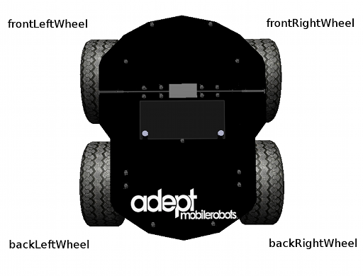

## Using the Pioneer 3-AT and Pioneer 3-DX robots

### Pioneer 3-AT

In this section, you will learn how to use Webots simulation model of the
Pioneer 3-AT robot. ([this
figure](using-the-pioneer-3-at-and-pioneer-3-dx-robots.md#pioneer-3-at-a-ready-to-use-all-terrain-base)).

#### Overview of the robot

%figure "Pioneer 3-AT, a ready-to-use all terrain base"

%end

The Pioneer 3-AT robot is an all-purpose outdoor base, used for research and
prototyping applications involving mapping, navigation, monitoring,
reconnaissance and other behaviors. It provides a ready-to-use set of devices
listed in [this
table](using-the-pioneer-3-at-and-pioneer-3-dx-robots.md#pioneer-3-at-features).

%figure "Pioneer 3-AT features"

| Feature | Description |
| --- | --- |
| Dimensions | 508 mm long, 497 mm large, 277 mm high |
| Weight | 12 kg, operating playload of 12 kg on floor |
| Batteries | 2-4 hours, up to 3 lead acid batteries of 7.2 Ah each, 12 V |
| Microcontroller I/O | 32 digital inputs, 8 digital outputs, 8 analog inputs, 3 serial extension ports |
| Skid steering drive | Turn radius: 0 cm, swing radius: 34 cm, max. traversable grade: 35% |
| Speed | Max. forward/backward speed: 0.7 m/s; Rotation speed: 140 deg/s |

%end

More information on the specifications and optional devices is available on
Adept Mobile Robots official
[webpage](http://www.mobilerobots.com/ResearchRobots/ResearchRobots/P3AT.aspx).

#### Simulation model

%figure "The Pioneer 3-AT model in Webots"

%end

The Pioneer 3-AT model in Webots is depicted in [this
figure](using-the-pioneer-3-at-and-pioneer-3-dx-robots.md#the-pioneer-3-at-model-in-webots).
This model includes support for 4 motors and 16 sonar sensors (8 forward-facing,
8 rear-facing) for proximity measurements. The standard model of the Pioneer
3-AT is provided in the "pioneer3AT.wbt" file which is located in the
"WEBOTS\_MODULES\_PATH/projects/robots/pioneer/pioneer3at/worlds" directory of
the Webots distribution.

%figure "Pioneer 3-AT motor names"

%end

The "pioneer3at.wbt" world file is a simulation example of a simple obstacle
avoidance behavior based on the use of a SICK LIDAR (see the
"obstacle\_avoidance\_with\_lidar.c" controller file in the
"WEBOTS\_MODULES\_PATH/projects/robots/pioneer/pioneer3at/controller"
directory).

The Pioneer 3-AT motors are RotationalMotor nodes named according to [this
figure](using-the-pioneer-3-at-and-pioneer-3-dx-robots.md#pioneer-3-at-motor-names).
The `wb_set_motor_position()` and `wb_set_motor_velocity()` functions allow the
user to manage the rotation of the wheels. The sonar sensors are numbered
according to [this
figure](using-the-pioneer-3-at-and-pioneer-3-dx-robots.md#sonar-sensors-positions).

%figure "Sonar sensors positions"

%end

The angle between two consecutive sensor directions is 20 degrees except for the
four side sensors (so0, so7, so8 and so15) for which the angle is 40 degrees.

### Pioneer 3-DX

In this section, you will learn how to use Webots simulation model of the
Pioneer 3-DX robot. ([this
figure](using-the-pioneer-3-at-and-pioneer-3-dx-robots.md#pioneer-3-dx-an-all-purpose-base-used-for-research-and-applications)).

#### Overview of the robot

%figure "Pioneer 3-DX, an all-purpose base, used for research and applications"

%end

The base Pioneer 3-DX platform is assembled with motors featuring 500-tick
encoders, 19 cm wheels, tough aluminum body, 8 forward-facing ultrasonic (sonar)
sensors, 8 optional real-facing sonar, 1, 2 or 3 hot-swappable batteries, and a
complete software development kit. The base Pioneer 3-DX platform can reach
speeds of 1.6 meters per second and carry a payload of up to 23 kg.

The Pioneer 3-DX robot is an all-purpose base, used for research and
applications involving mapping, teleoperation, localization, monitoring,
reconnaissance and other behaviors. Pioneer 3-DX is provided with a ready-to-use
set of devices listed in [this
table](using-the-pioneer-3-at-and-pioneer-3-dx-robots.md#pioneer-3-at-features).

%figure "Pioneer 3-AT features"

| Feature | Description |
| --- | --- |
| Dimensions | 455 mm long, 381 mm large, 237 mm high |
| Weight | 9 kg, operating playload of 17 kg |
| Batteries | 8-10 hours, 3 lead acid batteries of 7.2 Ah each, 12 V |
| Microcontroller I/O | 32 digital inputs, 8 digital outputs, 8 analog inputs, 3 serial extension ports |
| Skid steering drive | Turn radius: 0 cm, swing radius: 26.7 cm, max. traversable grade: 25% |
| Speed | Max. forward/backward speed: 1.2 m/s; Rotation speed: 300 deg/s |

%end

More information on the specifications and optional devices is available on
Adept Mobile Robots official
[webpage](http://www.mobilerobots.com/ResearchRobots/PioneerP3DX.aspx).

#### Simulation model

%figure "The Pioneer 3-DX model in Webots"

%end

The Pioneer 3-DX model in Webots is depicted in [this
figure](using-the-pioneer-3-at-and-pioneer-3-dx-robots.md#the-pioneer-3-dx-model-in-webots).
This model includes support for two motors, the caster wheel, 7 LEDs on the
control panel and 16 sonar sensors (8 forward-facing, 8 rear-facing) for
proximity measurements. The standard model of the Pioneer 3-DX is provided in
the "pioneer3dx.wbt" file which is located in the
"WEBOTS\_MODULES\_PATH/projects/robots/pioneer/pioneer3dx/worlds" directory of
the Webots distribution.

%figure "Pioneer 3-DX motor names"

%end

The "pioneer3dx.wbt" world file shows a simulation example of the Braitenberg
avoidance algorithm based on the use of the 16 sonar sensors (see the
"braitenberg.c" controller file in the
"WEBOTS\_MODULES\_PATH/projects/robots/pioneer/pioneer3dx/controller"
directory). The "pioneer3dx\_with\_kinect.wbt" world file in the same directory
is a simple simulation example of an obstacle avoidance behaviour based on a
Microsoft kinect sensor (see the "obstacle\_avoidance\_kinect.c" controller
file).

The Pioneer 3-DX motors are RotationalMotor nodes named according to [this
figure](using-the-pioneer-3-at-and-pioneer-3-dx-robots.md#pioneer-3-dx-motor-names).
The `wb_set_motor_position()` and `wb_set_motor_velocity()` functions allow the
user to manage the rotation of the wheels. The sonar sensors are numbered
according to [this
figure](using-the-pioneer-3-at-and-pioneer-3-dx-robots.md#sonar-sensors-positions).

The angle between two consecutive sensor directions is 20 degrees except for the
four side sensors (so0, so7, so8 and so15) for which the angle is 40 degrees.

