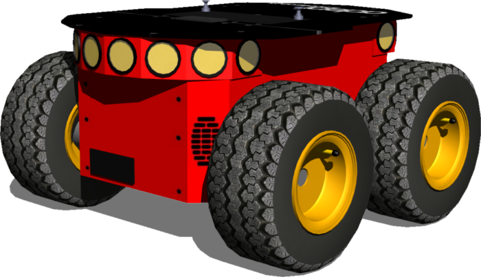
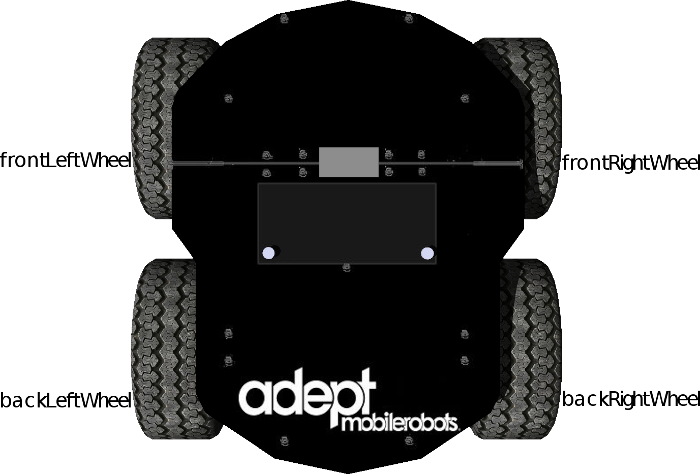
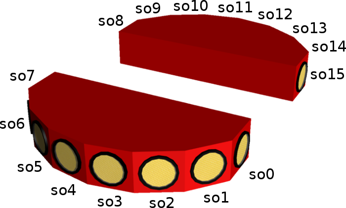

## Using the Pioneer 3-AT robot

### Pioneer 3-AT

%figure "Pioneer 3-AT, a ready-to-use all terrain base"

%end

The Pioneer 3-AT robot is an all-purpose outdoor base, used for research and prototyping applications involving mapping, navigation, monitoring, reconnaissance and other behaviors.
It provides a ready-to-use set of devices listed in [this table](#pioneer-3-at-features).

%figure "Pioneer 3-AT features"

| Feature             | Description                                                                     |
| ------------------- | ------------------------------------------------------------------------------- |
| Dimensions          | 508 mm long, 497 mm large, 277 mm high                                          |
| Weight              | 12 kg, operating playload of 12 kg on floor                                     |
| Batteries           | 2-4 hours, up to 3 lead acid batteries of 7.2 Ah each, 12 V                     |
| Microcontroller I/O | 32 digital inputs, 8 digital outputs, 8 analog inputs, 3 serial extension ports |
| Skid steering drive | Turn radius: 0 cm, swing radius: 34 cm, max. traversable grade: 35%             |
| Speed               | Max. forward/backward speed: 0.7 m/s; Rotation speed: 140 deg/s                 |

%end

More information on the specifications and optional devices is available on Adept Mobile Robots official [webpage](http://www.mobilerobots.com/ResearchRobots/ResearchRobots/P3AT.aspx).

#### Pioneer 3-AT model

%figure "The Pioneer 3-AT model in Webots"

%end

The Pioneer 3-AT model in Webots is depicted in [this figure](#the-pioneer-3-at-model-in-webots).
This model includes support for 4 motors and 16 sonar sensors (8 forward-facing, 8 rear-facing) for proximity measurements.
The standard model of the Pioneer 3-AT is provided in the "pioneer3AT.wbt" file which is located in the "WEBOTS\_HOME/projects/robots/pioneer/pioneer3at/worlds" directory of the Webots distribution.

%figure "Pioneer 3-AT motor names"

%end

The "pioneer3at.wbt" world file is a simulation example of a simple obstacle avoidance behavior based on the use of a SICK LIDAR (see the "obstacle\_avoidance\_with\_lidar.c" controller file in the "WEBOTS\_HOME/projects/robots/pioneer/pioneer3at/controller" directory).

The Pioneer 3-AT motors are RotationalMotor nodes named according to [this figure](#pioneer-3-at-motor-names).
The `wb_set_motor_position` and `wb_set_motor_velocity` functions allow the user to manage the rotation of the wheels.
The sonar sensors are numbered according to [this figure](#sonar-sensors-positions).

%figure "Sonar sensors positions"

%end

The angle between two consecutive sensor directions is 20 degrees except for the four side sensors (so0, so7, so8 and so15) for which the angle is 40 degrees.
