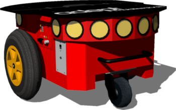
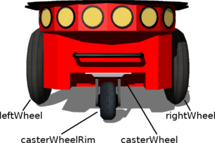
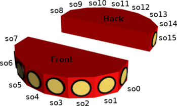

## Using the Pioneer 3-DX robot

%figure "Pioneer 3-DX, an all-purpose base, used for research and applications"

%end

The Pioneer 3-DX robot is an all-purpose base, used for research and applications involving mapping, teleoperation, localization, monitoring, reconnaissance and other behaviors.
Pioneer 3-DX is caracterized by a set of features listed in [this table](#pioneer-3-dx-characteristics).

The base Pioneer 3-DX platform is assembled with motors featuring 500-tick encoders, 19 cm wheels, tough aluminum body, 8 forward-facing ultrasonic (sonar) sensors, 8 optional rear-facing sonars, 1, 2 or 3 hot-swappable batteries, and a complete software development kit.
The base Pioneer 3-DX platform can reach speeds of 1.6 meters per second and carry a payload of up to 23 kg.

More information on the specifications and optional devices is available on Adept Mobile Robots official [webpage](http://www.mobilerobots.com/ResearchRobots/PioneerP3DX.aspx).

### Pioneer 3-DX model

%figure "Pioneer 3-DX characteristics"

| Characteristics     | Description                                                                     |
| ------------------- | ------------------------------------------------------------------------------- |
| Dimensions          | 485 mm long, 381 mm large, 217 mm high                                          |
| Weight              | 10 kg, operating playload of 17 kg                                              |
| Speed               | Max. forward/backward speed: 0.5 m/s; Rotation speed: 5.24 rad/s                |

%end

This model includes support for two motors, the caster wheel, 7 LEDs on the control panel and 16 sonar sensors (8 forward-facing, 8 rear-facing) for proximity measurements.
The standard model of the Pioneer 3-DX is provided in the "pioneer3dx.wbt" file which is located in the "WEBOTS\_HOME/projects/robots/adept/pioneer3/worlds" directory of the Webots distribution.

The "pioneer3dx.wbt" world file shows a simulation example of the Braitenberg avoidance algorithm based on the use of the 16 sonar sensors (see the "braitenberg.c" controller file in the "WEBOTS\_HOME/projects/robots/adept/pioneer3/controller" directory).
The "pioneer3dx\_with\_kinect.wbt" world file in the same directory is a simple simulation example of an obstacle avoidance behavior based on a Microsoft kinect sensor (see the "obstacle\_avoidance\_kinect.c" controller file).

The Pioneer 3-DX motors are `RotationalMotor` nodes named according to [this figure](#pioneer-3-dx-motor-names).
The `wb_set_motor_position` and `wb_set_motor_velocity` functions allow the user to manage the rotation of the wheels.

%figure "Pioneer 3-DX motor names"

%end

The sonar sensors are numbered according to [this figure](#sonar-sensors-positions).

%figure "Sonar sensors positions"

%end

The angle between two consecutive sensor directions is 20 degrees except for the four side sensors (so0, so7, so8 and so15) for which the angle is 40 degrees.
