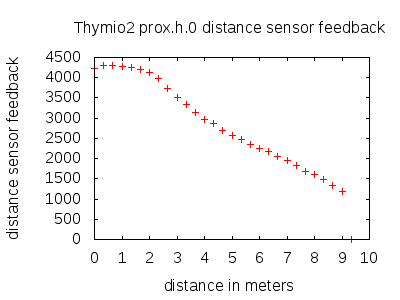
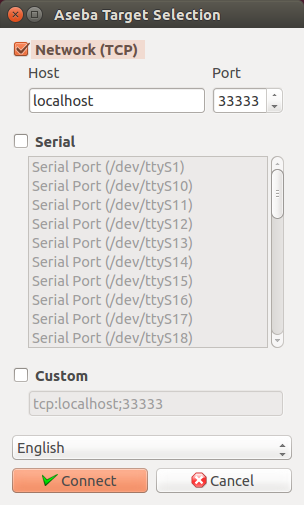
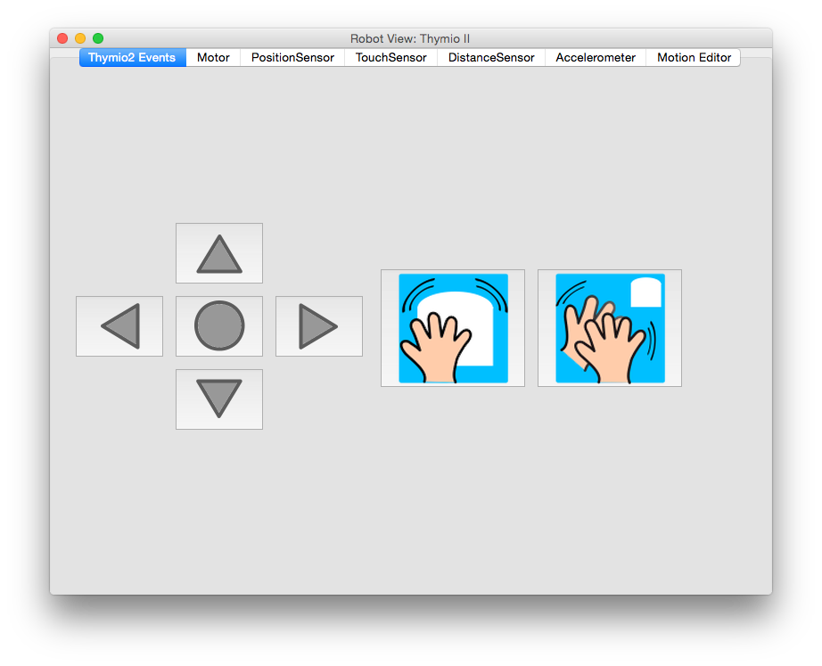
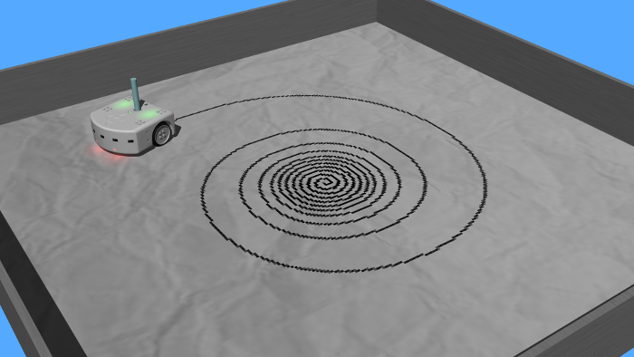
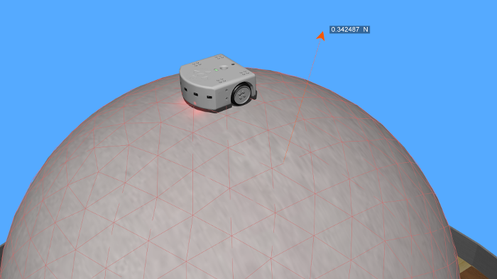

## Using the Thymio II robot

%figure "Thymio II model in Webots"

%end

Thymio II is an affordable educational robot. It provides three main features: a
large number of sensors and actuators, an educative interactivity based on light
and touch, a programming environment featuring graphical and text programming.

More information about the Thymio II is available from [its official
website](https://aseba.wikidot.com/en:thymio).

Webots contains an accurate model of the Thymio II robot (see the
[figure](#thymio-ii-model-in-webots)). Almost all the Thymio II devices have
been modeled and calibrated. Moreover Aseba studio and VPL for Thymio II can be
connected on the simulated model allowing you to program the simulated robot
using Aseba. Many Aseba examples are working directly with the simulated robot.
Finally several objects related to the Thymio II are available, including a pen
which can draw on any 3D object.

### Thymio II model

The [table](#thymio-ii-devices) shows which devices are supported by the model,
and their names (using the Webots terminology).

%figure "Thymio II devices"

| Device             | Support         | Webots name                                                                                                                               |
| ------------------ | --------------- | ----------------------------------------------------------------------------------------------------------------------------------------- |
| Motors             | Full support    | motor.[left-right]                                                                                                                        |
| RGB LEDs           | Full support    | leds.top, leds.bottom.[right-left]                                                                                                        |
| LEDs               | Full support    | leds.buttons.led[0-3], leds.circle.led[0-7], leds.prox.h.led[0-7], leds.prox.v.led[0-1], leds.sound, leds.rc, leds.temperature.[red-blue] |
| IR sensors         | Full support    | prox.horizontal.[0-6], prox.ground.[0-1]                                                                                                  |
| Accelerometer      | Full support    | acc                                                                                                                                       |
| Buttons            | Full support    | button.[forward-backward-left-right-center]                                                                                               |
| Microphone         | Clap event only | through the robot window                                                                                                                  |
| Speaker            | Not supported   | N/A                                                                                                                                       |
| Temperature sensor | Not supported   | N/A                                                                                                                                       |
| RC device          | Not supported   | N/A                                                                                                                                       |

%end

The Thymio II distance sensor feedback is given on [this
figure](#proximity-sensor-response-versus-distance). The calibration was
performed using a regular A4 white paper.

%figure "Proximity sensor response versus distance"

%end

### Connect Aseba to the Thymio II model

The default controller of the Thymio II PROTO is the `thymio2_demo` controller.
It should be changed to `thymio2_aseba` to allow the connection to Aseba
programming environment. However, most world files including the Thymio II robot
are already configured to use `thymio2_aseba` as a controller for the Thymio II
robot. Technically, `thymio2_aseba` creates a TCP/IP server on which Aseba can
be connected, and it wraps the Aseba API with the Webots API.

Here is how to proceed to connect Aseba to the Thymio II model in Webots. Make
sure that the simulation is running (the controller has started) and that the
controller of the Thymio II robot is `thymio2_aseba`. You can check this from
the Webots scene tree, by opening the Thymio2 node. Aseba Studio or VPL for
Thymio II can then be started. From the Aseba target selection dialog (see the
[figure](#aseba-studio-and-vpl-target-selection-dialog).), select the `Network
TCP/IP` option with the following parameters: `Host = localhost` and `Port =
33333`. Then just click on the `Connect` button.

In case of a simulation containing several Thymio II, the TCP/IP port of the
`thymio2_aseba` controller should be unique for each robot instance. This value
can be modified by editing the `Thymio2::controllerArgs` field.

%figure "Aseba Studio and VPL target selection dialog"

%end

The Thymio II window (see the [figure](#thymio-ii-robot-window)) can help you to
raise some events easily. These events are mainly useful when using the VPL for
Thymio II software. To open the Thymio II window, just double click on the 3D
model of the robot.

%figure "Thymio II robot window"

%end

### Thymio II Pen

You can easily add a pen in the simulated model by adding a `Thymio2Pen` node to
the `Thymio2::bodySlot` field. This pen can draw on every 3D object. This is
particularily useful to perform [these
exercises](https://aseba.wikidot.com/en:thymiodrawing). An example of this is
located there (see the [figure](#simulation-of-a-thymio-ii-having-a-pen)):
"WEBOTS\_MODULES\_PATH/projects/robots/thymio/worlds/thymio2\_pen.wbt"

%figure "Simulation of a Thymio II having a pen."

%end

### Thymio II Ball

[These exercises](https://aseba.wikidot.com/en:thymioballeinverse) can be
reproduced by adding a `Thymio2Ball` node in your world. The ball can be
slightly moved by applying a force on it (`ALT + mouse left click`). An example
of this is located there (see the
[figure](#simulation-of-a-thymio-ii-above-a-ball)):
"WEBOTS\_MODULES\_PATH/projects/robots/thymio/worlds/thymio2\_ball.wbt"

%figure "Simulation of a Thymio II above a ball."

%end

