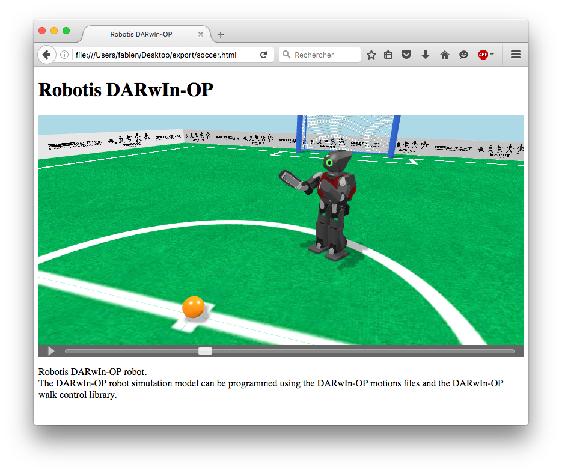

## Web Animation

### Description

Webots can record a simulation to an interactive 3D `HTML` page.
The result is similar to a movie with playback controls, except that
you can change the viewpoint at any time.

The mechanism is similar to the [web scene export](web-scene.md),
except that a supplementary `JSON` animation file containing the moving objects positions is exported.

The [figure below](#screenshot-of-a-web-animation-page-generated-by-webots)
shows an example of an animation page generated by Webots.

%figure "Screenshot of a Web animation page generated by Webots"

%end

### How to export a Web Animation

Select the `File / Make HTML5 Animation...` menu item and choose the target `HTML` file.
Webots will ask to playback the resulting file in the default browser (from the OS settings).

**Note**:
The `X3D` file, the `JSON` animation file and the required textures are exported in the same directory as the target `HTML` file.

**Note**:
The playback option may not work correctly depending on your default Web browser.
In this case, please refer to the [section below](#remarks-on-the-used-technologies-and-their-limitations).

**Note**:
A [Supervisor](supervisor-programming.md) can start or stop an animation recording as well.

### How to embed a Web Animation in your Website

Please refer to [this section](web-scene.md#how-to-embed-a-web-scene-in-your-website).

### Limitations

The animation file contains only modifications over the `Transform.translation`, `Transform.rotation` and `LED.color` fields.
The other VRML fields are not recorded in the animation file.
Node insertion or deletion are also not recorded in the animation file.

Additional limitations are described in [this section](web-scene.md#limitations).

### Remarks on the used Technologies and their Limitations

Please refer to [this section](web-scene.md#remarks-on-the-used-technologies-and-their-limitations).
