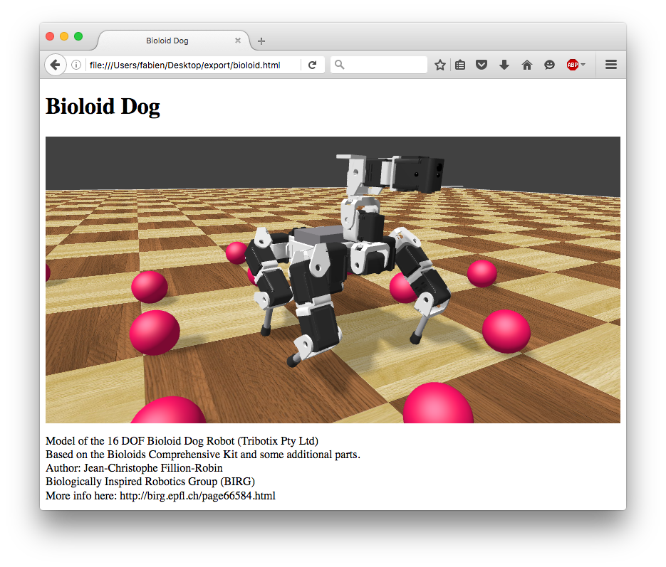

## X3D and Web Scene

### Purpose

Webots can export an entire simulation world to standard X3D file.
X3D is only containing graphical information.
Additionally, an HTML page is generated.
When open in a web browser, this page shows the 3D scene in a navigable canvas.

%figure "Screenshot of an HTML page containing a Webots scene generated by Webots."

%end

### How to export a Web Scene

**TODO: document**

### How to embed a Web Scene in your Website

**TODO: document**

### Limitations

**TODO: document**

### Technologies and Limitations

**TODO: document (Chrome and file protocol, etc.)**
