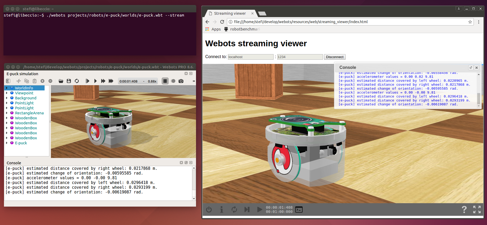

## Web Streaming

### Purpose

Webots can be used as a web streaming server, i.e., to send an entire 3D scene to several
Web browsers (clients), and to stream the position of the moving objects,
as shown in [the figure above](#screenshot-of-webots-used-as-a-streaming-server).

%figure "Screenshot of Webots used as a streaming server"

%end

### How to stream a Webots simulation

**TODO: document**

### What can be streamed

**TODO: document**

### Technologies and Limitations

**TODO: document**
