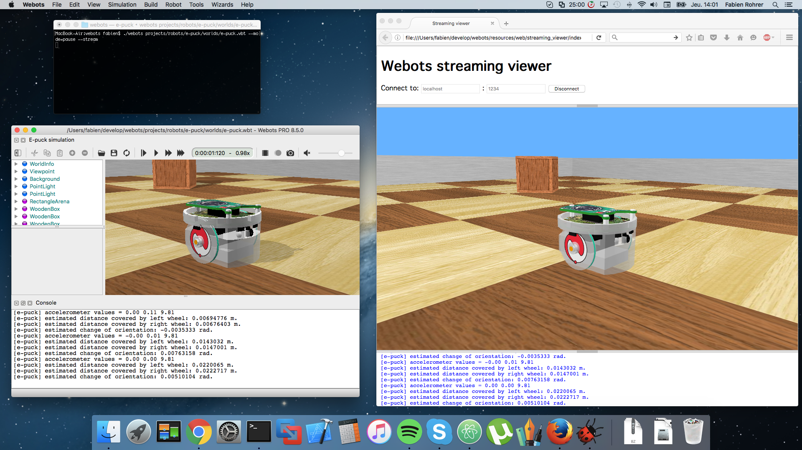

## Web Streaming

### Purpose

Webots can be used as a web streaming server, i.e., to send an entire 3D scene to several
Web browsers (clients), and to stream the position of the moving objects,
as shown in [the figure above](#screenshot-of-webots-used-as-a-streaming-server).

%figure "Screenshot of Webots used as a streaming server"

%end

### How to stream a Webots Simulation

**TODO: document**

### What can be streamed

**TODO: document**

### How to embed a Web Scene in your Website

**TODO: document**

### Limitations

**TODO: document**

### Technologies and Limitations

To render the scene in a Web browser, Webots is using X3DOM
(cf. [limitations](web-scene.md#technologies-and-limitations)).
To stream the scene modifications, Webots is using websockets.
Websockets are present on the majority of recent web browsers.
